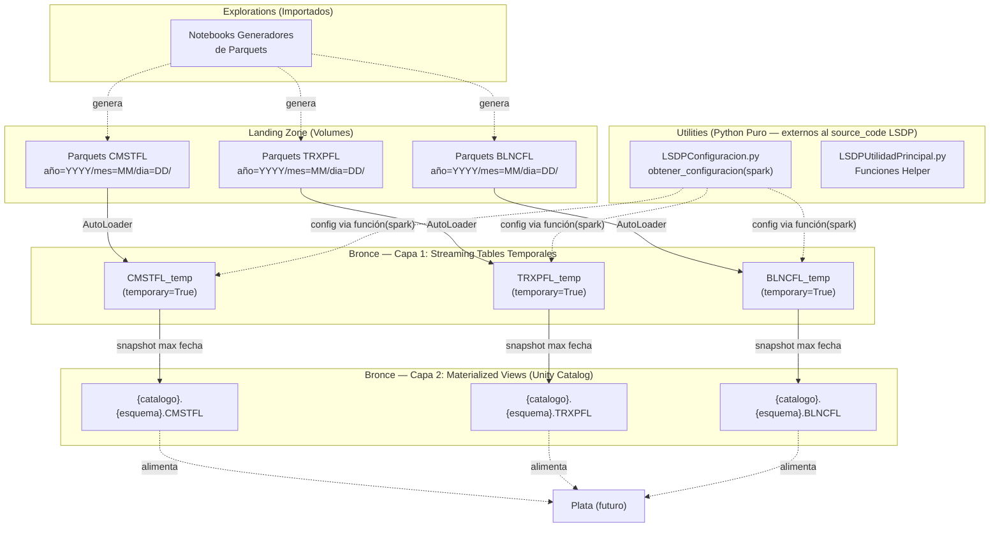
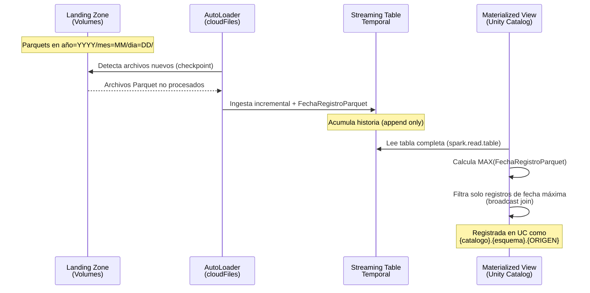
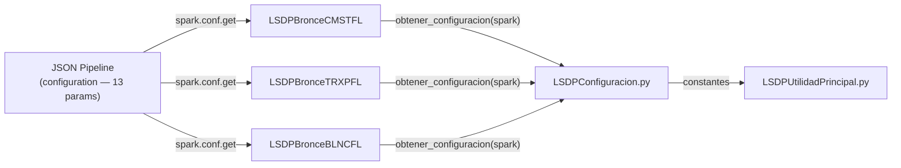
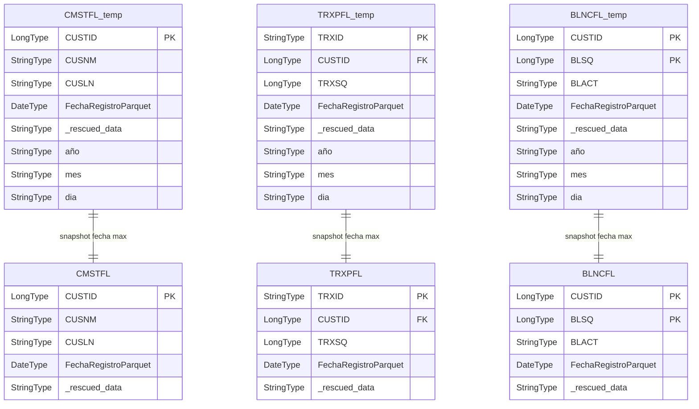

# Documento de Diseño Técnico — bronce-utilities-ingesta

## Visión General

**Propósito**: Este incremento entrega el módulo de configuración centralizada y la capa de ingesta (Medalla de Bronce) del pipeline LSDP, estableciendo los cimientos reutilizables para las medallas de Plata y Oro, y materializando la ingesta incremental de 3 fuentes Parquet AS400 mediante AutoLoader.

**Usuarios**: Ingenieros de datos que desarrollan y mantienen el pipeline LSDP del Data Warehouse bancario sobre Databricks Free Edition Serverless.

**Impacto**: Crea la estructura base del repositorio (`src/`, `utilities/`, `transformations/`, `explorations/`) y las primeras 6 tablas del pipeline (3 Streaming Tables temporales + 3 Materialized Views de snapshot).

### Objetivos

- Centralizar toda la configuración del pipeline en módulos Python reutilizables sin valores hard-coded.
- Implementar la ingesta incremental de CMSTFL (4M), TRXPFL (7M) y BLNCFL (4M) siguiendo el patrón de 2 capas de Bronce.
- Exponer funciones helper de hash (SHA2-256/512) y reordenamiento de columnas LC para uso de Plata y Oro.
- Importar notebooks generadores de Parquets existentes al repositorio para trazabilidad.

### No-Objetivos

- Implementación de tablas de Plata (Hubs, Links, Satellites) — corresponde a un incremento posterior.
- Implementación de tablas de Oro (Dimensiones, Hechos) — corresponde a un incremento posterior.
- Validación de calidad de datos con Expectations en Bronce — se evaluará en diseño futuro.
- Creación del JSON de definición del pipeline (Lakeflow Job) — es configuración de infraestructura, no código.
- Modificación de los notebooks generadores de Parquets importados.

---

## Arquitectura

### Patrón Arquitectónico y Mapa de Fronteras

El incremento sigue el patrón **Pipeline Declarativo por Capas** (Medallón), donde cada capa tiene responsabilidad única y las dependencias fluyen unidireccionalmente de abajo hacia arriba.



**Integración Arquitectónica**:

- **Patrón seleccionado**: Pipeline Declarativo por Capas (Medallón) — cada capa de Bronce encapsula una responsabilidad (ingesta incremental ó snapshot) con dependencia unidireccional.
- **Fronteras de dominio**: Los módulos de `utilities/` son transversales (consumidos por todas las medallas) pero **no forman parte del source_code LSDP** — son módulos Python externos importados por los notebooks; los notebooks de `transformations/` pertenecen a una medalla específica y sí son source_code; los notebooks de `explorations/` son auxiliares sin relación con el pipeline.
- **Patrones existentes preservados**: Convenciones de nombrado `LSDP{Medalla}{Nombre}`, `LSDP{Utilidad}.py`; decoradores LSDP con nombre de 3 partes; parametrización vía `spark.conf.get()` invocado desde función que recibe `spark`.
- **Justificación de componentes nuevos**: Cada componente materializa un requisito aprobado (ver trazabilidad).
- **Cumplimiento con steering**: Alineado con `structure.md` (organización por medallas), `tech.md` (restricciones Serverless, import LSDP correcto) y `product.md` (patrón de ingesta Bronce).

### Stack Tecnológico

| Capa | Elección / Versión | Rol en el Feature | Notas |
|------|--------------------|-------------------|-------|
| Lenguaje | PySpark (Python) | Todo el código del pipeline | Único lenguaje soportado en Free Edition |
| Framework Pipeline | LSDP (`from pyspark import pipelines as dp`) | Decoradores declarativos para ST y MV | Antes conocido como DLT |
| Ingesta | AutoLoader (`cloudFiles`) | Detección incremental de Parquets nuevos | Con schema evolution habilitado |
| Almacenamiento | Delta Lake | Formato de todas las tablas | Soporta Liquid Clustering |
| Catálogo | Unity Catalog | Registro de MV de Bronce | Las ST temporales no se registran |
| Infraestructura | Databricks Free Edition Serverless | Ejecución sin clusters gestionados | Ver restricciones en `tech.md` |

---

## Flujos del Sistema

### Flujo de Ingesta Bronce (por cada fuente)



### Flujo de Resolución de Configuración



---

## Trazabilidad de Requisitos

| Requisito | Resumen | Componentes | Interfaces | Flujos |
|-----------|---------|-------------|------------|--------|
| 1.1, 1.2, 1.3, 1.4 | Estructura de directorios y nombrado | Todos los archivos del incremento | N/A | N/A |
| 2.1, 2.2, 2.3, 2.4, 2.5 | Configuración centralizada | LSDPConfiguracion.py | Variables globales del pipeline | Flujo de Resolución de Configuración |
| 3.1, 3.2, 3.3, 3.4, 3.5 | Funciones helper reutilizables | LSDPUtilidadPrincipal.py | Funciones Python que retornan Column | N/A |
| 4.1–4.7 | Ingesta Bronce CMSTFL | LSDPBronceCMSTFL | ST CMSTFL_temp, MV CMSTFL | Flujo de Ingesta Bronce |
| 5.1–5.7 | Ingesta Bronce TRXPFL | LSDPBronceTRXPFL | ST TRXPFL_temp, MV TRXPFL | Flujo de Ingesta Bronce |
| 6.1–6.7 | Ingesta Bronce BLNCFL | LSDPBronceBLNCFL | ST BLNCFL_temp, MV BLNCFL | Flujo de Ingesta Bronce |
| 7.1–7.8 | Compatibilidad Serverless | Transversal a todos | N/A | N/A |
| 8.1–8.6 | Patrón consistente entre fuentes | LSDPBronce{CMSTFL,TRXPFL,BLNCFL} | Patrón ST→MV idéntico | Flujo de Ingesta Bronce |
| 9.1–9.4 | Importación notebooks exploración | Directorio explorations/ | N/A | N/A |
| 10.1–10.4 | Imports y dependencias | Todos los notebooks de Bronce | Acceso a vars de LSDPConfiguracion | Flujo de Resolución de Configuración |

---

## Componentes e Interfaces

### Resumen de Componentes

| Componente | Dominio / Capa | Propósito | Requisitos | Dependencias Clave | Contratos |
|------------|----------------|-----------|------------|-------------------|-----------|
| LSDPConfiguracion.py | Utilities (externo) | Parámetros del pipeline (vía función), constantes de negocio | 2.1–2.5, 10.4 | spark (recibido como parámetro) | Función + Constantes |
| LSDPUtilidadPrincipal.py | Utilities (externo) | Funciones helper de hash y reordenamiento LC | 3.1–3.5 | pyspark.sql.functions | Funciones Python → Column |
| LSDPBronceCMSTFL | Transformations / Bronce | Ingesta CMSTFL: ST temporal + MV snapshot | 4.1–4.7, 7.*, 8.*, 10.* | LSDPConfiguracion, LSDP, AutoLoader | ST + MV |
| LSDPBronceTRXPFL | Transformations / Bronce | Ingesta TRXPFL: ST temporal + MV snapshot | 5.1–5.7, 7.*, 8.*, 10.* | LSDPConfiguracion, LSDP, AutoLoader | ST + MV |
| LSDPBronceBLNCFL | Transformations / Bronce | Ingesta BLNCFL: ST temporal + MV snapshot | 6.1–6.7, 7.*, 8.*, 10.* | LSDPConfiguracion, LSDP, AutoLoader | ST + MV |
| explorations/ | Explorations | Notebooks generadores de Parquets (importados) | 9.1–9.4 | Ninguna (independientes) | N/A |

---

### Capa: Utilities

#### LSDPConfiguracion.py

| Campo | Detalle |
|-------|---------|
| Propósito | Centralizar todos los parámetros del pipeline LSDP (leídos via función que recibe `spark`), constantes de negocio y rutas de datos como módulo Python externo al source_code LSDP |
| Requisitos | 2.1, 2.2, 2.3, 2.4, 2.5, 10.4 |

**Responsabilidades y Restricciones**

- Exponer una función `obtener_configuracion(spark)` que lea 13 parámetros del pipeline y retorne un diccionario con los valores.
- Definir constantes de negocio inmutables a nivel de módulo (tipos ATM, bits de hash, separador, umbrales) — estas no dependen de `spark`.
- **No forma parte del source_code del pipeline LSDP** — es un módulo externo importado por los notebooks.
- No contener imports de LSDP (`from pyspark import pipelines as dp`).
- Propagar errores nativos de `spark.conf.get()` si un parámetro no está configurado (sin defaults).

**Dependencias**

- Inbound: `spark` (recibido como parámetro de `obtener_configuracion()`) — lectura de configuración (P0)
- Outbound: Todos los notebooks del pipeline — invocan `obtener_configuracion(spark)` y consumen el diccionario retornado (P0)

**Contratos**: Service [x], State [x]

##### Contrato de Servicio (Función de Configuración)

```python
def obtener_configuracion(spark) -> dict:
    """
    Lee los 13 parámetros del pipeline desde spark.conf y retorna
    un diccionario con las claves documentadas abajo.
    Recibe spark como parámetro porque este módulo no es source_code LSDP
    y no tiene acceso a la variable global spark del runtime.
    """
```

##### Contrato de Estado (Constantes de Módulo + Diccionario Retornado)

```python
# === Claves del diccionario retornado por obtener_configuracion(spark) ===
# --- Parámetros generales ---
catalogo: str           # pipeline.catalogo — Catálogo UC para Bronce
esquema: str            # pipeline.esquema — Esquema UC para Bronce
volumen: str            # pipeline.volumen — Nombre del Volume
catalogo_plata: str     # pipeline.catalogo_plata
esquema_plata: str      # pipeline.esquema_plata
catalogo_oro: str       # pipeline.catalogo_oro
esquema_oro: str        # pipeline.esquema_oro

# --- Rutas de datos por fuente (Landing Zone) ---
ruta_cmstfl: str        # pipeline.ruta_cmstfl — ej: archivo/LSDP_DataVault_DWH/cmstfl/
ruta_trxpfl: str        # pipeline.ruta_trxpfl — ej: archivo/LSDP_DataVault_DWH/trxpfl/
ruta_blncfl: str        # pipeline.ruta_blncfl — ej: archivo/LSDP_DataVault_DWH/blncfl/

# --- Schema Locations de AutoLoader (checkpoint) ---
schema_location_cmstfl: str  # pipeline.schema_location_cmstfl — ej: AutoLoader/schema/cmstfl/
schema_location_trxpfl: str  # pipeline.schema_location_trxpfl — ej: AutoLoader/schema/trxpfl/
schema_location_blncfl: str  # pipeline.schema_location_blncfl — ej: AutoLoader/schema/blncfl/

# === Constantes de Negocio (nivel de módulo, no dependen de spark) ===
TIPO_DATM: str = "DATM"
TIPO_CATM: str = "CATM"
TIPOS_ATM: list[str] = [TIPO_DATM, TIPO_CATM]
HASH_HUB_LINK_BITS: int = 256
HASH_SATELLITE_BITS: int = 512
HASH_SEPARATOR: str = "|"

# === Umbrales de Campos Calculados (nivel de módulo) ===
UMBRAL_RANGO_ETARIO: dict[str, tuple[int, int]]
UMBRAL_CATEGORIA_INGRESOS: dict[str, tuple[int, int]]
UMBRAL_CATEGORIA_SALDO: dict[str, tuple[int, int]]
UMBRAL_UTILIZACION_CREDITO: dict[str, tuple[float, float]]
UMBRAL_SOBREGIRO: dict[str, tuple[int, int]]
UMBRAL_RANGO_MONTO: dict[str, tuple[int, int]]
UMBRAL_RIESGO_FRAUDE: dict[str, tuple[int, int]]
```

**Notas de Implementación**

- `obtener_configuracion(spark)` ejecuta `spark.conf.get()` para cada parámetro y retorna un `dict` con las 13 claves.
- Los notebooks invocan: `config = obtener_configuracion(spark)` y luego acceden a `config["catalogo"]`, `config["ruta_cmstfl"]`, etc.
- Los umbrales siguen la estructura `{"ETIQUETA": (min, max)}` del SYSTEM.md sección 6.2.
- Las constantes de hash y separador son consumidas por `LSDPUtilidadPrincipal.py` vía import directo (no necesitan spark).
- Los 13 parámetros se configuran manualmente al crear el pipeline LSDP en el entorno de laboratorio.

---

#### LSDPUtilidadPrincipal.py

| Campo | Detalle |
|-------|---------|
| Propósito | Funciones helper reutilizables para cálculo de hashes SHA2, detección de cambios y reordenamiento de columnas de Liquid Clustering |
| Requisitos | 3.1, 3.2, 3.3, 3.4, 3.5, 7.3, 7.5, 7.6 |

**Responsabilidades y Restricciones**

- Exponer funciones que retornan objetos `Column` de PySpark.
- Usar exclusivamente funciones nativas de `pyspark.sql.functions` (jamás UDFs).
- Aplicar `.cast("string")` a toda columna antes de pasarla a `F.sha2()`.
- Usar `F.concat_ws()` (nunca operador `+`) para concatenar strings.
- No ejecutar `spark.conf.get()` ni definir parámetros — eso pertenece a `LSDPConfiguracion.py`.

**Dependencias**

- Inbound: Constantes de `LSDPConfiguracion.py` (`HASH_HUB_LINK_BITS`, `HASH_SATELLITE_BITS`, `HASH_SEPARATOR`) vía import directo (P0)
- Outbound: Notebooks de Plata y Oro (futuros) — consumirán las funciones (P1)

> **Nota**: Las funciones de hash operan con objetos `Column` de PySpark y no requieren `spark` como parámetro. `reordenar_columnas_lc` opera con `DataFrame`. Si en futuras iteraciones se añaden funciones que necesiten `spark` o `dbutils`, deben recibirlos como parámetro explícito (patrón establecido en `LSDPConfiguracion.py`).

**Contratos**: Service [x]

##### Interfaz de Servicio (Funciones Helper)

```python
from pyspark.sql import Column, DataFrame
from pyspark.sql import functions as F

def calcular_hash_hub(
    columnas: list[Column],
    bits: int = HASH_HUB_LINK_BITS,      # 256
    separador: str = HASH_SEPARATOR        # "|"
) -> Column:
    """
    Genera hash SHA2 combinando una o más columnas.
    - 1 columna: cast a string → F.sha2(col, bits)
    - N columnas: cast a string cada una → F.concat_ws(separador, ...) → F.sha2(..., bits)
    Retorna: Column de tipo StringType con el hash hexadecimal.
    """

def calcular_hash_diferenciador(
    hash_entidad: Column,
    *campos: Column
) -> Column:
    """
    Genera Hash_Diferenciador SHA2-512.
    Concatena hash_entidad + todos los campos (cast a string) con separador "|".
    Retorna: Column de tipo StringType con el hash hexadecimal.
    """

def reordenar_columnas_lc(
    df: DataFrame,
    columnas_lc: list[str]
) -> DataFrame:
    """
    Reordena columnas del DataFrame: columnas_lc primero, resto en orden original.
    Retorna: DataFrame con columnas reordenadas.
    """
```

**Notas de Implementación**

- `calcular_hash_hub`: Si `len(columnas) == 1`, aplica `F.sha2(columnas[0].cast("string"), bits)`. Si `len(columnas) > 1`, aplica `F.sha2(F.concat_ws(separador, *[c.cast("string") for c in columnas]), bits)`.
- `calcular_hash_diferenciador`: Aplica `F.sha2(F.concat_ws(HASH_SEPARATOR, hash_entidad, *[c.cast("string") for c in campos]), HASH_SATELLITE_BITS)`.
- `reordenar_columnas_lc`: Construye `df.select(*columnas_lc, *[c for c in df.columns if c not in columnas_lc])`.

---

### Capa: Transformations / Bronce

Los 3 notebooks de Bronce siguen un patrón idéntico. Se documenta el componente genérico y luego las variaciones por fuente.

#### Patrón Genérico de Notebook Bronce

Cada notebook define exactamente 2 artefactos LSDP:

**Artefacto 1 — Streaming Table Temporal (Capa 1)**

| Propiedad | Valor |
|-----------|-------|
| Decorador | `@dp.table(name="{ORIGEN}_temp", temporary=True, cluster_by=["FechaRegistroParquet"])` |
| Fuente | `spark.readStream.format("cloudFiles").load(ruta_{origen})` |
| Opciones AutoLoader | `cloudFiles.format = parquet`, `cloudFiles.inferColumnTypes = true`, `cloudFiles.schemaEvolutionMode = addNewColumns`, `cloudFiles.schemaLocation = {schema_location_ORIGEN}` (parámetro específico por fuente) |
| Columna derivada | `FechaRegistroParquet` = `F.to_date(F.concat_ws("-", F.col("año"), F.col("mes"), F.col("dia")))` |
| Registro en UC | No (temporal) |

**Artefacto 2 — Materialized View Snapshot (Capa 2)**

| Propiedad | Valor |
|-----------|-------|
| Decorador | `@dp.materialized_view(name=f"{catalogo}.{esquema}.{ORIGEN}", cluster_by=["FechaRegistroParquet"])` |
| Fuente | `spark.read.table("{ORIGEN}_temp")` |
| Lógica | Calcula `F.max("FechaRegistroParquet")` → broadcast join → filtra solo fecha máxima → `.drop("max_fecha")` |
| Registro en UC | Sí — `{catalogo}.{esquema}.{ORIGEN}` |

**Estructura de Imports del Notebook**

```python
from pyspark import pipelines as dp
from pyspark.sql import functions as F
from utilities.LSDPConfiguracion import obtener_configuracion

# Obtener configuración pasando spark del runtime LSDP
config = obtener_configuracion(spark)
# Usar config["catalogo"], config["ruta_cmstfl"], config["schema_location_cmstfl"], etc.
```

---

#### LSDPBronceCMSTFL

| Campo | Detalle |
|-------|---------|
| Propósito | Ingesta incremental de Maestro de Clientes (4,000,000 registros) |
| Requisitos | 4.1, 4.2, 4.3, 4.4, 4.5, 4.6, 4.7 |
| Archivo | `src/LSDP_Lab_DataVault_DWH/transformations/LSDPBronceCMSTFL.py` |

**Contratos**: Batch [x]

##### Contrato Batch — ST CMSTFL_temp

| Campo | Detalle |
|-------|---------|
| Trigger | Ejecución del pipeline LSDP |
| Input | Parquets en `ruta_cmstfl` (inferidos por AutoLoader) |
| Validación | AutoLoader valida esquema; `_rescued_data` captura incompatibilidades |
| Output | Streaming Table temporal `CMSTFL_temp` con 70 columnas originales + `año` + `mes` + `dia` + `FechaRegistroParquet` + `_rescued_data` |
| Idempotencia | AutoLoader mantiene checkpoint interno; archivos ya procesados no se reingestan |

##### Contrato Batch — MV CMSTFL

| Campo | Detalle |
|-------|---------|
| Trigger | Dependencia declarativa sobre `CMSTFL_temp` |
| Input | `spark.read.table("CMSTFL_temp")` |
| Validación | N/A (hereda de Capa 1) |
| Output | Materialized View `{catalogo}.{esquema}.CMSTFL` con todas las columnas de CMSTFL_temp filtradas por fecha máxima |
| Idempotencia | MV se recalcula completamente en cada ejecución (overwrite semántico) |

---

#### LSDPBronceTRXPFL

| Campo | Detalle |
|-------|---------|
| Propósito | Ingesta incremental de Transacciones (7,000,000 registros) |
| Requisitos | 5.1, 5.2, 5.3, 5.4, 5.5, 5.6, 5.7 |
| Archivo | `src/LSDP_Lab_DataVault_DWH/transformations/LSDPBronceTRXPFL.py` |

**Contratos**: Batch [x]

##### Contrato Batch — ST TRXPFL_temp

| Campo | Detalle |
|-------|---------|
| Trigger | Ejecución del pipeline LSDP |
| Input | Parquets en `ruta_trxpfl` |
| Output | Streaming Table temporal `TRXPFL_temp` con 60 columnas originales + `año` + `mes` + `dia` + `FechaRegistroParquet` + `_rescued_data` |
| Idempotencia | Checkpoint de AutoLoader en `schema_location_trxpfl` (parámetro específico) |

##### Contrato Batch — MV TRXPFL

| Campo | Detalle |
|-------|---------|
| Trigger | Dependencia sobre `TRXPFL_temp` |
| Output | Materialized View `{catalogo}.{esquema}.TRXPFL` filtrada por fecha máxima |

---

#### LSDPBronceBLNCFL

| Campo | Detalle |
|-------|---------|
| Propósito | Ingesta incremental de Saldos/Operaciones (4,000,000 registros) |
| Requisitos | 6.1, 6.2, 6.3, 6.4, 6.5, 6.6, 6.7 |
| Archivo | `src/LSDP_Lab_DataVault_DWH/transformations/LSDPBronceBLNCFL.py` |

**Contratos**: Batch [x]

##### Contrato Batch — ST BLNCFL_temp

| Campo | Detalle |
|-------|---------|
| Trigger | Ejecución del pipeline LSDP |
| Input | Parquets en `ruta_blncfl` |
| Output | Streaming Table temporal `BLNCFL_temp` con 100 columnas originales + `año` + `mes` + `dia` + `FechaRegistroParquet` + `_rescued_data` |
| Idempotencia | Checkpoint de AutoLoader en `schema_location_blncfl` (parámetro específico) |

##### Contrato Batch — MV BLNCFL

| Campo | Detalle |
|-------|---------|
| Trigger | Dependencia sobre `BLNCFL_temp` |
| Output | Materialized View `{catalogo}.{esquema}.BLNCFL` filtrada por fecha máxima |

---

### Capa: Explorations

#### Notebooks Generadores de Parquets (Importados)

| Campo | Detalle |
|-------|---------|
| Propósito | Generar archivos Parquet de prueba en la Landing Zone con estructura `año=YYYY/mes=MM/dia=DD/` |
| Requisitos | 9.1, 9.2, 9.3, 9.4 |
| Ubicación | `src/LSDP_Lab_DataVault_DWH/explorations/` |

**Responsabilidades y Restricciones**

- Se importan sin modificaciones al código fuente.
- No forman parte del pipeline LSDP de producción.
- Generan Parquets en la ruta de Landing Zone siguiendo el particionamiento `año=YYYY/mes=MM/dia=DD/`.

---

## Modelo de Datos

### Modelo Lógico — Tablas de Bronce



### Modelo Físico — Propiedades Delta

| Tabla | Tipo LSDP | Registro UC | Liquid Clustering | Columnas (aprox.) | Volumetría |
|-------|-----------|-------------|-------------------|--------------------|------------|
| CMSTFL_temp | Streaming Table | No (temporal) | `FechaRegistroParquet` | 70 + 4 derivadas = 74 | Crece incrementalmente |
| CMSTFL | Materialized View | Sí | `FechaRegistroParquet` | 74 (hereda de ST) | 4,000,000 por snapshot |
| TRXPFL_temp | Streaming Table | No (temporal) | `FechaRegistroParquet` | 60 + 4 derivadas = 64 | Crece incrementalmente |
| TRXPFL | Materialized View | Sí | `FechaRegistroParquet` | 64 (hereda de ST) | 7,000,000 por snapshot |
| BLNCFL_temp | Streaming Table | No (temporal) | `FechaRegistroParquet` | 100 + 4 derivadas = 104 | Crece incrementalmente |
| BLNCFL | Materialized View | Sí | `FechaRegistroParquet` | 104 (hereda de ST) | 4,000,000 por snapshot |

> **Nota sobre columnas derivadas**: Las 4 columnas derivadas son `año` (StringType, partición), `mes` (StringType, partición), `dia` (StringType, partición) y `FechaRegistroParquet` (DateType, calculada). La columna `_rescued_data` (StringType) es generada automáticamente por AutoLoader y se cuenta como parte de las columnas originales del Parquet.

---

## Estructura de Archivos del Incremento

```
src/LSDP_Lab_DataVault_DWH/
├── explorations/                          ← Notebooks importados (sin modificar)
│   └── {Notebooks generadores de Parquets}
├── transformations/
│   ├── LSDPBronceCMSTFL.py               ← ST CMSTFL_temp + MV CMSTFL
│   ├── LSDPBronceTRXPFL.py               ← ST TRXPFL_temp + MV TRXPFL
│   └── LSDPBronceBLNCFL.py               ← ST BLNCFL_temp + MV BLNCFL
└── utilities/
    ├── LSDPConfiguracion.py              ← Parámetros + Constantes
    └── LSDPUtilidadPrincipal.py          ← Funciones Helper (hash, LC)
```

---

## Referencias de Soporte

- Investigación detallada y decisiones de diseño: ver `research.md` en este directorio de spec.
- Patrones de código verificados: SYSTEM.md secciones 1.8 (Bronce) y 5.3 (Hashes).
- Restricciones Serverless: SYSTEM.md sección 5 y steering `tech.md`.
- Convenciones de nombrado: steering `structure.md`.
