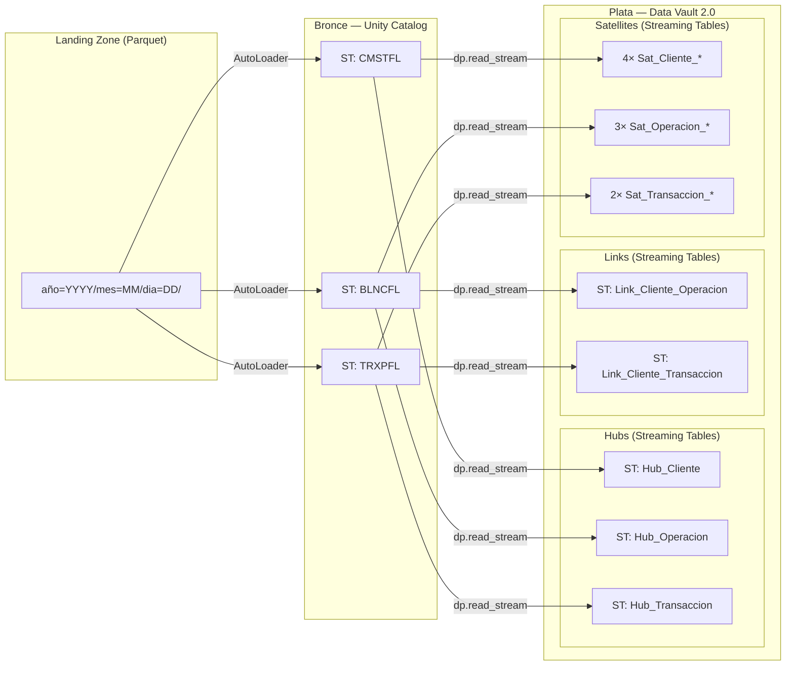
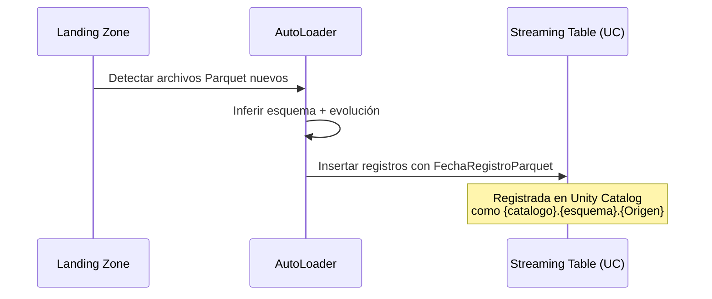
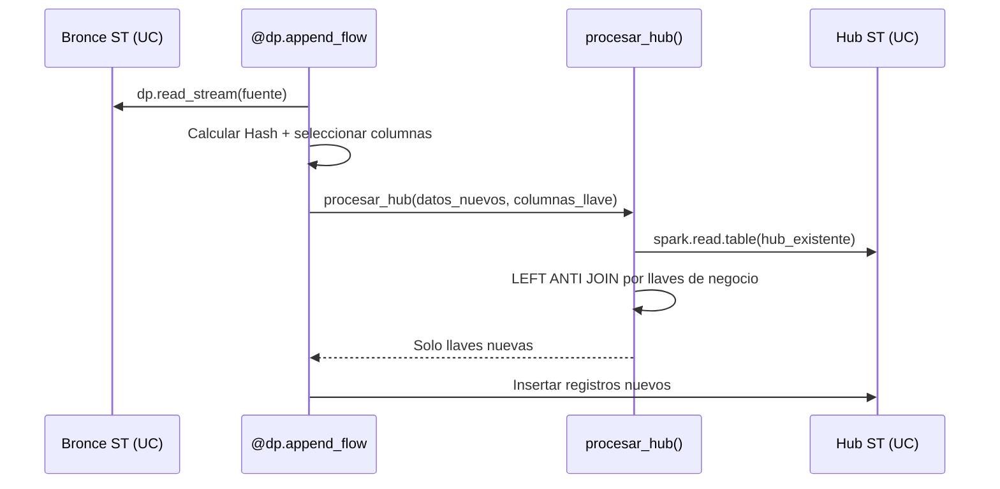
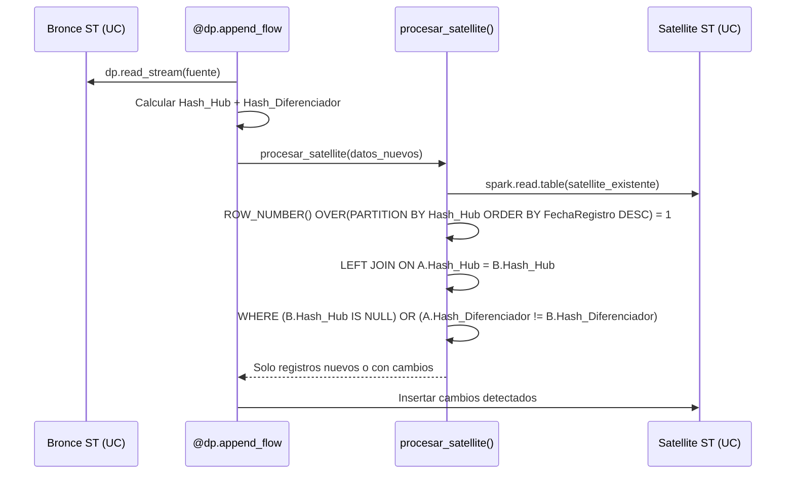
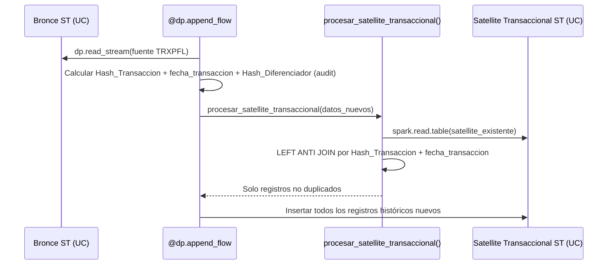

# Documento de Diseño Técnico

## Visión General

**Propósito**: Este incremento correctivo reestructura las medallas Bronce y Plata del pipeline LSDP Data Vault DWH, simplificando Bronce a una sola Streaming Table persistente por fuente y unificando todas las entidades Data Vault en Plata bajo el patrón Streaming Table + Append Flow con comportamiento Append-Only.

**Usuarios**: Ingenieros de datos que mantienen y extienden el pipeline LSDP, y responsables de la documentación técnica del proyecto.

**Impacto**: Modifica la arquitectura de ingesta (Bronce), el modelado Data Vault (Plata), la función de detección de cambios (`procesar_satellite()`), y toda la documentación técnica (SYSTEM.md, Steering).

### Objetivos
- Eliminar la capa redundante de Materialized Views de snapshot en Bronce.
- Migrar Hubs y Links de `@dp.materialized_view()` a `dp.create_streaming_table()` + `@dp.append_flow()` con detección de duplicados.
- Refinar la lógica de `procesar_satellite()` (Satellites estándar: Cliente, Operación) con LEFT JOIN exclusivamente por `Hash_{Hub}` y filtro WHERE por `Hash_Diferenciador`.
- Implementar `procesar_satellite_transaccional()` para Satellites transaccionales con LEFT ANTI JOIN por `Hash_Transaccion` + `fecha_transaccion`, sin ROW_NUMBER.
- Actualizar SYSTEM.md y Steering como fuente de verdad de la nueva arquitectura.

### No-Objetivos
- Modificar la Medalla de Oro (dimensiones, tabla de hechos).
- Cambiar el mecanismo de AutoLoader o el formato de archivos Parquet de la Landing Zone.
- Alterar las expectations de calidad de datos existentes (se trasladan al nuevo patrón sin cambios funcionales).
- Cambiar el esquema de columnas de las tablas Hub, Link o Satellite (excepción: adición de `fecha_transaccion` de tipo `DATE` en `Sat_Transaccion_DatosEstables` y `Sat_Transaccion_Montos` por Req 11.4).
- Modificar las funciones `calcular_hash_hub()`, `calcular_hash_diferenciador()`, `clasificar_por_umbral()` o `reordenar_columnas_lc()`.

## Arquitectura

### Análisis de Arquitectura Existente

**Bronce (actual — a eliminar)**:
- 2 capas por fuente: `@dp.table(temporary=True)` → `@dp.materialized_view()`.
- La MV filtra snapshot más reciente vía `F.broadcast(max_fecha)`.

**Plata (actual — a migrar)**:
- Hubs (3): `@dp.materialized_view()` con `dropDuplicates()`.
- Links (2): `@dp.materialized_view()` con `dropDuplicates()`.
- Satellites (9): `dp.create_streaming_table()` + `@dp.append_flow()` con `procesar_satellite()` — lectura de `*_temp`.

### Patrón de Arquitectura y Mapa de Límites



**Integración Arquitectónica**:
- **Patrón seleccionado**: Arquitectura Medallón simplificada — Bronce con capa única de Streaming Tables persistentes, Plata con todas las entidades Data Vault como Streaming Tables Append-Only.
- **Límites mantenidos**: Separación entre Bronce (ingesta) y Plata (modelado DV2.0). Cada notebook encapsula una unidad funcional.
- **Patrones existentes preservados**: AutoLoader, Liquid Clustering, parametrización centralizada, funciones helper de `LSDPUtilidadPrincipal.py`.
- **Nuevos componentes**: `procesar_hub()` y `procesar_link()` en `LSDPUtilidadPrincipal.py`.
- **Alineación con Steering**: Mantiene principios de Append-Only, cero valores hard-coded, y compatibilidad Serverless.

### Stack Tecnológico

| Capa | Elección / Versión | Rol en el Feature | Notas |
|------|-------------------|-------------------|-------|
| Framework de Pipelines | LSDP (`pyspark.pipelines`) | Motor de orquestación declarativo | Sin cambios |
| Ingesta | AutoLoader (`cloudFiles`) | Detección incremental de Parquets | Sin cambios en configuración |
| Almacenamiento | Delta Lake en Unity Catalog | Tablas Bronce y Plata | Bronce pasa de temporal a registrado en UC |
| Cómputo | Databricks Free Edition Serverless | Ejecución del pipeline | Sin cambios |

## Flujos del Sistema

### Flujo de Ingesta Bronce (Nuevo)



### Flujo Append-Only para Hubs (Nuevo)



### Flujo Append-Only para Links (Nuevo)

```mermaid
sequenceDiagram
    participant BR as Bronce ST (UC)
    participant AF as @dp.append_flow
    participant PL as procesar_link()
    participant LINK as Link ST (UC)

    AF->>BR: dp.read_stream(fuente)
    AF->>AF: Calcular Hashes de Hubs + Hash del Link
    AF->>PL: procesar_link(datos_nuevos, hash_cols)
    PL->>LINK: spark.read.table(link_existente)
    PL->>PL: LEFT ANTI JOIN por Hash_Hub1 + Hash_Hub2
    PL-->>AF: Solo combinaciones nuevas
    AF->>LINK: Insertar relaciones nuevas
```

### Flujo de Detección de Cambios en Satellites Estándar (Cliente, Operación)



### Flujo de Acumulación Histórica en Satellites Transaccionales (Hub_Transaccion)



## Trazabilidad de Requisitos

| Requisito | Resumen | Componentes | Interfaces | Flujos |
|-----------|---------|-------------|------------|--------|
| 1.1–1.8 | Simplificación Bronce: ST persistentes | NotebooksBronce | `@dp.table()` sin `temporary` | Ingesta Bronce |
| 2.1–2.4 | Consumo Plata desde ST Bronce | NotebooksPlata (todos) | `dp.read_stream()` | Todos los flujos Plata |
| 3.1–3.8 | Hubs como ST Append-Only | NotebooksHub, `procesar_hub()` | `dp.create_streaming_table()` + `@dp.append_flow()` | Append-Only Hubs |
| 4.1–4.8 | Links como ST Append-Only | NotebooksLink, `procesar_link()` | `dp.create_streaming_table()` + `@dp.append_flow()` | Append-Only Links |
| 5.1–5.7 | Detección de cambios Satellites estándar (LEFT JOIN por Hash_Hub + WHERE Hash_Diferenciador) | `procesar_satellite()` | LEFT JOIN por `Hash_Hub`, WHERE por `Hash_Diferenciador` | Detección Cambios Satellites Estándar |
| 6.1–6.7 | Actualización SYSTEM.md | SYSTEM.md | N/A | N/A |
| 7.1–7.4 | Actualización Steering | product.md, tech.md, structure.md | N/A | N/A |
| 8.1–8.4 | Refactorización notebooks Bronce | LSDPBronce{CMSTFL,TRXPFL,BLNCFL}.py | `@dp.table()` | Ingesta Bronce |
| 9.1–9.5 | Refactorización notebooks Hubs/Links | LSDPPlataHub*.py, LSDPPlataLink*.py | `dp.create_streaming_table()` + `@dp.append_flow()` | Append-Only Hubs/Links |
| 10.1–10.5 | Actualización notebooks Satellites estándar (Cliente, Operación) | LSDPPlataSatCliente.py, LSDPPlataSatOperacion.py | `dp.read_stream()` con nombre UC | Detección Cambios Satellites Estándar |
| 11.1–11.11 | Acumulación histórica Satellites transaccionales | LSDPPlataSatTransaccion.py, `procesar_satellite_transaccional()` | LEFT ANTI JOIN por `Hash_Transaccion` + `fecha_transaccion` | Acumulación Histórica Transaccional |

## Componentes e Interfaces

### Tabla Resumen

| Componente | Dominio/Capa | Intención | Cobertura Req | Dependencias Clave | Contratos |
|------------|-------------|-----------|---------------|--------------------|-----------| 
| NotebooksBronce | Bronce | Ingesta AutoLoader → ST registrada en UC | 1.1–1.8, 8.1–8.4 | LSDPConfiguracion (P0), reordenar_columnas_lc (P1) | Batch |
| NotebooksHub | Plata | Hub ST Append-Only con detección duplicados | 2.1–2.2, 3.1–3.8, 9.1–9.2, 9.5 | LSDPConfiguracion (P0), procesar_hub (P0), calcular_hash_hub (P0) | Streaming |
| NotebooksLink | Plata | Link ST Append-Only con detección duplicados | 2.1–2.2, 4.1–4.8, 9.3–9.5 | LSDPConfiguracion (P0), procesar_link (P0), calcular_hash_hub (P0) | Streaming |
| NotebooksSatellite (Estándar) | Plata | Satellite ST Acumulativa con CDC lógico (Cliente, Operación) | 2.1, 2.3–2.4, 5.1–5.7, 10.1–10.5 | LSDPConfiguracion (P0), procesar_satellite (P0) | Streaming |
| NotebooksSatellite (Transaccional) | Plata | Satellite ST con acumulación histórica completa (Hub_Transaccion) | 2.1, 2.3, 11.1–11.11 | LSDPConfiguracion (P0), procesar_satellite_transaccional (P0) | Streaming |
| procesar_hub() | Utilidades | Detección duplicados por llave de negocio | 3.2–3.4, 3.8 | spark.read.table (P0) | Servicio |
| procesar_link() | Utilidades | Detección duplicados por combinación de hashes | 4.2–4.4, 4.7 | spark.read.table (P0) | Servicio |
| procesar_satellite() | Utilidades | Detección cambios con LEFT JOIN por Hash_Hub + WHERE Hash_Diferenciador (Satellites estándar) — lógica existente que se mantiene | 5.1–5.7 | spark.read.table (P0) | Servicio |
| procesar_satellite_transaccional() | Utilidades | Deduplicación histórica con LEFT ANTI JOIN (Satellites transaccionales) | 11.1–11.9 | spark.read.table (P0) | Servicio |
| SYSTEM.md | Documentación | Fuente de verdad de arquitectura | 6.1–6.7 | N/A | N/A |
| SteeringFiles | Documentación | Contexto AI-DLC con trazabilidad | 7.1–7.4 | N/A | N/A |

### Capa: Bronce — Notebooks de Ingesta

#### LSDPBronce{Origen}.py (× 3: CMSTFL, TRXPFL, BLNCFL)

| Campo | Detalle |
|-------|---------|
| Intención | Ingesta incremental de Parquets vía AutoLoader y registro de Streaming Table en Unity Catalog |
| Requisitos | 1.1, 1.2, 1.3, 1.4, 1.5, 1.6, 1.7, 1.8, 8.1, 8.2, 8.3, 8.4 |

**Responsabilidades y Restricciones**
- Cada notebook contiene **una sola función** decorada con `@dp.table()` que registra la ST directamente en UC.
- La función de Materialized View de snapshot se **elimina por completo**.
- Se mantiene la generación de `FechaRegistroParquet`, `_rescued_data`, Liquid Clustering y configuración de AutoLoader.

**Dependencias**
- Inbound: Landing Zone Parquet — fuente de datos (P0)
- Outbound: `{catalogo}.{esquema}.{Origen}` — ST registrada en UC (P0)
- External: AutoLoader checkpoint — persistente e independiente del registro en UC (P0)

**Contratos**: Batch [x]

##### Batch / Job Contract
- **Trigger**: Ejecución del pipeline LSDP.
- **Input / validación**: Archivos Parquet en ruta `config["ruta_{origen}"]`. Schema evolution con `addNewColumns`.
- **Output / destino**: Streaming Table `{catalogo}.{esquema}.{Origen}` en UC.
- **Idempotencia y recuperación**: AutoLoader checkpoint gestiona idempotencia. Reinicio del pipeline reprocesa solo archivos no leídos.

**Estructura objetivo (pseudo-código)**:
```
@dp.table(
    name=f"{catalogo}.{esquema}.{Origen}",
    cluster_by=["FechaRegistroParquet"],
)
def {origen}():
    # AutoLoader readStream → withColumn FechaRegistroParquet → reordenar_columnas_lc
```

---

### Capa: Plata — Notebooks de Hubs

#### LSDPPlataHub{Entidad}.py (× 3: Cliente, Operacion, Transaccion)

| Campo | Detalle |
|-------|---------|
| Intención | Registrar llaves de negocio únicas como Streaming Table Append-Only |
| Requisitos | 2.1, 2.2, 3.1, 3.2, 3.3, 3.4, 3.5, 3.6, 3.7, 3.8, 9.1, 9.2, 9.5 |

**Responsabilidades y Restricciones**
- Reemplazar `@dp.materialized_view()` por `dp.create_streaming_table()` + `@dp.append_flow()`.
- Usar `procesar_hub()` para detectar llaves de negocio que ya existen en la tabla.
- Las expectations se definen en `dp.create_streaming_table()`.
- Leer datos de Bronce vía `dp.read_stream(f"{catalogo}.{esquema}.{Origen}")`.

**Dependencias**
- Inbound: ST Bronce `{catalogo}.{esquema}.{Origen}` — datos fuente vía `dp.read_stream()` (P0)
- Outbound: `procesar_hub()` — detección de duplicados (P0)

**Contratos**: Streaming [x]

##### Batch / Job Contract
- **Trigger**: Ejecución del pipeline LSDP.
- **Input / validación**: ST de Bronce con campos de llave de negocio. Expectations en `dp.create_streaming_table()`.
- **Output / destino**: ST `{catalogo_plata}.{esquema_plata}.Hub_{Entidad}` en UC.
- **Idempotencia y recuperación**: LEFT ANTI JOIN garantiza que registros existentes no se re-insertan.

**Configuración por Hub**:

| Hub | Fuente Bronce | Llave(s) de Negocio | Columnas Dedup | Expectations |
|-----|--------------|---------------------|----------------|--------------|
| Hub_Cliente | CMSTFL | `IdentificadorCliente` (CUSTID) | `["IdentificadorCliente"]` | `expect_or_drop("id_cliente_positivo")`, `expect_or_fail("hash_cliente_no_nulo")` |
| Hub_Operacion | BLNCFL | `IdentificadorCliente` (CUSTID) + `SecuenciaSaldo` (BLSQ) | `["IdentificadorCliente", "SecuenciaSaldo"]` | `expect_or_drop("id_cliente_positivo")`, `expect_or_fail("hash_operacion_no_nulo")` |
| Hub_Transaccion | TRXPFL | `IdentificadorTransaccion` (TRXID) | `["IdentificadorTransaccion"]` | `expect_or_fail("id_transaccion_no_nulo")`, `expect_or_fail("hash_transaccion_no_nulo")` |

**Estructura objetivo (pseudo-código)**:
```
dp.create_streaming_table(
    name=f"{catalogo_plata}.{esquema_plata}.Hub_{Entidad}",
    cluster_by=["FechaRegistro", "Hash_{Entidad}"],
    expect_all_or_drop=...,  # o expect_all_or_fail según Hub
)

@dp.append_flow(target=f"{catalogo_plata}.{esquema_plata}.Hub_{Entidad}")
def hub_{entidad}():
    # dp.read_stream(fuente_bronce)
    # .select(FechaRegistro, Hash, LlaveNegocio, FuenteDatos)
    # procesar_hub(datos, nombre_tabla, columnas_llave)
    # reordenar_columnas_lc(resultado, [...])
```

---

### Capa: Plata — Notebooks de Links

#### LSDPPlataLink{Relacion}.py (× 2: ClienteOperacion, ClienteTransaccion)

| Campo | Detalle |
|-------|---------|
| Intención | Registrar relaciones únicas entre Hubs como Streaming Table Append-Only |
| Requisitos | 2.1, 2.2, 4.1, 4.2, 4.3, 4.4, 4.5, 4.6, 4.7, 4.8, 9.3, 9.4, 9.5 |

**Responsabilidades y Restricciones**
- Reemplazar `@dp.materialized_view()` por `dp.create_streaming_table()` + `@dp.append_flow()`.
- Usar `procesar_link()` para detectar combinaciones de hashes que ya existen.
- Leer datos de Bronce con nombre completo de tres partes en UC vía `dp.read_stream()`.
- Los Links no requieren expectations de calidad de datos (`expect_or_drop`, `expect_or_fail`), dado que la integridad referencial se garantiza por la existencia previa de los Hubs referenciados.

**Dependencias**
- Inbound: ST Bronce `{catalogo}.{esquema}.{Origen}` — datos fuente vía `dp.read_stream()` (P0)
- Outbound: `procesar_link()` — detección de duplicados (P0)

**Contratos**: Streaming [x]

##### Batch / Job Contract
- **Trigger**: Ejecución del pipeline LSDP.
- **Input / validación**: ST de Bronce con campos necesarios para calcular Hashes de Hubs.
- **Output / destino**: ST `{catalogo_plata}.{esquema_plata}.Link_{Relacion}`.
- **Idempotencia y recuperación**: LEFT ANTI JOIN garantiza idempotencia.

**Configuración por Link**:

| Link | Fuente Bronce | Hash_Hub1 | Hash_Hub2 | Columnas Dedup |
|------|--------------|-----------|-----------|----------------|
| Link_Cliente_Operacion | BLNCFL | Hash_Cliente (CUSTID) | Hash_Operacion (CUSTID+BLSQ) | `["Hash_Cliente", "Hash_Operacion"]` |
| Link_Cliente_Transaccion | TRXPFL | Hash_Cliente (CUSTID) | Hash_Transaccion (TRXID) | `["Hash_Cliente", "Hash_Transaccion"]` |

**Estructura objetivo (pseudo-código)**:
```
dp.create_streaming_table(
    name=f"{catalogo_plata}.{esquema_plata}.Link_{Relacion}",
    cluster_by=["FechaRegistro", "Hash_{Hub1}", "Hash_{Hub2}"],
)

@dp.append_flow(target=f"{catalogo_plata}.{esquema_plata}.Link_{Relacion}")
def link_{relacion}():
    # dp.read_stream(fuente_bronce)
    # Calcular Hash_Hub1, Hash_Hub2, Hash_Link
    # procesar_link(datos, nombre_tabla, ["Hash_Hub1", "Hash_Hub2"])
    # reordenar_columnas_lc(resultado, [...])
```

---

### Capa: Plata — Notebooks de Satellites

#### LSDPPlataSat{Entidad}.py (× 3: Cliente, Operacion, Transaccion)

| Campo | Detalle |
|-------|---------|
| Intención | Actualizar referencia a Bronce y usar nueva lógica de cambio según tipo de Satellite |
| Requisitos | Estándar (Cliente, Operación): 2.1, 2.3, 2.4, 5.1–5.7, 10.1–10.5 — Transaccional: 2.1, 2.3, 11.1–11.11 |

**Responsabilidades y Restricciones**
- Cambiar `dp.read_stream("{Origen}_temp")` a `dp.read_stream(f"{catalogo}.{esquema}.{Origen}")`.
- Mantener sin cambios: `dp.create_streaming_table()`, `@dp.append_flow()`, expectations, `table_properties`, `cluster_by`.
- **Satellites estándar (Cliente, Operación)**: La lógica de cambio se delega a `procesar_satellite()`, que ya implementa el patrón de LEFT JOIN exclusivamente por `Hash_{Hub}` y filtro WHERE por `Hash_Diferenciador`.
- **Satellites transaccionales (Hub_Transaccion)**: La lógica de acumulación histórica se delega a la nueva función `procesar_satellite_transaccional()`. La columna `Hash_Diferenciador` se mantiene para trazabilidad pero no participa en deduplicación. Se añade `fecha_transaccion` de tipo `DATE` (derivada de TRXDT) a `Sat_Transaccion_DatosEstables` y `Sat_Transaccion_Montos`.

**Dependencias**
- Inbound: ST Bronce `{catalogo}.{esquema}.{Origen}` — vía `dp.read_stream()` (P0)
- Outbound: `procesar_satellite()` — detección de cambios para Satellites estándar (P0); `procesar_satellite_transaccional()` — deduplicación histórica para Satellites transaccionales (P0)

**Contratos**: Streaming [x]

**Notas de Implementación**
- Únicamente cambiar la referencia de lectura de Bronce en la función `_leer_{origen}()` de cada notebook.
- No se requieren cambios en la definición de `dp.create_streaming_table()` ni en los decoradores `@dp.append_flow()`.
- En `LSDPPlataSatTransaccion.py`: reemplazar `procesar_satellite()` por `procesar_satellite_transaccional()`, añadir columna `fecha_transaccion` de tipo `DATE` a `Sat_Transaccion_DatosEstables` y `Sat_Transaccion_Montos`, y mantener `Hash_Diferenciador` para trazabilidad.

---

### Capa: Utilidades — Funciones Helper

#### procesar_hub()

| Campo | Detalle |
|-------|---------|
| Intención | Detección de duplicados por llave(s) de negocio para inserción Append-Only en Hubs |
| Requisitos | 3.2, 3.3, 3.4, 3.8 |

**Responsabilidades y Restricciones**
- Recibe: `spark`, `catalogo_plata`, `esquema_plata`, `nombre_hub`, `columnas_llave: list[str]`, `datos_nuevos: DataFrame`.
- Lee la Streaming Table existente del Hub vía `spark.read.table()`.
- Ejecuta LEFT ANTI JOIN por las columnas de llave de negocio.
- Retorna solo registros con llaves nuevas (no existentes en la tabla).
- Primera ejecución (tabla no existe): retorna todos los registros — fallback por `AnalysisException`.

##### Interfaz de Servicio
```python
def procesar_hub(
    spark,
    catalogo_plata: str,
    esquema_plata: str,
    nombre_hub: str,
    columnas_llave: list[str],
    datos_nuevos: DataFrame,
) -> DataFrame:
    """Retorna solo los registros cuyas llaves de negocio no existen en el Hub."""
```
- **Precondiciones**: `datos_nuevos` contiene todas las `columnas_llave`. Hub registrado en UC o primera ejecución.
- **Postcondiciones**: DataFrame resultado contiene solo llaves nuevas. Esquema idéntico a `datos_nuevos`.
- **Invariantes**: Nunca modifica la tabla existente. Join es LEFT ANTI (no LEFT).

#### procesar_link()

| Campo | Detalle |
|-------|---------|
| Intención | Detección de duplicados por combinación de hashes de Hubs para inserción Append-Only en Links |
| Requisitos | 4.2, 4.3, 4.4, 4.7 |

**Responsabilidades y Restricciones**
- Recibe: `spark`, `catalogo_plata`, `esquema_plata`, `nombre_link`, `columnas_hash: list[str]`, `datos_nuevos: DataFrame`.
- Lee la Streaming Table existente del Link vía `spark.read.table()`.
- Ejecuta LEFT ANTI JOIN por las columnas de hash de los dos Hubs.
- Retorna solo combinaciones nuevas.
- Primera ejecución: fallback por `AnalysisException`.

##### Interfaz de Servicio
```python
def procesar_link(
    spark,
    catalogo_plata: str,
    esquema_plata: str,
    nombre_link: str,
    columnas_hash: list[str],
    datos_nuevos: DataFrame,
) -> DataFrame:
    """Retorna solo los registros cuya combinación de hashes no existe en el Link."""
```
- **Precondiciones**: `datos_nuevos` contiene todas las `columnas_hash`. Link registrado en UC o primera ejecución.
- **Postcondiciones**: DataFrame resultado contiene solo combinaciones nuevas.
- **Invariantes**: Nunca modifica la tabla existente.

#### procesar_satellite() (Mantenimiento de Lógica Existente)

| Campo | Detalle |
|-------|---------|
| Intención | Detección de cambios con LEFT JOIN exclusivamente por `Hash_{Hub}` y filtro WHERE por `Hash_Diferenciador` — aplica únicamente a Satellites estándar (Cliente, Operación) |
| Requisitos | 5.1, 5.2, 5.3, 5.4, 5.5, 5.6, 5.7 |

**Responsabilidades y Restricciones**
- Misma firma que la versión actual. Sin cambios en parámetros.
- **Lógica existente que se mantiene (sin cambios funcionales)**:
  1. Leer tabla existente → `ROW_NUMBER() OVER(PARTITION BY hash_col ORDER BY FechaRegistro DESC) = 1`.
  2. LEFT JOIN exclusivamente por `hash_col`: `datos_nuevos[hash_col] == ultimo[hash_col]` (condición única). Esto garantiza que cada registro de datos nuevos sea relacionado con el último estado conocido de esa entidad.
  3. Filtrar: `WHERE (ultimo[hash_col] IS NULL) OR (datos_nuevos["Hash_Diferenciador"] != ultimo["Hash_Diferenciador"])` — captura entidades nuevas (hash_col no existe en la tabla) y cambios detectados (hash_col existe pero Hash_Diferenciador difiere).
- Primera ejecución: fallback por `AnalysisException` se mantiene.

##### Interfaz de Servicio (sin cambios en firma)
```python
def procesar_satellite(
    spark,
    catalogo_plata: str,
    esquema_plata: str,
    nombre_sat: str,
    hash_col: str,
    datos_nuevos: DataFrame,
) -> DataFrame:
    """Retorna registros nuevos o con cambios detectados vía LEFT JOIN por Hash_Hub + WHERE Hash_Diferenciador."""
```
- **Precondiciones**: `datos_nuevos` contiene `hash_col` y `Hash_Diferenciador`.
- **Postcondiciones**: Resultado contiene solo registros a insertar.
- **Invariantes**: match por `hash_col` en el JOIN y coincidencia de `Hash_Diferenciador` en el filtro WHERE = registro excluido.

#### procesar_satellite_transaccional() (Nueva)

| Campo | Detalle |
|-------|---------||
| Intención | Deduplicación histórica con LEFT ANTI JOIN por `Hash_Transaccion` + `fecha_transaccion` — aplica únicamente a Satellites transaccionales (Hub_Transaccion) |
| Requisitos | 11.1, 11.2, 11.3, 11.5, 11.6, 11.7, 11.8, 11.9 |

**Responsabilidades y Restricciones**
- Recibe: `spark`, `catalogo_plata`, `esquema_plata`, `nombre_sat`, `hash_col: str`, `fecha_col: str`, `datos_nuevos: DataFrame`.
- Lee la Streaming Table existente del Satellite vía `spark.read.table()`.
- Ejecuta LEFT ANTI JOIN por `hash_col` + `fecha_col`.
- **No aplica** ROW_NUMBER ni ninguna reducción al último registro.
- Retorna todos los registros cuya combinación `hash_col` + `fecha_col` no exista en la tabla.
- La columna `Hash_Diferenciador` no participa en la deduplicación pero se mantiene en el DataFrame de salida.
- Primera ejecución (tabla no existe): retorna todos los registros — fallback por `AnalysisException`.

##### Interfaz de Servicio
```python
def procesar_satellite_transaccional(
    spark,
    catalogo_plata: str,
    esquema_plata: str,
    nombre_sat: str,
    hash_col: str,
    fecha_col: str,
    datos_nuevos: DataFrame,
) -> DataFrame:
    """Retorna registros no duplicados vía LEFT ANTI JOIN por hash + fecha."""
```
- **Precondiciones**: `datos_nuevos` contiene `hash_col` y `fecha_col`. Satellite registrado en UC o primera ejecución.
- **Postcondiciones**: DataFrame resultado contiene solo registros cuya combinación no existe en la tabla.
- **Invariantes**: Nunca modifica la tabla existente. No aplica ROW_NUMBER. `Hash_Diferenciador` se preserva pero no se usa para deduplicación.

---

### Capa: Documentación

#### SYSTEM.md

| Campo | Detalle |
|-------|---------|
| Intención | Reemplazar completamente la arquitectura documentada con la nueva estrategia |
| Requisitos | 6.1, 6.2, 6.3, 6.4, 6.5, 6.6, 6.7 |

**Responsabilidades y Restricciones**
- Secciones a reescribir: Medalla de Bronce, Medalla de Plata (estrategia de tipos de tabla), API de decoradores LSDP, Patrón de Ingesta Bronce.
- Actualizar todos los diagramas y bloques de código.
- Sin histórico de la arquitectura anterior.

#### product.md, tech.md, structure.md (Steering)

| Campo | Detalle |
|-------|---------|
| Intención | Actualizar Steering con nueva arquitectura + trazabilidad de evolución |
| Requisitos | 7.1, 7.2, 7.3, 7.4 |

**Responsabilidades y Restricciones**
- `product.md`: Actualizar capacidades principales reflejando nueva arquitectura.
- `tech.md`: Sección de Decisiones Técnicas — nueva justificación + sección de evolución con trazabilidad.
- `structure.md`: Tabla de Objetos de Base de Datos — eliminar MV en Bronce y Plata, todo como ST.
- Todos incluyen sección de evolución (arquitectura original → nueva).

## Modelo de Datos

### Modelo de Dominio

Las entidades de datos no cambian de esquema. Lo que cambia es el **tipo de tabla LSDP** y el **mecanismo de escritura**:

| Entidad | Tipo Anterior | Tipo Nuevo | Mecanismo de Escritura |
|---------|--------------|------------|----------------------|
| Bronce (CMSTFL, TRXPFL, BLNCFL) | ST temporal + MV snapshot | ST persistente en UC | AutoLoader (sin cambio) |
| Hub (Cliente, Operacion, Transaccion) | Materialized View | Streaming Table | `procesar_hub()` → LEFT ANTI JOIN |
| Link (ClienteOperacion, ClienteTransaccion) | Materialized View | Streaming Table | `procesar_link()` → LEFT ANTI JOIN |
| Satellite (9 tablas) | Streaming Table | Streaming Table (sin cambio) | Estándar: `procesar_satellite()` → LEFT JOIN por Hash_Hub + WHERE Hash_Diferenciador; Transaccional: `procesar_satellite_transaccional()` → LEFT ANTI JOIN |

### Modelo Lógico — Sin Cambios en Esquemas

Los esquemas de columnas de todas las tablas (Bronce, Hubs, Links, Satellites) permanecen **idénticos**. Solo cambia:

1. **Bronce**: Se elimina la MV de snapshot. La ST ahora tiene nombre `{catalogo}.{esquema}.{Origen}` en lugar de `{Origen}_temp`.
2. **Hubs**: Mismas columnas (`{LlaveNegocio}`, `Hash_{Hub}`, `FechaRegistro`, `FuenteDatos`).
3. **Links**: Mismas columnas (`Hash_{Link}`, `Hash_{Hub1}`, `Hash_{Hub2}`, `FechaRegistro`, `FuenteDatos`).
4. **Satellites**: Mismas columnas (`Hash_{Hub}`, `{Campos}`, `Hash_Diferenciador`, `FechaRegistro`, `FuenteDatos`). Excepción: los Satellites transaccionales (`Sat_Transaccion_DatosEstables`, `Sat_Transaccion_Montos`) incorporan la columna `fecha_transaccion` de tipo `DATE` (derivada de TRXDT) por Req 11.4.

### Modelo Físico — Cambios en Tipo de Tabla Delta

| Tabla | Tipo Delta Anterior | Tipo Delta Nuevo | Liquid Clustering |
|-------|--------------------|--------------------|-------------------|
| `{cat}.{esq}.CMSTFL` | Materialized View | Streaming Table | `["FechaRegistroParquet"]` |
| `{cat}.{esq}.TRXPFL` | Materialized View | Streaming Table | `["FechaRegistroParquet"]` |
| `{cat}.{esq}.BLNCFL` | Materialized View | Streaming Table | `["FechaRegistroParquet"]` |
| `{cat_p}.{esq_p}.Hub_Cliente` | Materialized View | Streaming Table | `["FechaRegistro", "Hash_Cliente"]` |
| `{cat_p}.{esq_p}.Hub_Operacion` | Materialized View | Streaming Table | `["FechaRegistro", "Hash_Operacion"]` |
| `{cat_p}.{esq_p}.Hub_Transaccion` | Materialized View | Streaming Table | `["FechaRegistro", "Hash_Transaccion"]` |
| `{cat_p}.{esq_p}.Link_Cliente_Operacion` | Materialized View | Streaming Table | `["FechaRegistro", "Hash_Cliente", "Hash_Operacion"]` |
| `{cat_p}.{esq_p}.Link_Cliente_Transaccion` | Materialized View | Streaming Table | `["FechaRegistro", "Hash_Cliente", "Hash_Transaccion"]` |
| `{cat_p}.{esq_p}.Sat_*` (9 tablas) | Streaming Table | Streaming Table (sin cambio) | Sin cambio |
