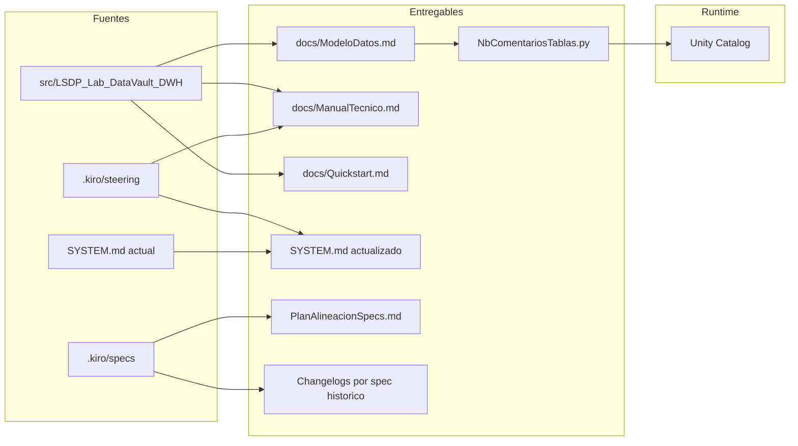
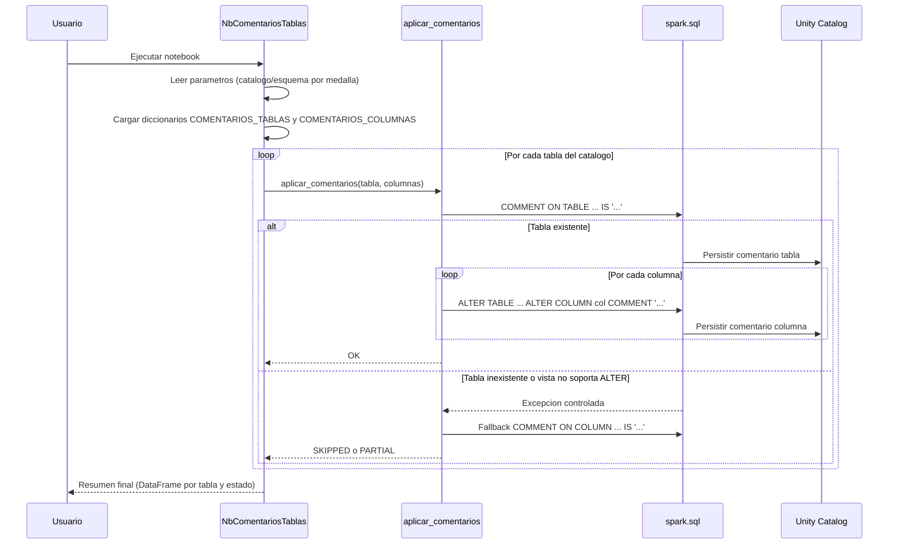
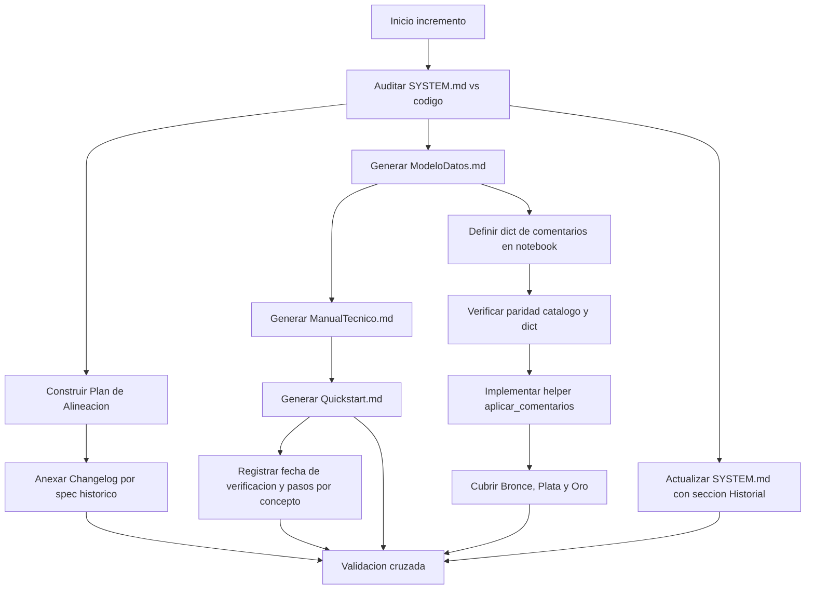
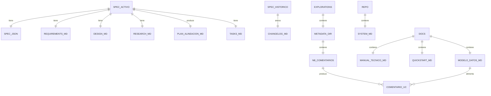

# Technical Design — `documentacion-consolidada-y-metadata`

## Overview

Este diseño formaliza la entrega de cuatro artefactos coordinados sobre el laboratorio LSDP Data Vault DWH: (1) revisión y consolidación de `SYSTEM.md`, (2) Plan de Alineación de specs históricos con changelog incremental, (3) tres documentos en `docs/` (`ModeloDatos.md`, `ManualTecnico.md`, `Quickstart.md`) y (4) un nuevo notebook `src/LSDP_Lab_DataVault_DWH/explorations/Metadata/NbComentariosTablas.py` que persiste comentarios en Unity Catalog.

**Users**: ingenieros de datos del repo (Manual Técnico), analistas y stakeholders (Modelo de Datos), nuevos usuarios (Quickstart) y administradores de Unity Catalog (notebook de comentarios).

**Impact**: el repo queda con una documentación coherente y trazable al código; Unity Catalog expone descripciones de negocio en cada tabla y columna del pipeline. **No se modifica** ningún notebook de `transformations/` ni el contrato del pipeline LSDP.

### Goals

- Single Source of Truth (`SYSTEM.md`) sin contradicciones con el código actual.
- Catálogo único de tablas/columnas que alimenta tanto la documentación humana como los comentarios persistidos en UC.
- Quickstart reproducible en Databricks Free Edition usando Git Folder en el workspace del usuario (sin "Repos").
- Notebook idempotente, tolerante a tablas inexistentes y conforme a Serverless.

### Non-Goals

- No se modifican notebooks productivos en `transformations/` ni `utilities/`.
- No se generan dashboards, alertas ni jobs adicionales de Databricks.
- No se introduce un parser Markdown ni un generador automático Mermaid → SQL.

## Architecture

### Existing Architecture Analysis

- Pipeline LSDP existente con tres medallas (Bronce/Plata/Oro) sobre Databricks Free Edition Serverless.
- Patrones consolidados en [.kiro/steering/tech.md](.kiro/steering/tech.md) y [.kiro/steering/structure.md](.kiro/steering/structure.md): AutoLoader en Bronce; Data Vault Raw Vault en Plata con estrategia mixta AUTO CDC SCD=1 vs `@dp.append_flow()`; Modelo Estrella en Oro con `Trx_ATM_Stream` (`@dp.table(temporary=True)`) y `Hec_Transacciones_ATM` (`@dp.materialized_view`).
- Specs históricos aprobados (`ready_for_implementation: true`) cuya integridad debe preservarse (ver Decisión "Plan de Alineación dentro del spec activo" en [research.md](.kiro/specs/documentacion-consolidada-y-metadata/research.md)).

### Architecture Pattern & Boundary Map

**Architecture Integration**:

- Selected pattern: **Documentación-as-code** con catálogo embebido (Markdown + dict Python sincronizados manualmente).
- Domain/feature boundaries:
  - **Capa Documental** (`docs/`, `SYSTEM.md`): solo lectura desde el código; sin efecto en runtime.
  - **Capa Spec** (`.kiro/specs/`): planeación y trazabilidad histórica; se modifica solo el spec activo y se anexan `CHANGELOG.md` a los históricos.
  - **Capa Metadata Runtime** (`src/.../explorations/Metadata/NbComentariosTablas.py`): único componente con efecto en Unity Catalog.
- Existing patterns preserved: `dbutils.widgets` para parámetros (único mecanismo en `NbComentariosTablas.py`, ya que se ejecuta fuera del motor LSDP); cero hard-coded; restricciones Serverless.
- New components rationale: el notebook de metadatos es el único componente "ejecutable" nuevo; el resto son documentos.
- Steering compliance: alineado a [.kiro/steering/product.md](.kiro/steering/product.md) (laboratorio reproducible), [.kiro/steering/tech.md](.kiro/steering/tech.md) (Serverless, ANSI Mode, hashing) y [.kiro/steering/structure.md](.kiro/steering/structure.md) (organización por medallas, `explorations/Metadata/` como nueva subcarpeta auxiliar).



### Technology Stack

| Layer | Choice / Version | Role in Feature | Notes |
|-------|------------------|-----------------|-------|
| Runtime | Databricks Free Edition Serverless | Ejecución de `NbComentariosTablas.py` | Restricciones: sin `cache`, sin RDD, sin UDFs, ANSI Mode on |
| Lenguaje | PySpark (Python 3.x del runtime) | Notebook de metadatos | Sin dependencias externas adicionales |
| API SQL | Spark SQL — `COMMENT ON`, `ALTER TABLE … ALTER COLUMN … COMMENT` | Persistir comentarios en UC | Idempotente por diseño |
| Catálogo | Unity Catalog | Almacén de comentarios sobre Streaming Tables, Materialized Views y Views | Catálogos/esquemas vienen de `dbutils.widgets` (notebook standalone) |
| Parámetros del pipeline LSDP | `spark.conf.get` (13 parámetros obligatorios) | Configuración de catálogos, esquemas, volumen y rutas | `pipeline.catalogo`, `pipeline.esquema`, `pipeline.volumen`, `pipeline.catalogo_plata`, `pipeline.esquema_plata`, `pipeline.catalogo_oro`, `pipeline.esquema_oro`, `pipeline.ruta_cmstfl`, `pipeline.ruta_trxpfl`, `pipeline.ruta_blncfl`, `pipeline.schema_location_cmstfl`, `pipeline.schema_location_trxpfl`, `pipeline.schema_location_blncfl` |
| Documentación | Markdown + Mermaid (renderer GitHub) | `docs/*.md`, `SYSTEM.md`, plan, changelogs | Diagramas pure Mermaid; nodos sin `@`, `()`, `[]` |
| Spec | `.kiro/specs/<feature>/` | Trazabilidad SDD | Idioma `es` según `spec.json` |

### Risk Control Alignment

| Riesgo | Control de diseño | Componentes | Validación |
|--------|-------------------|-------------|------------|
| R1 — Drift catálogo↔notebook | Sección fija de sincronización en `ModeloDatos.md`, nota visible en notebook y actualización conjunta en la misma PR | `ModeloDatosDoc`, `DiccionariosCatalogo`, `NbComentariosTablas` | Celda `assert set(COMENTARIOS_COLUMNAS.keys()) == tablas_modelo_datos` ejecutable antes de comentar + tarea de revisión en `tasks.md` |
| R2 — Mermaid no renderizable | Un `erDiagram` por medalla, `flowchart` macro separado y convención estricta de nombres de nodos | `ModeloDatosDoc`, `DesignDoc` | Render en visor GitHub y checklist documental |
| R3 — Quickstart obsoleto por cambios UI | Pasos por concepto, sin screenshots, con fecha ISO de última verificación | `QuickstartDoc` | Revisión de encabezado y consistencia con flujo actual de Databricks Free Edition |
| R4 — `COMMENT ON COLUMN` no soportado en MV/View | Fallback secuencial `ALTER TABLE` → `COMMENT ON COLUMN` → `SKIPPED` sin abortar | `AplicarComentariosHelper`, `NbComentariosTablas` | Prueba dirigida sobre objetos de Oro y revisión del resumen final por tabla |

## System Flows

### Flujo de ejecución del Notebook `NbComentariosTablas.py`



### Flujo documental (generación)



## Requirements Traceability

| Requirement | Summary | Components | Interfaces | Flows |
|-------------|---------|------------|------------|-------|
| 1.1 | SYSTEM.md como SoT sincronizado | SystemMdConsolidator | Sección actualizada | Flujo documental |
| 1.2 | Corrección de discrepancias con historial | SystemMdConsolidator + HistorialSection | `Historial de Cambios` | Flujo documental |
| 1.3 | Eliminar estrategias contradictorias | SystemMdConsolidator | — | Flujo documental |
| 1.4 | Preservar secciones obligatorias | SystemMdConsolidator | — | Flujo documental |
| 1.5 | Idioma español, palabras clave en inglés | SystemMdConsolidator | — | — |
| 1.6 | Sección Historial fechado ISO 8601 | HistorialSection | — | — |
| 2.1 | Plan cubre 4 specs históricos | PlanAlineacionDoc | `PlanAlineacionSpecs.md` | Flujo documental |
| 2.2 | Registrar divergencias estructuradas | PlanAlineacionDoc | Tabla de divergencias | — |
| 2.3 | Preservar specs originales | ChangelogPorSpec | `CHANGELOG.md` | — |
| 2.4 | Decisiones post-implementación | ChangelogPorSpec | — | — |
| 2.5 | Plan en spec activo | PlanAlineacionDoc | — | — |
| 2.6 | Mejoras OPT-001/B.1/B.2 explícitas | PlanAlineacionDoc | — | — |
| 3.1 | `docs/ModeloDatos.md` con 3 medallas | ModeloDatosDoc | Markdown | — |
| 3.2 | Catálogo por columna | ModeloDatosDoc → CatalogoColumnas | Tablas Markdown | — |
| 3.3 | ER por medalla | ModeloDatosDoc | Mermaid `erDiagram` x3 | — |
| 3.4 | Linaje macro | ModeloDatosDoc | Mermaid `flowchart` | Flujo documental |
| 3.5 | Tipo DV + patrón LSDP por entidad | ModeloDatosDoc | — | — |
| 3.6 | Granularidad/llaves Oro | ModeloDatosDoc | — | — |
| 3.7 | Catálogo técnico en español | ModeloDatosDoc | — | — |
| 4.1 | `docs/ManualTecnico.md` didáctico | ManualTecnicoDoc | Markdown | — |
| 4.2 | Auto CDC SCD=1 explicado | ManualTecnicoDoc | Sección "Estrategias de deduplicación" | — |
| 4.3 | `append_flow` + helpers explicados | ManualTecnicoDoc | Sección "Helpers de Plata" | — |
| 4.4 | ST/MV temporales explicadas | ManualTecnicoDoc | Sección "Tablas y vistas temporales" | — |
| 4.5 | Propiedades obligatorias | ManualTecnicoDoc | Tabla de propiedades por tipo | — |
| 4.6 | Restricciones Serverless/ANSI | ManualTecnicoDoc | — | — |
| 4.7 | Patrones de hash | ManualTecnicoDoc | — | — |
| 4.8 | Estilo explicativo | ManualTecnicoDoc | — | — |
| 5.1 | `docs/Quickstart.md` numerado | QuickstartDoc | Markdown | — |
| 5.2 | Git Folder en workspace dir (sin Repos) | QuickstartDoc | Sección "Carga del repo" | — |
| 5.3 | Paso 1: `NbConfiguracionInicial` | QuickstartDoc | — | — |
| 5.4 | Paso 2: `NbGenerarMaestroCliente` | QuickstartDoc | — | — |
| 5.5 | Paso 3: Saldos + Transaccional en paralelo | QuickstartDoc | — | — |
| 5.6 | Paso 4: Configuración LSDP | QuickstartDoc | — | — |
| 5.7 | Paso 5: Ejecutar LSDP + verificación | QuickstartDoc | — | — |
| 5.8 | Prerrequisitos | QuickstartDoc | — | — |
| 5.9 | Idioma y nivel de detalle | QuickstartDoc | — | — |
| 6.1 | Crear notebook en `explorations/Metadata` | NbComentariosTablas | Archivo Python notebook | — |
| 6.2 | Solo `spark.sql` de COMMENT/ALTER | AplicarComentariosHelper | `aplicar_comentarios(...)` | Flujo notebook |
| 6.3 | Cubrir Bronce/Plata/Oro | NbComentariosTablas + DiccionariosCatalogo | — | Flujo notebook |
| 6.4 | Parámetros vía widgets (notebook standalone) | NbComentariosTablas | `dbutils.widgets` exclusivamente — NO `spark.conf.get` | — |
| 6.5 | Comentarios estandarizados técnicos | DiccionariosCatalogo | dicts | — |
| 6.6 | Comentarios derivados de `ModeloDatos.md` | DiccionariosCatalogo | dicts | — |
| 6.7 | Tolerancia a tabla inexistente | AplicarComentariosHelper | `try/except` | Flujo notebook |
| 6.8 | Idempotente | AplicarComentariosHelper | — | — |
| 6.9 | Conforme a Serverless | NbComentariosTablas | — | — |
| 6.10 | Celdas por medalla | NbComentariosTablas | Estructura del notebook | — |
| 7.1 | Idioma español global | Todos los componentes documentales | — | — |
| 7.2 | Nombres validados contra código | Todos | — | — |
| 7.3 | Enlaces relativos | Todos | — | — |
| 7.4 | Dependencias declaradas | ModeloDatosDoc + NbComentariosTablas | Sección "Sincronización" | — |
| 7.5 | No contradicción con `tech.md` | Todos | — | — |
| 7.6 | Mermaid válido y legible | ModeloDatosDoc + DesignDoc | — | — |
| 7.7 | Encabezado estandarizado | Todos | — | — |

## Components and Interfaces

| Component | Domain/Layer | Intent | Req Coverage | Key Dependencies (P0/P1) | Contracts |
|-----------|--------------|--------|--------------|--------------------------|-----------|
| SystemMdConsolidator | Documentación | Auditar y reescribir `SYSTEM.md` alineado al código, con sección de historial | 1.1, 1.2, 1.3, 1.4, 1.5, 1.6 | `transformations/`+`utilities/` (P0), `.kiro/steering/` (P0) | Batch documental |
| PlanAlineacionDoc | Documentación-Spec | Generar `PlanAlineacionSpecs.md` con divergencias y mejoras post-impl | 2.1, 2.2, 2.5, 2.6 | Specs históricos (P0), Código (P0) | Batch documental |
| ChangelogPorSpec | Spec | Anexar `CHANGELOG.md` por spec histórico sin alterar artefactos originales | 2.3, 2.4 | Specs históricos (P0) | Batch documental |
| ModeloDatosDoc | Documentación | `docs/ModeloDatos.md` con catálogo por columna y diagramas ER + linaje | 3.1, 3.2, 3.3, 3.4, 3.5, 3.6, 3.7, 7.4 | `transformations/*.py` (P0), `utilities/` (P0) | Batch documental |
| ManualTecnicoDoc | Documentación | `docs/ManualTecnico.md` explicativo (Auto CDC, append_flow, ST/MV temporales, propiedades, restricciones, hashing) | 4.1–4.8 | `tech.md` (P0), Código (P0) | Batch documental |
| QuickstartDoc | Documentación | `docs/Quickstart.md` paso a paso (Git Folder en workspace, notebooks generadores, configuración LSDP, ejecución) | 5.1–5.9 | Notebooks de `explorations/GenerarParquets/` (P0), parámetros pipeline (P0) | Batch documental |
| NbComentariosTablas | Runtime metadata | Notebook que ejecuta comentarios en UC para Bronce/Plata/Oro de forma idempotente y tolerante | 6.1, 6.3, 6.4, 6.9, 6.10, 7.5 | UC (P0), parámetros pipeline (P0) | Batch / State |
| AplicarComentariosHelper | Runtime metadata | Función auxiliar que aplica COMMENT por tabla y por columna con manejo de excepciones | 6.2, 6.7, 6.8 | `spark.sql` (P0) | Service |
| DiccionariosCatalogo | Runtime metadata | Estructuras `COMENTARIOS_TABLAS` y `COMENTARIOS_COLUMNAS` con descripciones técnicas y de negocio | 6.5, 6.6, 7.4 | `ModeloDatos.md` (P0) | State (datos en memoria) |

### Documentación

#### SystemMdConsolidator

| Field | Detail |
|-------|--------|
| Intent | Producir `SYSTEM.md` consistente con el código y sumar sección de historial fechado |
| Requirements | 1.1, 1.2, 1.3, 1.4, 1.5, 1.6 |

**Responsibilities & Constraints**

- Recorrer secciones obligatorias del documento y validarlas contra el código real.
- No eliminar secciones declaradas como insumos de `/kiro-steering` y `/kiro-spec-init`.
- Preservar idioma español; mantener decoradores y APIs en inglés.

**Dependencies**

- Inbound: revisor humano (P0).
- Outbound: `SYSTEM.md` (P0).
- External: ninguno.

**Contracts**: Batch (proceso documental).

**Implementation Notes**

- Integration: cambios commiteados en una sola PR; sección "Historial de Cambios" con `2026-05-01` y entradas por tema.
- Validation: lista de verificación contra `tech.md` y `structure.md`.
- Risks: drift futuro si nuevos notebooks no actualizan `SYSTEM.md`; mitigación: nota de mantenimiento al final.

#### PlanAlineacionDoc

| Field | Detail |
|-------|--------|
| Intent | Documento navegable con divergencias spec↔código y mejoras post-impl (OPT-001, B.1/B.2) |
| Requirements | 2.1, 2.2, 2.5, 2.6 |

**Responsibilities & Constraints**

- Tabla por spec histórico con columnas: `Archivo`, `Sección`, `Divergencia`, `Impacto`, `Acción`.
- Sección "Mejoras aplicadas no especificadas" enumerando OPT-001, correcciones B.1, B.2 y otros.
- Ruta: `.kiro/specs/documentacion-consolidada-y-metadata/PlanAlineacionSpecs.md`.

**Dependencies**

- Inbound: revisor humano (P0).
- Outbound: `PlanAlineacionSpecs.md` (P0).

**Contracts**: Batch.

**Implementation Notes**

- Integration: enlazar desde `requirements.md` y `design.md` del spec activo.
- Validation: revisar que cada spec histórico tenga al menos una entrada o "Sin divergencias detectadas".

#### ChangelogPorSpec

| Field | Detail |
|-------|--------|
| Intent | Anexar `CHANGELOG.md` por spec histórico, preservando intactos `requirements.md`, `design.md`, `tasks.md` |
| Requirements | 2.3, 2.4 |

**Responsibilities & Constraints**

- Crear archivo nuevo, nunca modificar artefactos existentes.
- Entradas con fecha ISO 8601 y referencia al `PlanAlineacionSpecs.md`.

**Contracts**: Batch.

**Implementation Notes**

- Integration: cuatro archivos (uno por spec histórico) más una nota cruzada al plan.
- Risks: olvido de actualizar el changelog en próximas alineaciones; mitigado con entrada plantilla.

#### ModeloDatosDoc

| Field | Detail |
|-------|--------|
| Intent | Catálogo exhaustivo por columna + diagramas ER por medalla + linaje macro |
| Requirements | 3.1–3.7, 7.4 |

**Responsibilities & Constraints**

- Una sub-sección por medalla. Cada tabla con su catálogo: `Columna | Tipo | Descripción | Origen | Llave/Hash`.
- Identificación de tipo DV (Hub/Link/Sat) y patrón LSDP por entidad.
- 3 diagramas Mermaid `erDiagram` (uno por medalla) + 1 `flowchart` macro (linaje).
- Sección "Sincronización con `NbComentariosTablas.py`" que documenta la dependencia bidireccional con el dict del notebook (Req 7.4).

**Contracts**: Batch documental.

**Implementation Notes**

- Integration: enlaces relativos a notebooks; nombres exactos según `transformations/*.py`.
- Validation: nombres de columnas comprobados con `grep` sobre el código; cada medalla debe tener su propio `erDiagram` y el linaje macro debe quedar en un `flowchart` separado para evitar sobrecarga de render.
- Risks: divergencia futura si se añaden columnas; mitigado con nota de mantenimiento, sección fija "Sincronización con `NbComentariosTablas.py`" y revisión manual de paridad catálogo↔dict antes de cerrar la PR.

#### ManualTecnicoDoc

| Field | Detail |
|-------|--------|
| Intent | Manual didáctico explicando el "porqué" técnico del comportamiento del LSDP |
| Requirements | 4.1–4.8 |

**Responsibilities & Constraints**

- Secciones obligatorias:
  1. Visión y arquitectura.
  2. Estrategias de deduplicación: Auto CDC SCD=1 vs `@dp.append_flow()`.
  3. Helpers de Plata (`procesar_hub`, `procesar_link`, `procesar_satellite`, `procesar_satellite_transaccional`) con criterios de selección.
  4. Streaming Tables y Materialized Views temporales (justificación, efecto en UC, dónde se usan).
  5. Propiedades obligatorias por tipo de tabla (tabla resumen).
  6. Restricciones de Serverless y reglas ANSI Mode.
  7. Patrones de hash (SHA2-256 / SHA2-512, separador `|`).
  8. Decisiones de Oro (cost model `NUM_JOINS_THRESHOLD_EXCEEDED`, `CHANGESET_SIZE_THRESHOLD_EXCEEDED`, `delta.targetFileSize=16mb`).
- Estilo explicativo, ejemplos extraídos del código real.

**Contracts**: Batch documental.

**Implementation Notes**

- Integration: enlazar a `ModeloDatos.md` y `NbComentariosTablas.py`.
- Validation: revisión de que ningún ejemplo viole `tech.md`.
- Risks: longitud excesiva; mitigado con índice navegable y subdivisiones por medalla.

#### QuickstartDoc

| Field | Detail |
|-------|--------|
| Intent | Guía paso a paso para clonar, configurar y ejecutar el laboratorio en Free Edition |
| Requirements | 5.1–5.9 |

**Responsibilities & Constraints**

- Estructura: `Prerrequisitos` → `Carga del repositorio (Git Folder en workspace dir)` → `Paso 1 NbConfiguracionInicial` → `Paso 2 NbGenerarMaestroCliente` → `Paso 3 NbGenerarSaldosCliente + NbGenerarTransaccionalCliente (paralelo)` → `Paso 4 Configuración LSDP` → `Paso 5 Ejecución LSDP y verificación`.
- Prohibido mencionar la sección "Repos" (obsoleta).
- Cada notebook documentado con tabla de parámetros: `Widget | Tipo | Default | Descripción | Cuándo cambiar`.
- El encabezado de `Quickstart.md` debe incluir `Última verificación: <ISO 8601>` y una nota explícita de que los pasos se describen por concepto estable, no por capturas de UI.
- Se prohíben screenshots y referencias frágiles a menús que puedan cambiar; la guía debe describir acciones conceptuales dentro del workspace del usuario.

**Contracts**: Batch documental.

**Implementation Notes**

- Integration: enlazar a `Quickstart.md` desde `README.md` (verificación de enlace en spec activo).
- Validation: la lista de parámetros del LSDP debe coincidir con `tech.md` (`pipeline.catalogo`, `pipeline.esquema`, etc.) y el encabezado debe reflejar fecha de verificación vigente.

### Runtime Metadata

#### NbComentariosTablas

| Field | Detail |
|-------|--------|
| Intent | Notebook que persiste comentarios de tabla y columna en Unity Catalog para todas las medallas |
| Requirements | 6.1, 6.3, 6.4, 6.9, 6.10, 7.5 |

**Responsibilities & Constraints**

- Ruta: `src/LSDP_Lab_DataVault_DWH/explorations/Metadata/NbComentariosTablas.py`.
- Compatibilidad estricta con Serverless: cero `cache`, RDD, UDFs, threading, `spark.sparkContext`.
- La primera celda Markdown debe incluir una nota visible: "Si cambia el catálogo de `docs/ModeloDatos.md`, este notebook debe actualizarse en la misma PR".
- Estructura de celdas:
  1. Markdown: portada (título, fecha, referencia a spec).
  2. Python: imports + lectura de parámetros exclusivamente vía `dbutils.widgets.get(...)` (este notebook se ejecuta fuera del motor LSDP — `spark.conf.get("pipeline.*")` no está disponible en contexto standalone; usar `spark.conf.get` aquí causa `SparkException` inmediata).
  3. Python: definición de `COMENTARIOS_TABLAS` y `COMENTARIOS_COLUMNAS`.
  4. Python: definición de helper `aplicar_comentarios(catalogo, esquema, tabla, columnas, comentario_tabla)`.
  5. Markdown: "Bronce" + Python aplicando `CMSTFL`, `TRXPFL`, `BLNCFL`.
  6. Markdown: "Plata" + Python aplicando Hubs, Links y Sats (orden lógico).
  7. Markdown: "Oro" + Python aplicando Dimensiones, `Map_Cliente_Operacion_Dominante`, `Trx_ATM_Enriquecida` (si materializado), `Hec_Transacciones_ATM` y vista CDF.
  8. Python: resumen final como `DataFrame` desplegable (creado vía `spark.createDataFrame`).

**Dependencies**

- Inbound: ejecución manual o vía Job en Free Edition.
- Outbound: Unity Catalog (P0).

**Contracts**: Batch / State.

##### Service Interface (helper)

```python
def aplicar_comentarios(
    catalogo: str,
    esquema: str,
    tabla: str,
    columnas: dict[str, str],
    comentario_tabla: str,
) -> dict[str, str]:
    """Aplica COMMENT a una tabla/vista y a sus columnas.

    Returns: dict con claves "tabla" y "columnas" cuyos valores son
    "OK" | "SKIPPED" | mensaje de error truncado.
    """
```

- Preconditions: `catalogo`, `esquema`, `tabla` no vacíos; `columnas` puede estar vacío.
- Postconditions: estado en UC con comentarios aplicados, o ningún cambio si la tabla no existe.
- Invariants: ejecuciones repetidas son idempotentes y no producen excepciones no controladas.

##### Batch / Job Contract

- Trigger: ejecución manual (post `LSDP run`) o por Job programado.
- Input / validation: parámetros obtenidos de `dbutils.widgets` (6 widgets: `catalogo`, `esquema`, `catalogo_plata`, `esquema_plata`, `catalogo_oro`, `esquema_oro`); cada widget tiene valor por defecto vacío y se valida no-vacío antes de ejecutar comentarios. **No se usa `spark.conf.get`**.
- Output / destination: Unity Catalog — comentarios sobre tabla y columnas; STDOUT con resumen.
- Idempotency & recovery: rejecutable; falla parcial registra warning y continúa.

##### State Management

- State model: solo metadatos en UC (no datos).
- Persistence & consistency: `COMMENT ON`/`ALTER COLUMN COMMENT` sustituyen el valor previo (write-through).
- Concurrency strategy: si dos ejecuciones concurrentes ocurren, gana la última (last-write-wins, aceptable para metadatos).

**Implementation Notes**

- Integration: comentarios derivados del catálogo en `docs/ModeloDatos.md`; modificación coordinada en PR.
- Validation: prueba manual sobre catálogo de prueba antes de aplicar a producción del laboratorio; verificación explícita de paridad entre `ModeloDatos.md` y los dicts `COMENTARIOS_*`.
- Risks: divergencia con `ModeloDatos.md` (R1) — mitigado con tarea de paridad, nota cruzada en la primera celda y actualización conjunta obligatoria en la misma PR.

#### AplicarComentariosHelper

| Field | Detail |
|-------|--------|
| Intent | Encapsular `try/except` por tabla y por columna para tolerar tablas faltantes y producir log estructurado |
| Requirements | 6.2, 6.7, 6.8 |

**Responsibilities & Constraints**

- Una sola función pública (`aplicar_comentarios`) y una privada `_escapar_literal_sql(texto)` que evita inyección al construir literales con `'` (defensa en profundidad).
- No usa f-strings con texto sin escapar para construir SQL — usa `' '` con apóstrofo escapado (`''`).
- Para Materialized Views o Views, la secuencia obligatoria es: `ALTER TABLE … ALTER COLUMN … COMMENT`; si falla por tipo de objeto, fallback con `COMMENT ON COLUMN <fqdn>.<col> IS '<texto>'`; si ambos fallan, registrar `SKIPPED` y continuar sin abortar el notebook.

**Contracts**: Service (función Python).

**Implementation Notes**

- Validation: tests informales en celda final ejecutando `aplicar_comentarios` con catálogo/esquema/tabla inexistentes y verificando `SKIPPED`, más una prueba dirigida sobre un objeto de Oro que fuerce el fallback `COMMENT ON COLUMN`.
- Risks: SQL injection en comentarios — mitigado por escape de literal y por que el contenido proviene del propio repo (no de fuente externa).

#### DiccionariosCatalogo

| Field | Detail |
|-------|--------|
| Intent | Almacenar pares `tabla → comentario` y `(tabla, columna) → comentario`; estandarizar columnas técnicas DV |
| Requirements | 6.5, 6.6, 7.4 |

**Responsibilities & Constraints**

- `COMENTARIOS_TABLAS: dict[str, str]`: clave `nombre_tabla_simple` (ej. `"Hub_Cliente"`); valor descripción.
- `COMENTARIOS_COLUMNAS: dict[str, dict[str, str]]`: por tabla, sub-dict columna→comentario.
- Constantes para columnas técnicas: `COMENTARIO_HASH_HUB`, `COMENTARIO_HASH_LINK`, `COMENTARIO_FECHA_REGISTRO`, `COMENTARIO_FUENTE_DATOS`, `COMENTARIO_HASH_DIFERENCIADOR` (reutilizadas en cada Hub/Link/Sat).

**Contracts**: State (datos en memoria).

**Implementation Notes**

- Integration: estructura espejo del catálogo de `docs/ModeloDatos.md`.
- Validation:
  - Nota visible en cabecera del notebook recordando actualizar ambos artefactos y organización del dict con la misma segmentación por medalla que `ModeloDatos.md` para facilitar la revisión de paridad.
  - La celda de paridad (última celda Python antes del resumen final) debe incluir un `assert` que compare `set(COMENTARIOS_COLUMNAS.keys())` con el set de tablas documentadas en `ModeloDatos.md`. Si los sets difieren, la celda lanza `AssertionError` con el detalle de las tablas faltantes o sobrantes, permitiendo detectar drift antes de ejecutar los comentarios. Este `assert` es la implementación del Test 4 definido en Testing Strategy.

## Data Models

### Domain Model

El feature no introduce nuevas entidades de negocio. Reutiliza las del pipeline existente, documentándolas:

- **Bronce**: `CMSTFL` (Maestro Cliente), `TRXPFL` (Transaccional), `BLNCFL` (Saldos).
- **Plata (Data Vault Raw Vault)**:
  - Hubs: `Hub_Cliente`, `Hub_Operacion`, `Hub_Transaccion`.
  - Links: `Link_Cliente_Operacion`, `Link_Cliente_Transaccion`.
  - Satellites: `Sat_Cliente_*`, `Sat_Operacion_*`, `Sat_Transaccion_*` (los exactos por catálogo se enumeran en `ModeloDatos.md`).
  - Vista CDF: `LSDPPlataVistaTRXPFLCDF`.
- **Oro (Modelo Estrella)**: `Dim_Cliente`, `Dim_Operacion`, `Dim_Tiempo`, `Map_Cliente_Operacion_Dominante`, `Trx_ATM_Enriquecida` (`@dp.table(temporary=True)`), `Hec_Transacciones_ATM` (`@dp.materialized_view`).

### Logical Data Model (artefactos del feature)



### Physical Data Model

No aplica (feature documental + metadatos sobre tablas existentes). El único efecto físico es la actualización del campo `comment` en las definiciones de tabla y columna en Unity Catalog.

### Data Contracts & Integration

- **Contrato `COMMENT` Spark SQL**:
  - `COMMENT ON TABLE <catalogo>.<esquema>.<tabla> IS '<texto>'`.
  - `ALTER TABLE <catalogo>.<esquema>.<tabla> ALTER COLUMN <columna> COMMENT '<texto>'`.
  - Para Materialized Views/Views, fallback a `COMMENT ON COLUMN <catalogo>.<esquema>.<vista>.<columna> IS '<texto>'` cuando `ALTER TABLE` no aplica.
- **Esquema de log de ejecución del notebook** (DataFrame final):
  - `medalla: string`, `tabla: string`, `estado_tabla: string`, `columnas_ok: int`, `columnas_skipped: int`, `mensaje: string`.

## Error Handling

### Error Strategy

- **Documentación**: errores se manejan en revisión humana (PR review). Validación textual: verificación cruzada nombre/columna ↔ código.
- **Notebook `NbComentariosTablas.py`**: estrategia "best-effort por tabla". Cada `aplicar_comentarios` aísla excepciones y aplica fallback obligatorio `ALTER TABLE` → `COMMENT ON COLUMN` antes de marcar `SKIPPED`.

### Error Categories and Responses

- **Tabla inexistente** (`AnalysisException` / `TABLE_OR_VIEW_NOT_FOUND`): registrar warning con nombre cualificado, continuar; estado `SKIPPED`.
- **Columna inexistente** (`COLUMN_NOT_FOUND`): warning a nivel columna; estado `SKIPPED` para esa columna; otras columnas y tablas continúan.
- **Permiso insuficiente** (`PERMISSION_DENIED`): warning explicando falta de privilegio `MODIFY`/`OWNER`; no abortar ejecución completa.
- **Vista no soporta `ALTER COLUMN`**: capturar y reintentar con `COMMENT ON COLUMN`; si también falla, marcar columna como `SKIPPED`.
- **SQL inválido** por carácter no escapado en literal: prevenido por `_escapar_literal_sql`; si aún así ocurre, se registra como error y se continúa.
- **Errores documentales (Markdown)**: revisor humano; validación de Mermaid en visor GitHub.

### Monitoring

- Resumen final del notebook como `DataFrame` desplegable en pantalla (no requiere job logging especial).
- Para revisores de documentación: checklist en `tasks.md`.

## Testing Strategy

### Validación documental

1. **Verificación cruzada nombres**: cada nombre de tabla/columna citado en `docs/*.md` y `SYSTEM.md` debe existir mediante `grep` sobre `src/`.
2. **Validación Mermaid**: todos los diagramas deben renderizar en visor estándar de GitHub (sin paréntesis, sin `@`).
3. **Conformidad lingüística**: contenido en español; claves EARS y APIs en inglés.
4. **Coherencia con `tech.md`**: ningún ejemplo del Manual Técnico debe contradecir restricciones Serverless/ANSI.
5. **Paridad catálogo↔notebook**: cada par `(tabla, columna)` documentado en `ModeloDatos.md` debe estar presente en `COMENTARIOS_TABLAS`/`COMENTARIOS_COLUMNAS` o quedar justificado como exclusión explícita.
6. **Vigencia Quickstart**: `Quickstart.md` debe exponer `Última verificación` en formato ISO 8601 y no incluir screenshots ni referencias a "Repos".

### Validación del notebook (`NbComentariosTablas.py`)

1. **Test 1 — Idempotencia**: ejecutar dos veces consecutivas; los comentarios resultantes son idénticos y no hay excepciones.
2. **Test 2 — Tabla inexistente**: ejecutar antes de correr el LSDP; el notebook produce `SKIPPED` para todas las tablas y termina con código 0.
3. **Test 3 — Cobertura**: verificar que el set de tablas comentadas coincide con la unión de las definiciones en `transformations/*.py` (tarea de revisión humana).
4. **Test 4 — Paridad catálogo↔dict**: comparar (manualmente) los pares `(tabla, columna)` entre `docs/ModeloDatos.md` y los dicts del notebook.
5. **Test 5 — Fallback sobre MV/View**: validar al menos un objeto de Oro donde `ALTER TABLE … ALTER COLUMN … COMMENT` no sea aplicable y confirmar que el notebook reintenta con `COMMENT ON COLUMN` sin abortar.
6. **Test 6 — Conformidad Serverless**: revisión `grep` en el notebook para descartar uso de `cache`, `persist`, `sparkContext`, `rdd`, `parallelize`, `mapPartitions`, `udf`.

## Security Considerations

- **SQL Injection**: el notebook construye sentencias SQL dinámicamente. Aunque las fuentes son archivos del propio repo (no input externo), se aplica `_escapar_literal_sql` (duplicar `'` → `''`) como defensa en profundidad.
- **Permisos en UC**: ejecutar el notebook requiere `MODIFY`/`OWNER` sobre las tablas afectadas; documentar este requisito en el encabezado del notebook y en `Quickstart.md` (sección Prerrequisitos).
- **Datos sensibles**: ningún comentario incluye datos personales ni secretos; describe estructura, no contenido. No hay riesgo de fuga.

## Performance & Scalability

- El notebook ejecuta entre ~20 y ~40 sentencias `COMMENT ON TABLE` y unas pocas centenas de `ALTER COLUMN`. Tiempo de ejecución esperado: bajo (segundos a 1–2 minutos en Free Edition Serverless).
- No hay carga sobre Spark workers; `spark.sql` con DDL son operaciones de catálogo.
- No requiere optimizaciones especiales.

## Migration Strategy

No aplica migración de datos. La introducción del directorio `src/LSDP_Lab_DataVault_DWH/explorations/Metadata/` es aditiva y no rompe la estructura existente. La actualización de `SYSTEM.md` y los documentos de `docs/` son cambios documentales aprobados vía PR.
