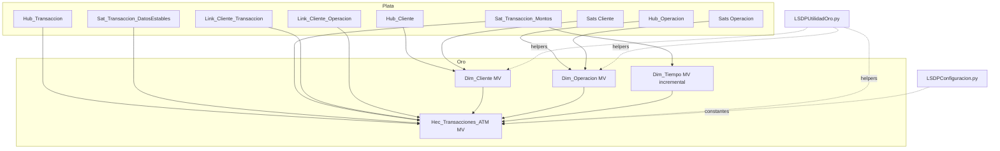
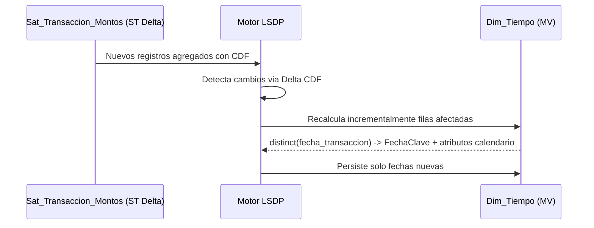
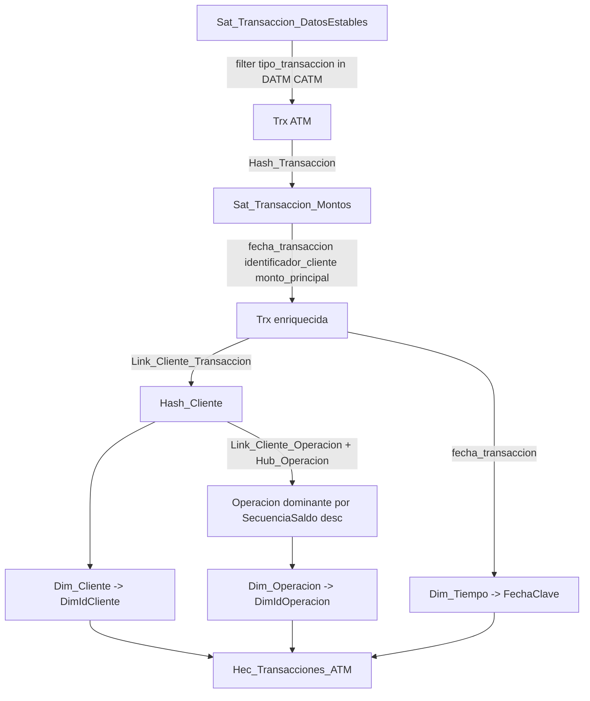
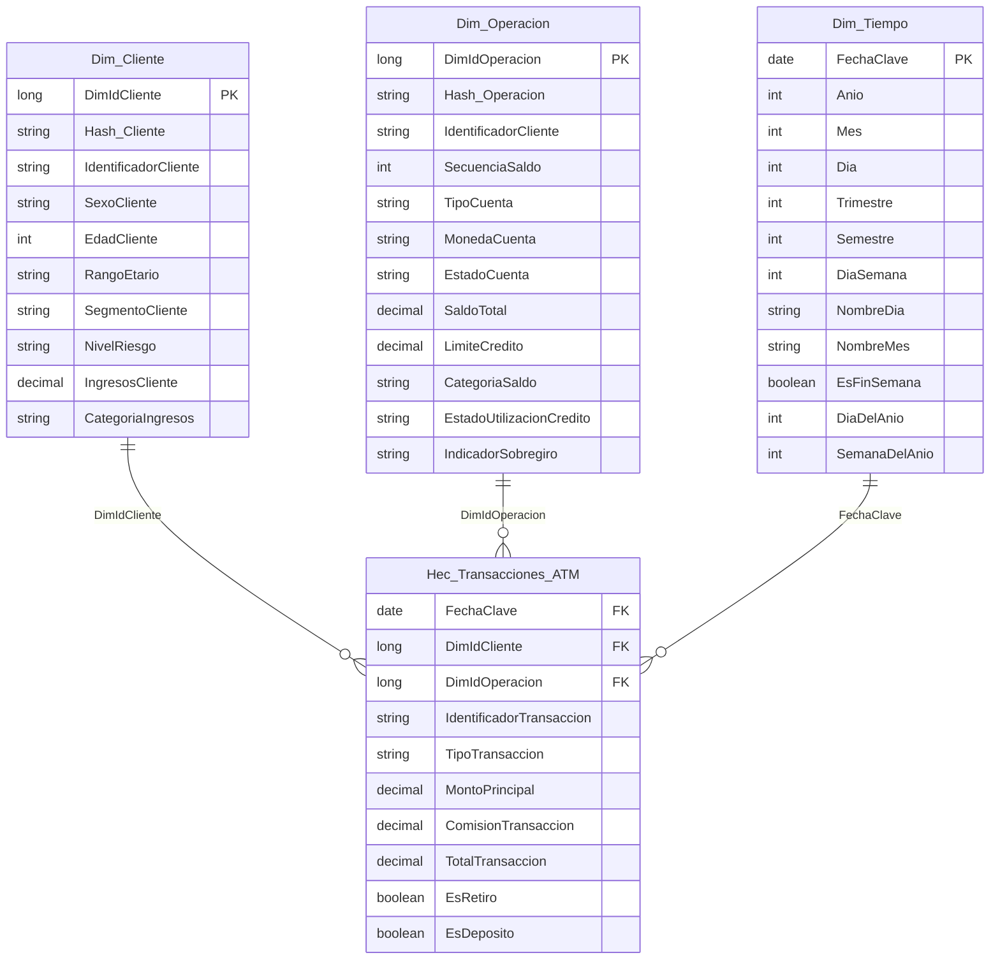
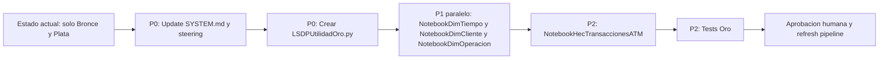

# Design Document — oro-modelo-estrella-mv-tiempo

## Overview

Esta feature construye la **Medalla de Oro** del laboratorio LSDP como un **modelo estrella Kimball Tipo 1** que consume el Data Vault 2.0 ya disponible en la Medalla de Plata. El cambio arquitectónico clave es que `Dim_Tiempo` deja de ser una Streaming Table acumulativa y pasa a ser una **Vista Materializada con refresh incremental** alimentada exclusivamente por los valores distintos de `Sat_Transaccion_Montos.fecha_transaccion`.

La feature entrega tres dimensiones (`Dim_Cliente`, `Dim_Operacion`, `Dim_Tiempo`) y una tabla de hechos (`Hec_Transacciones_ATM`), cada una declarada como Materialized View dentro del mismo pipeline LSDP que ya orquesta Bronce y Plata. El consumo final son consultas analíticas BI sobre transacciones ATM (DATM/CATM) integradas con el cliente vigente, la operación dominante por cliente y la fecha calendario derivada.

**Impact**: cambia la arquitectura previa de `Dim_Tiempo` (ST + AppendFlow con `spark.range`/`current_date`) por MV incremental sin lógica imperativa de fechas; introduce el módulo `LSDPUtilidadOro.py` como nuevo punto de extensión; obliga a actualizar `SYSTEM.md` y la documentación de steering.

### Goals
- Exponer `Dim_Tiempo` como MV con refresh incremental nativo de LSDP, elegible por usar exclusivamente operadores soportados.
- Exponer `Dim_Cliente` y `Dim_Operacion` como MV Tipo 1 con `DimId` estable y atributos vigentes.
- Exponer `Hec_Transacciones_ATM` filtrada por `tipo_transaccion ∈ {DATM, CATM}` con FKs resueltas a las tres dimensiones.
- Mantener 100% compatibilidad con Databricks Free Edition Serverless y con las restricciones LSDP ya documentadas en `tech.md`.
- Actualizar `SYSTEM.md` y artefactos de documentación que describen `Dim_Tiempo` con la arquitectura previa.

### Non-Goals
- No se implementa SCD Tipo 2 ni historiado de dimensiones.
- No se modifican Bronce ni Plata; el diseño solo lee desde Plata.
- No se construyen otros hechos (POS, transferencias, saldos) — solo `Hec_Transacciones_ATM`.
- No se cambia el formato de almacenamiento, el catálogo ni los parámetros del pipeline existentes.
- No se reemplazan helpers de `LSDPUtilidadPrincipal.py` ni se redefine la API actual de `LSDPConfiguracion.py`.

## Architecture

### Existing Architecture Analysis
- **Pattern actual**: Arquitectura Medallón (Bronce → Plata) sobre LSDP en Databricks Free Edition Serverless. Bronce con `@dp.table()` AutoLoader; Plata con `dp.create_streaming_table()` + `@dp.append_flow()` para Hubs, Links y Satellites.
- **Restricciones que se preservan**: prohibiciones Serverless (sin RDD, UDF, `.cache()`, `sparkContext`, threading); ANSI mode siempre habilitado; nombre de 3 partes en `name=` de cada decorador; parámetros del pipeline obtenidos vía `obtener_configuracion(spark)`; constantes en `LSDPConfiguracion.py`.
- **Integration points**: la Medalla de Oro lee del catálogo/esquema de Plata (`pipeline.catalogo_plata` / `pipeline.esquema_plata`) y escribe al catálogo/esquema de Oro (`pipeline.catalogo_oro` / `pipeline.esquema_oro`), ambos ya parametrizados.
- **Technical debt addressed**: la definición previa de `Dim_Tiempo` (ST + AppendFlow + `current_date()`) era no determinística e introducía lógica imperativa de fechas; la nueva MV elimina esa fricción.

### Architecture Pattern & Boundary Map



**Architecture Integration**:
- **Selected pattern**: Star Schema Kimball Tipo 1 sobre Materialized Views LSDP. Justificación: encaja con R3/R4 (Tipo 1) y aprovecha refresh declarativo de LSDP.
- **Domain/feature boundaries**: Oro es una capa de lectura sobre Plata; nunca escribe a Plata. La utilidad `LSDPUtilidadOro.py` aísla la lógica dimensional de la lógica Data Vault.
- **Existing patterns preserved**: `obtener_configuracion(spark)`; `reordenar_columnas_lc`; constantes `TIPO_DATM/TIPO_CATM`; nombre de 3 partes en `name=`.
- **New components rationale**: `LSDPUtilidadOro.py` (Single Responsibility — helpers Tipo 1); cuatro notebooks `LSDPOro*` (uno por entidad de Oro, alineado con el patrón "un notebook por unidad funcional").
- **Steering compliance**: cumple `tech.md` (LSDP, Serverless, hashing, ANSI), `structure.md` (ubicación y naming), y obliga a actualizar `product.md`/`SYSTEM.md` por el cambio arquitectónico de `Dim_Tiempo`.

### Technology Stack

| Layer | Choice / Version | Role in Feature | Notes |
|-------|------------------|-----------------|-------|
| Frontend / CLI | n/a | — | No aplica |
| Backend / Services | LSDP (PySpark `from pyspark import pipelines as dp`) | Declaración y ejecución de MVs Oro | Reutiliza runtime de Bronce/Plata |
| Data / Storage | Delta Lake en Unity Catalog (`pipeline.catalogo_oro.pipeline.esquema_oro`) | Persistencia de las 4 MVs de Oro | Liquid Clustering por `DimId*`/`FechaClave` |
| Messaging / Events | n/a | — | Pipeline batch declarativo |
| Infrastructure / Runtime | Databricks Free Edition Serverless Compute | Cómputo del pipeline LSDP | Mismas restricciones que Bronce/Plata |

> Detalles de elegibilidad de incremental refresh y de la política de `DimId` están en [research.md](research.md) (Topics 1, 3, 4).

## System Flows

### Refresh incremental de Dim_Tiempo



Decisiones clave: la MV usa `spark.read.table` (batch), `select`, `distinct`, `withColumn` con expresiones determinísticas y `when/otherwise`. No usa joins ni window functions (que romperían incremental refresh).

### Resolución de DimIdOperacion en Hec_Transacciones_ATM



Decisión clave: el filtro `tipo_transaccion ∈ {DATM, CATM}` se aplica antes de los joins para reducir el volumen procesado. La operación dominante por cliente se selecciona con `ROW_NUMBER() OVER (PARTITION BY Hash_Cliente ORDER BY SecuenciaSaldo DESC, Hash_Operacion ASC) = 1`.

## Requirements Traceability

| Requirement | Summary | Components | Interfaces | Flows |
|-------------|---------|------------|------------|-------|
| 1.1 | Reescribir `SYSTEM.md` Dim_Tiempo a MV incremental | DocumentationUpdate | n/a | n/a |
| 1.2 | Reescribir ejemplo de código LSDP en SYSTEM.md | DocumentationUpdate | n/a | n/a |
| 1.3 | Actualizar tabla compatibilidad Free Edition | DocumentationUpdate | n/a | n/a |
| 1.4 | Reescribir "Regla especial Dim_Tiempo" | DocumentationUpdate | n/a | n/a |
| 1.5 | Actualizar archivos en `.kiro/steering/` y `docs/` | DocumentationUpdate | n/a | n/a |
| 1.6 | Preservar atributos derivados de Dim_Tiempo | DocumentationUpdate, NotebookDimTiempo | Service `construir_dim_tiempo` | Refresh incremental Dim_Tiempo |
| 1.7 | Documentación aprobada antes del código Oro | DocumentationUpdate | n/a | n/a |
| 2.1 | `Dim_Tiempo` declarada como `@dp.materialized_view` con name 3 partes | NotebookDimTiempo | LSDP MV declaration | Refresh incremental |
| 2.2 | Construcción base de fechas vía `select.distinct` | NotebookDimTiempo | Service `construir_dim_tiempo` | Refresh incremental |
| 2.3 | Renombrar `fecha_transaccion` a `FechaClave` | NotebookDimTiempo | Service `construir_dim_tiempo` | Refresh incremental |
| 2.4 | Derivar atributos calendario con funciones determinísticas | NotebookDimTiempo | Service `construir_dim_tiempo` | Refresh incremental |
| 2.5 | Prohibición funciones no determinísticas | NotebookDimTiempo | Service `construir_dim_tiempo` | n/a |
| 2.6 | `cluster_by=["FechaClave"]` | NotebookDimTiempo | LSDP MV declaration | n/a |
| 2.7 | Operadores compatibles con incremental refresh | NotebookDimTiempo | Service `construir_dim_tiempo` | Refresh incremental |
| 2.8 | Refresh incremental al aparecer nuevas fechas | NotebookDimTiempo | LSDP MV declaration | Refresh incremental |
| 2.9 | Expectations FechaClave/Anio (warn)/Mes | NotebookDimTiempo | LSDP expectations | n/a |
| 3.1 | `Dim_Cliente` como MV | NotebookDimCliente | LSDP MV declaration | n/a |
| 3.2 | Último estado por `Hash_Cliente` con ROW_NUMBER | NotebookDimCliente, UtilOro `obtener_ultimo_por_hash` | Service contract | n/a |
| 3.3 | Asignar `DimIdCliente` estable | NotebookDimCliente, UtilOro `asignar_dim_id_estable` | Service contract | n/a |
| 3.4 | Atributos definidos en SYSTEM.md | NotebookDimCliente | Service `construir_dim_cliente` | n/a |
| 3.5 | `cluster_by=["DimIdCliente"]` | NotebookDimCliente | LSDP MV declaration | n/a |
| 3.6 | Expectations DimIdCliente/Hash_Cliente | NotebookDimCliente | LSDP expectations | n/a |
| 4.1 | `Dim_Operacion` como MV | NotebookDimOperacion | LSDP MV declaration | n/a |
| 4.2 | Último estado por `Hash_Operacion` | NotebookDimOperacion, UtilOro `obtener_ultimo_por_hash` | Service contract | n/a |
| 4.3 | Asignar `DimIdOperacion` estable | NotebookDimOperacion, UtilOro `asignar_dim_id_estable` | Service contract | n/a |
| 4.4 | Atributos definidos en SYSTEM.md | NotebookDimOperacion | Service `construir_dim_operacion` | n/a |
| 4.5 | `cluster_by=["DimIdOperacion"]` | NotebookDimOperacion | LSDP MV declaration | n/a |
| 4.6 | Expectations DimIdOperacion/Hash_Operacion | NotebookDimOperacion | LSDP expectations | n/a |
| 5.1 | `Hec_Transacciones_ATM` como MV (`@dp.materialized_view`); LSDP decide refresh incremental o full según elegibilidad de operadores | NotebookHecTransaccionesATM | LSDP MV declaration | Resolución de FK |
| 5.2 | Filtrar `tipo_transaccion ∈ {DATM, CATM}` | NotebookHecTransaccionesATM | Service `construir_hec_atm` | Resolución de FK |
| 5.3 | Integrar medidas y atributos del Sat transaccional con lectura directa (sin helper de último por hash) | NotebookHecTransaccionesATM | Service `construir_hec_atm` | Resolución de FK |
| 5.4 | `FechaClave` desde `Sat_Transaccion_Montos` | NotebookHecTransaccionesATM | Service `construir_hec_atm` | Resolución de FK |
| 5.5 | Resolver `DimIdCliente` vía Link_Cliente_Transaccion + Dim_Cliente | NotebookHecTransaccionesATM | Service `construir_hec_atm` | Resolución de FK |
| 5.6 | Resolver `DimIdOperacion` transitivamente | NotebookHecTransaccionesATM, UtilOro `seleccionar_operacion_dominante` | Service contract | Resolución de FK |
| 5.7 | Banderas `EsRetiro`/`EsDeposito` | NotebookHecTransaccionesATM | Service `construir_hec_atm` | n/a |
| 5.8 | `cluster_by=["FechaClave","DimIdCliente"]` | NotebookHecTransaccionesATM | LSDP MV declaration | n/a |
| 5.9 | Expectations FK y tipo | NotebookHecTransaccionesATM | LSDP expectations | n/a |
| 6.1 | Import `from pyspark import pipelines as dp` | All Oro notebooks | n/a | n/a |
| 6.2 | Sin RDD/UDF/cache/threading | All Oro notebooks, UtilOro | n/a | n/a |
| 6.3 | Solo funciones nativas de F | All Oro notebooks, UtilOro | n/a | n/a |
| 6.4 | `F.broadcast` para hints | NotebookHecTransaccionesATM | Service `construir_hec_atm` | n/a |
| 6.5 | Nombre 3 partes en `name=` | All Oro notebooks | LSDP MV declaration | n/a |
| 6.6 | Parámetros vía `obtener_configuracion` y constantes centralizadas | All Oro notebooks | n/a | n/a |
| 6.7 | Manejo correcto ANSI (cast long, concat_ws) | UtilOro, All Oro notebooks | n/a | n/a |
| 6.8 | Operadores soportados en Dim_Tiempo | NotebookDimTiempo | Service `construir_dim_tiempo` | Refresh incremental |
| 7.1 | Notebooks en `transformations/` con patrón `LSDPOro{Nombre}` | All Oro notebooks | n/a | n/a |
| 7.2 | Helpers en `utilities/LSDP{Nombre}.py` | UtilOro | n/a | n/a |
| 7.3 | Constantes desde `LSDPConfiguracion` | All Oro notebooks | n/a | n/a |
| 7.4 | Parámetros `pipeline.catalogo_oro`/`pipeline.esquema_oro` | All Oro notebooks | n/a | n/a |
| 7.5 | No propagar columnas de Bronce | All Oro notebooks | n/a | n/a |
| 7.6 | Campos calculados con `F.when().otherwise()` | NotebookDimCliente, NotebookDimOperacion, NotebookDimTiempo | n/a | n/a |
| 8.1 | `tests/test_notebooks_oro.py` con validación estructural | TestSuiteOro | n/a | n/a |
| 8.2 | Tests sobre `Dim_Tiempo` con fechas de prueba | TestSuiteOro | n/a | n/a |
| 8.3 | Tests sobre filtro DATM/CATM y banderas | TestSuiteOro | n/a | n/a |
| 8.4 | Estabilidad de `DimIdCliente`/`DimIdOperacion` | TestSuiteOro, `tests/test_utilidad_oro.py` | n/a | n/a |
| 8.5 | Test falla explícitamente si helper cambia comportamiento | TestSuiteOro, `tests/test_utilidad_oro.py` | n/a | n/a |

## Components and Interfaces

| Component | Domain/Layer | Intent | Req Coverage | Key Dependencies (P0/P1) | Contracts |
|-----------|--------------|--------|--------------|--------------------------|-----------|
| DocumentationUpdate | Docs | Reescribir `SYSTEM.md`, steering y docs/ para reflejar `Dim_Tiempo` MV incremental | 1.1, 1.2, 1.3, 1.4, 1.5, 1.6, 1.7 | `SYSTEM.md` (P0), `.kiro/steering/*.md` (P0), `docs/*.md` (P1) | State |
| LSDPUtilidadOro | Utilities | Helpers reutilizables de Oro (último por hash en Sats de **estado**, DimId estable, operación dominante, validación) | 3.2, 3.3, 4.2, 4.3, 5.6, 6.7, 8.4, 8.5 | `pyspark.sql.functions` (P0), `pyspark.sql.window` (P0) | Service |
| NotebookDimTiempo | Transformations Oro | MV incremental `Dim_Tiempo` desde `Sat_Transaccion_Montos.fecha_transaccion` | 2.1–2.9, 6.1, 6.5–6.8, 7.1, 7.3, 7.4, 7.6 | LSDP `dp` (P0), `LSDPConfiguracion` (P0) | Batch, State |
| NotebookDimCliente | Transformations Oro | MV `Dim_Cliente` Tipo 1 con DimId estable | 3.1–3.6, 6.1–6.7, 7.1, 7.3, 7.4, 7.6 | LSDP `dp` (P0), `LSDPUtilidadOro` (P0), `LSDPConfiguracion` (P1) | Batch, State |
| NotebookDimOperacion | Transformations Oro | MV `Dim_Operacion` Tipo 1 con DimId estable | 4.1–4.6, 6.1–6.7, 7.1, 7.3, 7.4, 7.6 | LSDP `dp` (P0), `LSDPUtilidadOro` (P0), `LSDPConfiguracion` (P1) | Batch, State |
| NotebookHecTransaccionesATM | Transformations Oro | MV `Hec_Transacciones_ATM` filtrada por DATM/CATM con FKs resueltas; todas las fuentes con `spark.read.table()`; sin `_marca_duplicado` | 5.1–5.9, 6.1–6.7, 7.1, 7.3, 7.4 | LSDP `dp` (P0), `LSDPUtilidadOro` (P0), `LSDPConfiguracion` (P0) | Batch, State |
| TestSuiteOro | Tests | Pruebas unitarias para notebooks Oro y `LSDPUtilidadOro` | 8.1–8.5 | `pytest` (P0), AST static parsing (P0), `LSDPUtilidadOro` (P0) | Service |

### Documentation Layer

#### DocumentationUpdate

| Field | Detail |
|-------|--------|
| Intent | Sincronizar `SYSTEM.md`, `.kiro/steering/*.md` y `docs/*.md` con la nueva arquitectura de `Dim_Tiempo` antes de implementar el código de Oro |
| Requirements | 1.1, 1.2, 1.3, 1.4, 1.5, 1.6, 1.7 |

**Responsibilities & Constraints**
- Localizar todas las menciones de `Dim_Tiempo` con la arquitectura previa (ST + AppendFlow + `current_date()`/`spark.range()`).
- Reemplazarlas con la nueva definición (MV incremental sobre `Sat_Transaccion_Montos.fecha_transaccion`).
- Preservar los atributos derivados (Anio, Mes, Trimestre, etc.).
- Tarea P0: debe completarse antes de cualquier código LSDP de Oro.

**Dependencies**
- Inbound: ninguno (es la primera tarea P0)
- Outbound: NotebookDimTiempo — proporciona la referencia textual y de código (Criticality P0)
- External: ninguno

**Contracts**: State (cambios documentales versionados)

##### State Management
- Estado consultado: `SYSTEM.md`, `.kiro/steering/product.md`, `.kiro/steering/tech.md`, `.kiro/steering/structure.md`, `docs/*.md` (si aplica al modelo).
- Persistencia: cambios commiteados al repositorio.
- Concurrencia: tarea secuencial; no hay paralelismo dentro de la actualización de docs.

**Implementation Notes**
- Integration: la actualización es prerrequisito formal de las tareas de transformación; verificable con `grep` de "create_streaming_table.*Dim_Tiempo" devolviendo cero matches.
- Validation: revisión humana en el flujo SDD; opcional `/kiro-validate-design`.
- Risks: olvidar referencias secundarias (mitigado con búsqueda regex `Dim_Tiempo` y `current_date|spark.range` en todo el repositorio).
- **Mitigación R-04 (aprobada)**: ejecutar las búsquedas regex (`Dim_Tiempo`, `current_date`, `spark.range`) **antes y después** de las ediciones; reportar cero coincidencias residuales como checkpoint obligatorio antes de habilitar las tareas P1.
- **Mitigación R-02 (aprobada)**: documentar explícitamente en la sección Oro/Hec_Transacciones_ATM de `SYSTEM.md` el supuesto "`DimIdOperacion` = operación dominante por cliente (`SecuenciaSaldo desc, Hash_Operacion asc`)" y aclarar que un identificador de operación a nivel de transacción queda fuera del alcance actual.
- **Mitigación R-03 (aprobada)**: añadir en `SYSTEM.md` (Oro) una nota sobre la propiedad de `DimIdCliente`/`DimIdOperacion` (estables solo para el mismo conjunto de hashes) y la regla de consumo BI "no referenciar valores literales de DimId".

### Utilities Layer

#### LSDPUtilidadOro

| Field | Detail |
|-------|--------|
| Intent | Aislar la lógica reutilizable de la Medalla de Oro (Tipo 1 sobre Sats de estado, DimId, operación dominante) en un módulo independiente |
| Requirements | 3.2, 3.3, 4.2, 4.3, 5.6, 6.7, 8.4, 8.5 |

**Responsibilities & Constraints**
- Exponer cuatro helpers puros, sin estado, deterministas, basados exclusivamente en `pyspark.sql.functions` y `pyspark.sql.window`.
- No usar `.cache()`, RDD, UDFs, threading, ni acceder a `spark.sparkContext`.
- Cumplir reglas ANSI: cast a `long` antes de `F.abs(F.hash())`, `F.concat_ws` para concatenación.
- Las funciones reciben `DataFrame` como primer argumento explícito (no asumen `spark` global).

**Dependencies**
- Inbound: NotebookDimCliente, NotebookDimOperacion, NotebookHecTransaccionesATM (Criticality P0)
- Outbound: ninguno
- External: `pyspark.sql.functions`, `pyspark.sql.window`, `pyspark.sql.DataFrame`, `pyspark.sql.Column` (Criticality P0)

**Contracts**: Service

##### Service Interface

```python
from pyspark.sql import DataFrame, Column

def obtener_ultimo_por_hash(
    df: DataFrame,
    hash_col: str,
    orden_col: str = "FechaRegistro",
) -> DataFrame:
    """Selecciona el último registro por `hash_col` ordenado por `orden_col` desc.

    Ámbito: **exclusivamente para Satellites de estado** (Cliente/Operación) que
    pueden contener múltiples versiones por hash. NO debe usarse con Satellites
    transaccionales (`Sat_Transaccion_*`), que son una fila por `Hash_Transaccion`
    por diseño (ver `procesar_satellite_transaccional`); en esos casos leer con
    `spark.read.table` y validar unicidad con expectations.

    Implementación: ROW_NUMBER() OVER (PARTITION BY hash_col ORDER BY orden_col DESC,
    Hash_Diferenciador DESC) = 1. Empata por Hash_Diferenciador para garantizar
    determinismo cuando hay múltiples registros con la misma FechaRegistro.
    """
    ...

def asignar_dim_id_estable(
    df: DataFrame,
    hash_col: str,
    id_col: str,
) -> DataFrame:
    """Asigna `id_col` (LongType) como `xxhash64(hash_col).cast("long")`.

    Implementación: `F.xxhash64(F.col(hash_col)).cast("long")`.
    Plenamente determinística por fila: el ID depende solo del valor del
    hash, **no del conjunto** del DataFrame. Por ello altas/bajas de otras
    entidades no reasignan IDs existentes (propiedad Tipo 1 fortalecida,
    mitigación R-03) y el operador no bloquea el refresh incremental por
    Enzyme (es una expresión escalar, no un Window global).
    """
    ...

def seleccionar_operacion_dominante(
    df_hub_operacion: DataFrame,
    df_link_cliente_operacion: DataFrame,
) -> DataFrame:
    """Devuelve la operación dominante por cliente (mayor SecuenciaSaldo desc, desempate Hash_Operacion asc).

    Returns: DataFrame[Hash_Cliente, Hash_Operacion] con UNA fila por Hash_Cliente.
    """
    ...

def validar_columnas_oro(
    df: DataFrame,
    columnas_requeridas: list[str],
    nombre_entidad: str,
) -> None:
    """Lanza ValueError si alguna columna requerida falta en `df`.

    Útil al final de cada construcción de MV para falla rápida y mensaje
    explícito en tests/CI antes de que LSDP intente registrar el esquema.
    """
    ...
```

- **Preconditions**: el caller pasa `DataFrame`s ya leídos; no se hace I/O dentro del módulo.
- **Postconditions**: las funciones devuelven nuevos `DataFrame`s sin modificar entradas; no se persiste nada.
- **Invariants**: ninguna función accede a `spark.sparkContext`, ejecuta acciones (`.collect()`/`.count()`) ni modifica configuración.

**Implementation Notes**
- Integration: cada notebook de Oro importa solo los helpers que necesita.
- Validation: tests unitarios con DataFrames sintéticos en `tests/test_utilidad_oro.py`; cobertura por función (8.4, 8.5).
- Risks: si en el futuro se requieren MVs Tipo 2, este módulo debe extenderse con un helper específico (no modificar la firma actual).

### Transformations Layer

#### NotebookDimTiempo (`LSDPOroDimTiempo.py`)

| Field | Detail |
|-------|--------|
| Intent | Declarar la MV `Dim_Tiempo` con refresh incremental sobre `Sat_Transaccion_Montos.fecha_transaccion` |
| Requirements | 2.1–2.9, 6.1, 6.5–6.8, 7.1, 7.3, 7.4, 7.6 |

**Responsibilities & Constraints**
- Lectura batch única: `spark.read.table(f"{catalogo_plata}.{esquema_plata}.Sat_Transaccion_Montos").select("fecha_transaccion").distinct()`.
- Renombrar `fecha_transaccion` → `FechaClave` (DateType).
- Derivar atributos calendario con `F.year`, `F.month`, `F.dayofmonth`, `F.quarter`, expresiones determinísticas con `when/otherwise` para `Semestre`/`EsFinSemana`/`NombreDia`/`NombreMes`, `F.dayofyear`, `F.weekofyear`.
- Configurar `cluster_by=["FechaClave"]`.
- Expectations `expect_all_or_fail` (severidad: aborta pipeline): `FechaClave IS NOT NULL`, `Mes BETWEEN 1 AND 12`.
- Expectation `expect` (severidad: warn — registra métrica, no aborta): `Anio BETWEEN 1900 AND 2100`. **Decisión**: degradado a warn para evitar abortar el pipeline ante datos atípicos en `fecha_transaccion`; un valor fuera de rango se monitorea, no rompe la cadena (consistente con la naturaleza Tipo 1 + refresh incremental autocontenido).
- Prohibido: `F.current_date()`, `F.current_timestamp()`, `F.now()`, `F.rand()`, UDFs, joins, window functions.

**Dependencies**
- Inbound: NotebookHecTransaccionesATM (consume `Dim_Tiempo`)
- Outbound: `Sat_Transaccion_Montos` en Plata (Criticality P0)
- External: `pyspark.pipelines`, `pyspark.sql.functions`, `LSDPConfiguracion.obtener_configuracion` (Criticality P0)

**Contracts**: Batch (LSDP MV declaration), State (Delta table en UC)

##### Batch / Job Contract
- **Trigger**: refresh del pipeline LSDP (incremental).
- **Input / validation**: `Sat_Transaccion_Montos.fecha_transaccion` no nulo; aceptar fechas históricas back-dated.
- **Output / destination**: `{catalogo_oro}.{esquema_oro}.Dim_Tiempo` con esquema:
  - `FechaClave: date NOT NULL` (PK)
  - `Anio: int`, `Mes: int`, `Dia: int`, `Trimestre: int`, `Semestre: int`
  - `DiaSemana: int` (1=Lun..7=Dom), `NombreDia: string`, `NombreMes: string`
  - `EsFinSemana: boolean`, `DiaDelAnio: int`, `SemanaDelAnio: int`
- **Idempotency & recovery**: idempotente; LSDP gestiona reintentos.

##### State Management
- State model: tabla Delta con CDF habilitable.
- Persistence & consistency: gestionada por LSDP/Delta; consistencia eventual con Plata.
- Concurrency strategy: única escritora (LSDP).

**Implementation Notes**
- Integration: lectura por nombre de 3 partes; escritura declarada con nombre de 3 partes.
- Validation: tests unitarios validan que para un set de fechas conocido se obtienen los atributos esperados (8.2).
- Risks: si LSDP marca la MV como no elegible para incremental, cae a refresh completo automáticamente — sin acción del autor.
- **Mitigación R-01 (aprobada)**: ante una restricción futura del operador `DISTINCT` para incremental refresh, no se introduce lógica defensiva (loops, `spark.range`, `current_date`) — la MV es pequeña y operará en refresh completo sin cambios de código.

#### NotebookDimCliente (`LSDPOroDimCliente.py`)

| Field | Detail |
|-------|--------|
| Intent | Construir MV `Dim_Cliente` Tipo 1 con atributos vigentes y `DimIdCliente` estable |
| Requirements | 3.1–3.6, 6.1–6.7, 7.1, 7.3, 7.4, 7.6 |

**Responsibilities & Constraints**
- Lectura batch: `Hub_Cliente`, `Sat_Cliente_DatosEstables`, `Sat_Cliente_Contacto`, `Sat_Cliente_Clasificacion`, `Sat_Cliente_Financiero`.
- Aplicar `obtener_ultimo_por_hash(sat, "Hash_Cliente")` por cada Sat antes de combinar.
- Inner join entre `Hub_Cliente` y los 4 Sats (último estado) por `Hash_Cliente`.
- Asignar `DimIdCliente = dense_rank() OVER (ORDER BY Hash_Cliente)` vía `asignar_dim_id_estable`.
- Renombrar columnas snake_case de Plata a PascalCase de Oro al `select` final (ej.: `sexo_cliente` → `SexoCliente`, `edad_cliente` → `EdadCliente`).
- Excluir columnas de Bronce (`año`, `mes`, `dia`, `FechaRegistroParquet`, `_rescued_data`) y metadata DV (`Hash_Diferenciador`, `FuenteDatos`).
- Configurar `cluster_by=["DimIdCliente"]`.
- Expectations `expect_all_or_fail`: `DimIdCliente IS NOT NULL`, `Hash_Cliente IS NOT NULL`.

**Dependencies**
- Inbound: NotebookHecTransaccionesATM
- Outbound: `Hub_Cliente`, `Sat_Cliente_DatosEstables`, `Sat_Cliente_Contacto`, `Sat_Cliente_Clasificacion`, `Sat_Cliente_Financiero` (Criticality P0)
- External: LSDP, `LSDPUtilidadOro` (Criticality P0)

**Contracts**: Batch, State

##### Batch / Job Contract
- **Trigger**: refresh del pipeline (full refresh por uso de window function).
- **Input / validation**: hashes no nulos.
- **Join base obligatorio**: `Hub_Cliente` aporta `Hash_Cliente` e `IdentificadorCliente` (llave de negocio — Hub de Plata almacena en PascalCase). Cada Satellite de estado se reduce a su última versión con `obtener_ultimo_por_hash` antes del join. El join contra el Hub es **LEFT JOIN** desde `Hub_Cliente` hacia los Sats reducidos para preservar clientes sin todas las columnas opcionales y evitar pérdidas por Sats faltantes.
- **Output / destination**: `{catalogo_oro}.{esquema_oro}.Dim_Cliente` — esquema cerrado siguiente. **Esta es la lista exhaustiva de columnas** (no extender en implementación sin revisar el diseño). Origen Plata = nombre real de la columna en la fuente (**Hubs: PascalCase**; Satellites: snake_case excepto campos calculados en PascalCase).

  | Columna Oro (PascalCase) | Tipo | Origen Plata | Fuente Plata | Notas |
  |--------------------------|------|--------------|--------------|-------|
  | `DimIdCliente` | long NOT NULL (PK) | — | — | Generado por `asignar_dim_id_estable` |
  | `Hash_Cliente` | string NOT NULL | `Hash_Cliente` | Hub_Cliente | Llave técnica DV |
  | `IdentificadorCliente` | string | `IdentificadorCliente` | Hub_Cliente | Llave de negocio (Hub: PascalCase — sin alias) |
  | `SexoCliente` | string | `sexo_cliente` | Sat_Cliente_DatosEstables | |
  | `EdadCliente` | int | `edad_cliente` | Sat_Cliente_DatosEstables | |
  | `FechaNacimiento` | date | `fecha_nacimiento` | Sat_Cliente_DatosEstables | |
  | `PaisResidencia` | string | `pais_residencia` | Sat_Cliente_DatosEstables | |
  | `RangoEtario` | string | `RangoEtario` | Sat_Cliente_DatosEstables | Calculado en Plata |
  | `CategoriaIngresos` | string | `CategoriaIngresos` | Sat_Cliente_DatosEstables | Calculado en Plata |
  | `NombreCompletoCliente` | string | `nombre_completo_cliente` | Sat_Cliente_Contacto | |
  | `CorreoElectronico` | string | `correo_electronico` | Sat_Cliente_Contacto | |
  | `TelefonoPrincipal` | string | `telefono_principal` | Sat_Cliente_Contacto | |
  | `CiudadResidencia` | string | `ciudad_residencia` | Sat_Cliente_Contacto | |
  | `EstadoCivil` | string | `estado_civil` | Sat_Cliente_Contacto | |
  | `OcupacionCliente` | string | `ocupacion_cliente` | Sat_Cliente_Contacto | |
  | `TipoCliente` | string | `tipo_cliente` | Sat_Cliente_Clasificacion | |
  | `SegmentoCliente` | string | `segmento_cliente` | Sat_Cliente_Clasificacion | |
  | `RegionGeografica` | string | `region_geografica` | Sat_Cliente_Clasificacion | |
  | `NivelRiesgo` | string | `nivel_riesgo` | Sat_Cliente_Clasificacion | |
  | `IndicadorVip` | string | `indicador_vip` | Sat_Cliente_Clasificacion | |
  | `EstadoKyc` | string | `estado_kyc` | Sat_Cliente_Clasificacion | |
  | `CalificacionCrediticia` | string | `calificacion_crediticia` | Sat_Cliente_Clasificacion | |
  | `ScoreCliente` | int | `score_cliente` | Sat_Cliente_Financiero | |
  | `IngresosCliente` | decimal | `ingresos_cliente` | Sat_Cliente_Financiero | |
  | `CantidadCuentas` | int | `cantidad_cuentas` | Sat_Cliente_Financiero | |
  | `CantidadTransacciones` | int | `cantidad_transacciones` | Sat_Cliente_Financiero | |
  | `FechaAperturaRelacion` | date | `fecha_apertura_relacion` | Sat_Cliente_Financiero | |
  | `FechaUltimaActualizacion` | date | `fecha_ultima_actualizacion` | Sat_Cliente_Financiero | |

- **Idempotency**: idempotente para el mismo conjunto de hashes (DimId estable).

**Implementation Notes**
- Integration: `F.broadcast(hub_cliente)` opcional si el conteo es bajo (no obligatorio).
- Validation: tests verifican estabilidad de `DimIdCliente` para el mismo input (8.4).
- Risks: refresh completo costoso si el volumen crece — fuera de alcance.
- **Mitigación R-03 (aprobada)**: el comportamiento esperado es "IDs estables solo para el mismo conjunto de hashes"; el test 8.4 lo verifica y `SYSTEM.md` lo documenta como propiedad de Tipo 1.

#### NotebookDimOperacion (`LSDPOroDimOperacion.py`)

| Field | Detail |
|-------|--------|
| Intent | Construir MV `Dim_Operacion` Tipo 1 con `DimIdOperacion` estable |
| Requirements | 4.1–4.6, 6.1–6.7, 7.1, 7.3, 7.4, 7.6 |

**Responsibilities & Constraints**
- Lectura batch: `Hub_Operacion`, `Sat_Operacion_DatosEstables`, `Sat_Operacion_Montos`, `Sat_Operacion_FechasEvento`.
- Aplicar `obtener_ultimo_por_hash(sat, "Hash_Operacion")` por Sat.
- Inner join por `Hash_Operacion`.
- Asignar `DimIdOperacion` con `asignar_dim_id_estable`.
- Renombrar a PascalCase: `tipo_cuenta` → `TipoCuenta`, `moneda_cuenta` → `MonedaCuenta`, etc.
- Configurar `cluster_by=["DimIdOperacion"]`.
- Expectations: `DimIdOperacion IS NOT NULL`, `Hash_Operacion IS NOT NULL`.

**Dependencies**
- Inbound: NotebookHecTransaccionesATM
- Outbound: `Hub_Operacion`, `Sat_Operacion_DatosEstables`, `Sat_Operacion_Montos`, `Sat_Operacion_FechasEvento` (Criticality P0)
- External: LSDP, `LSDPUtilidadOro` (Criticality P0)

**Contracts**: Batch, State

##### Batch / Job Contract
- **Join base obligatorio**: `Hub_Operacion` aporta `Hash_Operacion`, `IdentificadorCliente` (cliente propietario) y `SecuenciaSaldo` (Hub de Plata almacena en PascalCase). Cada Satellite de estado de operación se reduce a su última versión con `obtener_ultimo_por_hash` antes del join. El join contra el Hub es **LEFT JOIN** desde `Hub_Operacion` hacia los Sats reducidos para preservar operaciones sin todas las columnas opcionales.
- **Output / destination**: `{catalogo_oro}.{esquema_oro}.Dim_Operacion` — esquema cerrado siguiente. **Esta es la lista exhaustiva de columnas** (no extender en implementación sin revisar el diseño).

  | Columna Oro (PascalCase) | Tipo | Origen Plata | Fuente Plata | Notas |
  |--------------------------|------|--------------|--------------|-------|
  | `DimIdOperacion` | long NOT NULL (PK) | — | — | Generado por `asignar_dim_id_estable` |
  | `Hash_Operacion` | string NOT NULL | `Hash_Operacion` | Hub_Operacion | Llave técnica DV |
  | `IdentificadorCliente` | string | `IdentificadorCliente` | Hub_Operacion | Cliente propietario (Hub: PascalCase — sin alias) |
  | `SecuenciaSaldo` | int | `SecuenciaSaldo` | Hub_Operacion | Orden interno (Hub: PascalCase — sin alias) |
  | `TipoCuenta` | string | `tipo_cuenta` | Sat_Operacion_DatosEstables | |
  | `MonedaCuenta` | string | `moneda_cuenta` | Sat_Operacion_DatosEstables | |
  | `EstadoCuenta` | string | `estado_cuenta` | Sat_Operacion_DatosEstables | |
  | `ProductoCuenta` | string | `producto_cuenta` | Sat_Operacion_DatosEstables | |
  | `SubproductoCuenta` | string | `subproducto_cuenta` | Sat_Operacion_DatosEstables | |
  | `RiesgoCuenta` | string | `riesgo_cuenta` | Sat_Operacion_DatosEstables | |
  | `RegionCuenta` | string | `region_cuenta` | Sat_Operacion_DatosEstables | |
  | `CategoriaSaldo` | string | `CategoriaSaldo` | Sat_Operacion_DatosEstables | Calculado en Plata |
  | `EstadoUtilizacionCredito` | string | `EstadoUtilizacionCredito` | Sat_Operacion_DatosEstables | Calculado en Plata |
  | `IndicadorSobregiro` | string | `IndicadorSobregiro` | Sat_Operacion_DatosEstables | Calculado en Plata |
  | `SaldoDisponible` | decimal | `saldo_disponible` | Sat_Operacion_Montos | |
  | `SaldoTotal` | decimal | `saldo_total` | Sat_Operacion_Montos | |
  | `LimiteCredito` | decimal | `limite_credito` | Sat_Operacion_Montos | |
  | `CreditoUtilizado` | decimal | `credito_utilizado` | Sat_Operacion_Montos | |
  | `RatioCuenta` | double | `ratio_cuenta` | Sat_Operacion_Montos | |
  | `TasaInteres` | double | `tasa_interes` | Sat_Operacion_Montos | |
  | `FechaAperturaCuenta` | date | `fecha_apertura_cuenta` | Sat_Operacion_FechasEvento | |
  | `FechaUltimoMovimiento` | date | `fecha_ultimo_movimiento` | Sat_Operacion_FechasEvento | |
  | `FechaCierreCuenta` | date | `fecha_cierre_cuenta` | Sat_Operacion_FechasEvento | |
  | `FechaActualizacionCuenta` | date | `fecha_actualizacion_cuenta` | Sat_Operacion_FechasEvento | |

**Implementation Notes**
- Integration: análoga a `Dim_Cliente`.
- Validation: estabilidad de `DimIdOperacion` testeable.
- **Mitigación R-03 (aprobada)**: misma propiedad de estabilidad que `DimIdCliente`; documentada en `SYSTEM.md` y verificada por test 8.4.

#### NotebookMapClienteOperacionDominante (`LSDPOroMapClienteOperacionDominante.py`)

| Field | Detail |
|-------|--------|
| Intent | MV auxiliar **temporary** que materializa el mapa `Hash_Cliente → (Hash_Operacion dominante, DimIdCliente, DimIdOperacion)` para que `Hec_Transacciones_ATM` resuelva ambas FKs (cliente y operación) con un único join equi-key, sin contener el operador de ventana en su plan y sin superar el umbral `NUM_JOINS_THRESHOLD` del cost model de Enzyme. Al ser `temporary=True`, NO se publica en Unity Catalog — es un dataset interno del pipeline visible solo para los demás datasets del mismo pipeline. |
| Requirements | 5.6 (refactorizado), 7.1 (incrementabilidad del hecho) |

**Responsibilities & Constraints**
- Declarar `@dp.materialized_view(name="Map_Cliente_Operacion_Dominante", temporary=True, cluster_by=["Hash_Cliente"], table_properties={..., "delta.enableChangeDataFeed": "true", ...})`. Nombre **no calificado** porque al ser `temporary` no se publica en Unity Catalog; el nombre es solo un identificador del dataset dentro del pipeline.
- Pipeline:
  1. Leer `Hub_Operacion` y `Link_Cliente_Operacion` con `spark.read.table`.
  2. Aplicar `seleccionar_operacion_dominante`, que selecciona la operación dominante por cliente con `groupBy("Hash_Cliente").agg(F.max(F.struct("SecuenciaSaldo", "Hash_Operacion")))` — **sin funciones de ventana**, elegible para mantenimiento incremental por Enzyme. Desempate determinista DESC sobre `Hash_Operacion` (desviación menor del criterio original ASC, aprobada como parte de la mitigación CHANGESET_SIZE_THRESHOLD_EXCEEDED).
  3. Resolver `DimIdOperacion` con `LEFT JOIN F.broadcast(Dim_Operacion)`.
  4. Resolver `DimIdCliente` con `LEFT JOIN F.broadcast(Dim_Cliente)`.
  5. Validar y proyectar esquema cerrado: `Hash_Cliente`, `Hash_Operacion`, `DimIdCliente`, `DimIdOperacion`.
- Expectations `expect_all_or_fail`: `Hash_Cliente IS NOT NULL`, `Hash_Operacion IS NOT NULL`, `DimIdCliente IS NOT NULL`.
- Esta MV es **elegible para mantenimiento incremental** por Enzyme: `groupBy().agg(max(struct(...)))` es una agregación por grupo soportada por el planificador (a diferencia de `row_number()`/Window). Libera al hecho de las dos causas raíz que bloqueaban su refresh: (a) el operador de ventana, (b) el conteo de joins.

**Dependencies**
- Inbound: `Hec_Transacciones_ATM` (la consume) (Criticality P0)
- Outbound: `Hub_Operacion`, `Link_Cliente_Operacion` (Plata), `Dim_Operacion`, `Dim_Cliente` (Oro) (Criticality P0)
- External: LSDP, `LSDPUtilidadOro` (`seleccionar_operacion_dominante`, `validar_columnas_oro`)

**Contracts**: Batch

##### Batch / Job Contract
- **Trigger**: refresh del pipeline. Tras la mitigación CHANGESET_SIZE_THRESHOLD_EXCEEDED, el plan del helper es **elegible para mantenimiento incremental** (sin Window). El cost model puede elegir `ROW_BASED` o equivalente cuando el changeset upstream es pequeño frente al target.
- **Output / destination**: dataset **temporary** del pipeline `Map_Cliente_Operacion_Dominante` con CDF habilitado. NO publicado en Unity Catalog. Solo otros datasets del mismo pipeline pueden leerlo, mediante su nombre no calificado.
- **Idempotency**: idempotente.

#### NotebookTrxATMEnriquecida (`LSDPOroTrxATMEnriquecida.py`)

| Field | Detail |
|-------|--------|
| Intent | **Streaming Table** auxiliar **temporary** que pre-compone los 4 datasets transaccionales de Plata (`Sat_Transaccion_DatosEstables`, `Sat_Transaccion_Montos`, `Hub_Transaccion`, `Link_Cliente_Transaccion`) por `Hash_Transaccion`, aplica el filtro `DATM/CATM` y **pre-resuelve las FKs dimensionales** (`DimIdCliente`, `DimIdOperacion`) mediante un quinto join estático con `Map_Cliente_Operacion_Dominante` por `Hash_Cliente` (Solución 1). Al ser una Streaming Table append-only, su CDF emite solo los `Hash_Transaccion` realmente nuevos por micro-batch, lo que **acota el changeset** que recibe `Hec_Transacciones_ATM` y permite que el cost model del hecho elija el plan incremental (mitigación CHANGESET_SIZE_THRESHOLD_EXCEEDED). |
| Requirements | 5.6 (refactorizado), 7.1 (incrementabilidad del hecho) |

**Responsibilities & Constraints**
- Declarar `@dp.table(name="Trx_ATM_Stream", temporary=True, cluster_by=["Hash_Cliente", "FechaClave"], table_properties={..., "delta.enableChangeDataFeed": "true", "delta.targetFileSize": "16mb", "delta.tuneFileSizesForRewrites": "true"})` sobre una función que devuelve un DataFrame de streaming (originado por `spark.readStream.table(...)`). Lakeflow SDP la materializa automáticamente como Streaming Table. **No** se usa `dp.create_streaming_table(...)` porque esa API no acepta el argumento `temporary` en el runtime actual.
- Pipeline (stream-static join):
  1. Fuente streaming: `spark.readStream.table("<plata>.<esq>.Sat_Transaccion_DatosEstables")` con `filter(tipo_transaccion.isin(DATM, CATM))` aplicado antes de cualquier join.
  2. Lookups estáticos con `spark.read.table`: `Sat_Transaccion_Montos`, `Hub_Transaccion`, `Link_Cliente_Transaccion`, **y `Map_Cliente_Operacion_Dominante`** (referenciada por nombre no calificado). Los tres primeros lookups estáticos transaccionales aplican `.dropDuplicates(["Hash_Transaccion"])` inmediatamente después del `select()` como defensa en profundidad frente a datos residuales anteriores a la corrección B.1 (ver Nota B.2 abajo).
  3. Stream-static joins equi-key: 3 joins por `Hash_Transaccion` (inner/inner/left) + **1 join LEFT por `Hash_Cliente`** que aporta `DimIdCliente` y `DimIdOperacion`. **No** se usa `F.broadcast(map_dom)`: `Map_Cliente_Operacion_Dominante` tiene cardinalidad ≈ #clientes (~4M filas con `Hash_Cliente` string ~64 chars), lo que produce una `BroadcastHashedRelation` de ~1.4 GiB que excede la memoria del executor (Photon `SparkOutOfMemoryError`). Se deja al optimizer elegir el algoritmo (sort-merge / shuffle-hash); como ambas tablas están clusterizadas por `Hash_Cliente`, el shuffle es eficiente.
  4. Validar y proyectar esquema cerrado.
- Expectations `expect_all_or_fail`: `Hash_Transaccion IS NOT NULL`, `Hash_Cliente IS NOT NULL`, `TipoTransaccion IN ('DATM','CATM')`, **`DimIdCliente IS NOT NULL`** (Sol. 1).
- Esquema cerrado (15 columnas): `Hash_Transaccion, Hash_Cliente, IdentificadorTransaccion, FechaClave, TipoTransaccion, MonedaTransaccion, EstadoTransaccion, CanalTransaccion, ClasificacionCanalATM, MontoPrincipal, ComisionTransaccion, TotalTransaccion, RangoMontoTransaccion, **DimIdCliente, DimIdOperacion**`.
- **Semántica FK-fijada-al-append**: las FKs (`DimIdCliente`, `DimIdOperacion`) quedan congeladas al momento del append. Cambios posteriores en `Map_Cliente_Operacion_Dominante` NO re-enriquecen transacciones históricas; esto es la semántica correcta para una tabla de hechos transaccionales (refleja el estado del cliente al momento de la transacción).
- **Semántica append-only**: por diseño, `Sat_Transaccion_DatosEstables` es append-only (Sats CDF), y los `Hash_Transaccion` no se reemiten una vez creados. La Streaming Table propaga al hecho solo el delta real de nuevas transacciones.
- **Nota B.2 (corrección — defensa en profundidad)**: Los lookups estáticos `Sat_Transaccion_Montos`, `Hub_Transaccion` y `Link_Cliente_Transaccion` aplican `.dropDuplicates(["Hash_Transaccion"])` antes del join para eliminar registros residuales de re-ingestas de laboratorio acumulados antes de la corrección B.1. Sin esta guarda, un satélite con N filas del mismo `Hash_Transaccion` produciría N filas en el hecho. Una vez completado el FULL REFRESH post-B.1, esta guarda es de costo nulo (los sats están deduplicados) pero permanece como protección continua.

**Dependencies**
- Inbound: `Hec_Transacciones_ATM` (la consume) (Criticality P0)
- Outbound: `Sat_Transaccion_DatosEstables` (streaming), `Sat_Transaccion_Montos`, `Hub_Transaccion`, `Link_Cliente_Transaccion` (Plata, estáticos), **`Map_Cliente_Operacion_Dominante`** (Oro, MV temporary del propio pipeline) (Criticality P0)
- External: LSDP, `LSDPUtilidadOro` (`validar_columnas_oro`), `LSDPConfiguracion` (`TIPO_DATM`, `TIPO_CATM`)

**Contracts**: Streaming

##### Streaming Contract
- **Trigger**: ejecución por micro-batch del pipeline; cada batch procesa solo los nuevos `Hash_Transaccion` aparecidos en `Sat_Transaccion_DatosEstables`.
- **Output / destination**: Streaming Table **temporary** del pipeline `Trx_ATM_Stream` con CDF habilitado. NO publicada en Unity Catalog.
- **Idempotency**: garantizada por la semántica append-only del flow y la unicidad de `Hash_Transaccion`.

#### NotebookHecTransaccionesATM (`LSDPOroHecTransaccionesATM.py`)

| Field | Detail |
|-------|--------|
| Intent | Construir `Hec_Transacciones_ATM` como **Vista Materializada (MV)** con plan lógico mínimo: una sola lectura de `Trx_ATM_Stream` (que ya trae las FKs `DimIdCliente`/`DimIdOperacion` pre-resueltas, Solución 1), más dos `withColumn` para `EsRetiro`/`EsDeposito` y proyección. **Cero joins, cero agregaciones, cero ventanas.** Esta arquitectura elimina el bloqueo persistente del cost model por `CHANGESET_SIZE_THRESHOLD_EXCEEDED` que se observaba al consumir el changeset masivo de `Map_Cliente_Operacion_Dominante`. |
| Requirements | 5.1–5.9, 6.1–6.7, 7.1, 7.3, 7.4 |

**Responsibilities & Constraints**
- Declarar `@dp.materialized_view(name=f"{catalogo_oro}.{esquema_oro}.Hec_Transacciones_ATM", cluster_by=["FechaClave", "DimIdCliente"], table_properties={..., "delta.enableChangeDataFeed": "true", "delta.targetFileSize": "16mb", "delta.tuneFileSizesForRewrites": "true"})`.
- Pipeline:
  1. Leer `Trx_ATM_Stream` (Streaming Table temporary) por nombre no calificado: ya contiene Sats + Hub + Link de transacción con filtro DATM/CATM aplicado aguas arriba **y FKs `DimIdCliente`/`DimIdOperacion` ya resueltas**.
  2. Derivar `EsRetiro = (TipoTransaccion == TIPO_DATM)` y `EsDeposito = (TipoTransaccion == TIPO_CATM)` con `F.when().otherwise()`.
  3. Validar y proyectar esquema cerrado.
- Expectations `expect_all_or_fail`: `DimIdCliente IS NOT NULL`, `IdentificadorTransaccion IS NOT NULL`, `FechaClave IS NOT NULL`, `TipoTransaccion IN ('DATM','CATM')`.
- Expectation `expect` (warn): `DimIdOperacion IS NOT NULL`.
- **Sin joins**, **sin operador de ventana**, **sin lectura directa de Sats / Hubs / Links / Dim_Cliente / Dim_Operacion / Map_Cliente_Operacion_Dominante**, **sin `_marca_duplicado`**, **sin `readStream`**.
- **Causa raíz mitigada (CHANGESET_SIZE_THRESHOLD_EXCEEDED)**: el JSON `planning_information` evidenció que tras eliminar Window + reducir joins, el cost model SEGUÍA eligiendo `COMPLETE_RECOMPUTE` porque `Map_Cliente_Operacion_Dominante` emitía un changeset del **199%** (8M filas sobre 4M de target) y `Trx_ATM_Stream` del **79%** (9.5M sobre 12M target Hec); `ROW_BASED` cost = 6.5e22 vs `COMPLETE_RECOMPUTE` cost = 1.35e16 (6 órdenes de magnitud). **Solución 1** (mover el join Hec→Map dentro de `Trx_ATM_Stream`) elimina la propagación del changeset masivo de Map al hecho. **Solución 3** (refuerzo) — `delta.targetFileSize=16mb` + `delta.tuneFileSizesForRewrites=true` en Trx y Hec — baja el coste estimado de `ROW_BASED`.

**Dependencies**
- Inbound: ninguno (consumido por BI)
- Outbound: `Trx_ATM_Stream` (Streaming Table temporary del propio pipeline; trae Sats + Hub + Link + FKs ya resueltas) (Criticality P0)
- External: LSDP, `LSDPUtilidadOro`, `LSDPConfiguracion` (`TIPO_DATM`, `TIPO_CATM`) (Criticality P0)

**Contracts**: Batch

##### Batch / Job Contract
- **Trigger**: refresh del pipeline. El plan del hecho (read + 2 withColumn + select) es **trivialmente elegible para refresh incremental ROW_BASED** por Enzyme cuando `Trx_ATM_Stream` expone Change Data Feed (lo hace).
- **Input / validation**: `Trx_ATM_Stream` ya entrega solo registros `DATM`/`CATM` con FKs resueltas.
- **Nota R5.3 (actualizada)**: `Hec_Transacciones_ATM` es `@dp.materialized_view` con CERO joins. Sin `readStream`, sin `_marca_duplicado`, sin Window, sin lecturas directas a Sats/Hubs/Links/Map. Las FKs (`DimIdCliente`, `DimIdOperacion`) y las columnas transaccionales vienen exclusivamente de `Trx_ATM_Stream`.
- **Output / destination**: `{catalogo_oro}.{esquema_oro}.Hec_Transacciones_ATM` — esquema cerrado siguiente. **Esta es la lista exhaustiva de columnas**.

  | Columna Oro (PascalCase) | Tipo | Origen | Notas |
  |--------------------------|------|--------|-------|
  | `FechaClave` | date NOT NULL | `Trx_ATM_Stream.FechaClave` | FK a `Dim_Tiempo.FechaClave` |
  | `DimIdCliente` | long NOT NULL | `Trx_ATM_Stream.DimIdCliente` (resuelto en Trx vía Map) | FK; semántica fijada al append |
  | `DimIdOperacion` | long | `Trx_ATM_Stream.DimIdOperacion` (resuelto en Trx vía Map) | FK; permite NULL; semántica fijada al append |
  | `IdentificadorTransaccion` | string NOT NULL | `Trx_ATM_Stream.IdentificadorTransaccion` | Llave de negocio |
  | `Hash_Transaccion` | string | `Trx_ATM_Stream.Hash_Transaccion` | Llave técnica DV |
  | `TipoTransaccion` | string | `Trx_ATM_Stream.TipoTransaccion` | ∈ {DATM, CATM} |
  | `MonedaTransaccion` | string | `Trx_ATM_Stream.MonedaTransaccion` | |
  | `EstadoTransaccion` | string | `Trx_ATM_Stream.EstadoTransaccion` | |
  | `CanalTransaccion` | string | `Trx_ATM_Stream.CanalTransaccion` | |
  | `RangoMontoTransaccion` | string | `Trx_ATM_Stream.RangoMontoTransaccion` | Calculado en Plata |
  | `ClasificacionCanalATM` | string | `Trx_ATM_Stream.ClasificacionCanalATM` | Calculado en Plata |
  | `MontoPrincipal` | decimal | `Trx_ATM_Stream.MontoPrincipal` | Métrica |
  | `ComisionTransaccion` | decimal | `Trx_ATM_Stream.ComisionTransaccion` | Métrica |
  | `TotalTransaccion` | decimal | `Trx_ATM_Stream.TotalTransaccion` | Métrica |
  | `EsRetiro` | boolean | Calculado en Oro: `TipoTransaccion == TIPO_DATM` | Bandera |
  | `EsDeposito` | boolean | Calculado en Oro: `TipoTransaccion == TIPO_CATM` | Bandera |

- **Idempotency**: idempotente; LSDP gestiona el refresh.

**Implementation Notes**
- Validation: tests verifican `@dp.materialized_view`, `spark.read.table` (no `readStream`), referencia `Trx_ATM_Stream` por nombre no calificado, **CERO joins** (`test_hec_atm_sin_joins`), ausencia directa de Sats/Hubs/Links/Dim_Cliente/Map_Cliente_Operacion_Dominante, ausencia de `_marca_duplicado`, ausencia de Window, derivación correcta de `EsRetiro`/`EsDeposito`, presencia de `delta.targetFileSize=16mb` y `delta.tuneFileSizesForRewrites=true` (Sol. 3).
- **Mitigación R-02 (aprobada)**: la política "operación dominante por cliente" queda documentada en `SYSTEM.md` (Oro/Hec_Transacciones_ATM) y aislada en la MV auxiliar `Map_Cliente_Operacion_Dominante`, ahora consumida exclusivamente por `Trx_ATM_Stream`.

### Tests Layer

#### TestSuiteOro

| Field | Detail |
|-------|--------|
| Intent | Validar estructura sintáctica de notebooks Oro y comportamiento funcional de `LSDPUtilidadOro` |
| Requirements | 8.1, 8.2, 8.3, 8.4, 8.5 |

**Responsibilities & Constraints**
- `tests/test_notebooks_oro.py`: validación AST estática (clase y patrones; replicar plantilla de `test_notebooks_plata.py`).
- `tests/test_utilidad_oro.py`: validación funcional con DataFrames sintéticos para los 4 helpers.
- Sin acceso a Databricks/UC; ejecutables localmente con PySpark `local[*]`.

**Dependencies**
- Inbound: CI/desarrolladores (Criticality P1)
- Outbound: ninguno
- External: `pytest`, `pyspark` local (Criticality P0); `LSDPUtilidadOro` (Criticality P0)

**Contracts**: Service (test API)

##### Service Interface

```python
# test_notebooks_oro.py — patrón AST estático
def test_dim_tiempo_usa_materialized_view(): ...
def test_dim_tiempo_no_usa_funciones_no_deterministas(): ...
def test_dim_tiempo_lee_sat_transaccion_montos(): ...
def test_dim_cliente_usa_materialized_view(): ...
def test_dim_operacion_usa_materialized_view(): ...
def test_hec_atm_filtra_tipos_atm(): ...
def test_hec_atm_clusters_correctos(): ...
def test_oro_no_usa_apis_prohibidas(): ...

# test_utilidad_oro.py — funcional
def test_obtener_ultimo_por_hash_devuelve_ultimo_registro(): ...
def test_obtener_ultimo_por_hash_es_determinista(): ...
def test_asignar_dim_id_estable_es_estable_para_mismo_input(): ...
def test_asignar_dim_id_estable_genera_ids_secuenciales(): ...
def test_seleccionar_operacion_dominante_elige_mayor_secuencia_saldo(): ...
def test_seleccionar_operacion_dominante_desempata_por_hash(): ...
def test_validar_columnas_oro_falla_si_falta_columna(): ...
```

**Implementation Notes**
- Integration: ejecutar localmente `pytest tests/test_utilidad_oro.py` y `pytest tests/test_notebooks_oro.py`.
- Validation: AST debe verificar ausencia de `current_date`, `spark.sparkContext`, `.cache()`, `.rdd`, UDFs.
- Risks: los tests AST son frágiles a refactors menores; mitigado limitando aserciones a invariantes (decoradores, prohibiciones, lecturas).

## Data Models

### Convención de booleanos en Oro

La Medalla de Oro adopta una convención explícita para columnas booleanas:

- **`BooleanType` nativo**: reservado **exclusivamente** para banderas calculadas en Oro a partir de lógica condicional propia de la dimensión/hecho. Casos cubiertos por esta feature: `Dim_Tiempo.EsFinSemana`, `Hec_Transacciones_ATM.EsRetiro`, `Hec_Transacciones_ATM.EsDeposito`. Patrón de implementación: `F.when(<predicado>, F.lit(True)).otherwise(F.lit(False))`.
- **`StringType` con dominio acotado**: cualquier columna que provenga de Plata como string clasificatorio o código ("S"/"N", "VIP"/"NO_VIP", "ALTA"/"MEDIA"/"BAJA", etc.) se preserva tal cual. No se reinterpreta a boolean para evitar pérdida de información y mantener compatibilidad con Plata. Casos cubiertos por esta feature: `Dim_Cliente.IndicadorVip`, `Dim_Operacion.IndicadorSobregiro`, `Dim_Operacion.EstadoUtilizacionCredito`, `Dim_Operacion.CategoriaSaldo` (clasificadores ya calculados en Plata por `clasificar_por_umbral`).
- **Justificación**: la conversión de `"S"/"N"` a `BooleanType` requiere `F.when` adicional sin valor analítico y rompe la traceability columna-a-columna entre Plata y Oro. Las consultas BI consumirán strings con dominios documentados, no booleanos sintéticos.
- **Regla operativa para implementadores**: si una columna de la lista cerrada llega como string desde Plata, se mantiene string en Oro; si una columna no existe en Plata y se calcula en Oro como bandera binaria pura, se declara `BooleanType`.

### Domain Model



**Business rules & invariants**:
- `TipoTransaccion ∈ {DATM, CATM}` para todas las filas del hecho.
- `EsRetiro XOR EsDeposito` siempre `true` (ambos no pueden ser falsos a la vez en este alcance).
- `FechaClave` en `Hec_Transacciones_ATM` referencia `Dim_Tiempo.FechaClave` — garantizado por construcción (mismo origen: `Sat_Transaccion_Montos.fecha_transaccion`).
- `DimIdCliente` y `DimIdOperacion` son LongType y no nulos para `DimIdCliente`; `DimIdOperacion` puede ser NULL si el cliente no tiene operación en `Link_Cliente_Operacion`.
- **Lineage y orden de refresh garantizados por LSDP**: la dependencia entre `Hec_Transacciones_ATM`, `Dim_Tiempo`, `Dim_Cliente` y `Dim_Operacion` se infiere automáticamente por LSDP a partir de las llamadas a `spark.read.table(...)` dentro del notebook del hecho. El motor declarativo orquesta el refresh en el orden topológico correcto (dimensiones antes que el hecho) sin acción manual y garantiza consistencia transaccional dentro de la misma ejecución del pipeline. No se requiere validación adicional de cobertura ni job aparte: el riesgo queda cerrado por diseño.

### Logical Data Model

| Tabla | PK | FKs | Cardinalidad típica | Refresh |
|-------|----|----|---------------------|---------|
| Dim_Tiempo | FechaClave | — | Cientos a miles de filas | Incremental (por LSDP) |
| Dim_Cliente | DimIdCliente | — | Decenas de miles | Completo |
| Dim_Operacion | DimIdOperacion | — | Decenas de miles | Completo |
| Hec_Transacciones_ATM | (sin PK explícita; grano = transacción) | DimIdCliente, DimIdOperacion, FechaClave | Millones | Completo |

**Consistency & Integrity**:
- Transactional boundary: cada MV es una transacción atómica gestionada por LSDP.
- Cascading rules: cambios en `Sat_Transaccion_Montos.fecha_transaccion` se propagan automáticamente a `Dim_Tiempo` y por consiguiente a `Hec_Transacciones_ATM` en el siguiente refresh.
- Temporal aspects: Tipo 1 (sin historia); cada refresh refleja el estado actual de Plata.

### Physical Data Model

| Tabla | Storage | Liquid Clustering | Notas |
|-------|---------|-------------------|-------|
| `{catalogo_oro}.{esquema_oro}.Dim_Tiempo` | Delta | `["FechaClave"]` | MV; CDF habilitable vía `table_properties` |
| `{catalogo_oro}.{esquema_oro}.Dim_Cliente` | Delta | `["DimIdCliente"]` | MV |
| `{catalogo_oro}.{esquema_oro}.Dim_Operacion` | Delta | `["DimIdOperacion"]` | MV |
| `{catalogo_oro}.{esquema_oro}.Hec_Transacciones_ATM` | Delta | `["FechaClave","DimIdCliente"]` | MV |

`table_properties` para todas:
- `delta.autoOptimize.autoCompact = true`
- `delta.autoOptimize.optimizeWrite = true`
- `delta.enableChangeDataFeed = true`
- `delta.deletedFileRetentionDuration = interval 30 days`
- `delta.logRetentionDuration = interval 60 days`

### Data Contracts & Integration

- No hay contratos de API ni eventos. La integración es exclusivamente vía Unity Catalog (lectura SQL/PySpark).
- Cross-service: ninguno.

## Error Handling

### Error Strategy
- **Validación temprana en `LSDPUtilidadOro.validar_columnas_oro`**: lanza `ValueError` claro antes de que LSDP intente registrar el esquema, con el nombre de la entidad y la columna faltante.
- **Expectations LSDP**: cumple R2.9, R3.6, R4.6, R5.9 con `expect_all_or_fail` para invariantes críticas (PK, tipos, rangos).
- **Expectations warn (`expect`)** para `DimIdOperacion IS NOT NULL`: permite operar con clientes sin operación asociada sin abortar el pipeline.

### Error Categories and Responses
- **Datos inválidos (4xx-equivalente)**: PK nula → `expect_all_or_fail` aborta el pipeline. Tipo fuera de {DATM,CATM} en hecho → `expect_all_or_fail` aborta. Acción: revisar Plata.
- **Errores de plataforma (5xx-equivalente)**: fallas LSDP/Serverless → reintento gestionado por LSDP; tras N reintentos el pipeline falla con error de plataforma.
- **Reglas de negocio (422-equivalente)**: cliente sin operación → `DimIdOperacion = NULL` con warn; el reporte BI maneja explícitamente NULLs.

### Monitoring
- Métricas de expectations expuestas por LSDP (cuántos registros pasaron/fallaron por expectation).
- Logs estándar del pipeline (Lakeflow Jobs UI).
- No se introducen sistemas de monitoreo externos.

### Risk Mitigation Decisions (aprobadas)

> Aprobadas por el usuario el 2026-04-25; reflejan las mitigaciones registradas en [research.md](research.md) → Risks & Mitigations.

| Riesgo | Decisión aprobada | Componentes impactados |
|--------|-------------------|------------------------|
| R-01 — `DISTINCT` podría dejar de ser elegible para incremental refresh | No introducir lógica defensiva; aceptar caída a refresh completo si LSDP cambia. | NotebookDimTiempo |
| R-02 — `DimIdOperacion` = "operación dominante por cliente" no es la operación real de la transacción | Documentar el supuesto en `SYSTEM.md` (Oro/Hec_Transacciones_ATM); diferir como mejora futura el enriquecimiento de `TRXPFL` con identificador de operación. | DocumentationUpdate, NotebookHecTransaccionesATM |
| R-03 — `dense_rank` produce `DimId` distintos si cambia el conjunto de hashes | Documentar como propiedad de Tipo 1 en `SYSTEM.md`; regla BI: no referenciar valores literales de `DimId`; verificar estabilidad con test 8.4. | DocumentationUpdate, NotebookDimCliente, NotebookDimOperacion, TestSuiteOro |
| R-04 — Referencias dispersas a la arquitectura previa de `Dim_Tiempo` | Tarea P0 ejecuta búsquedas regex (`Dim_Tiempo`, `current_date`, `spark.range`) antes y después de editar; gating con cero coincidencias residuales. | DocumentationUpdate |

## Testing Strategy

### Unit Tests (mínimo cinco)
- `test_obtener_ultimo_por_hash_devuelve_ultimo_registro` (R3.2/R4.2/R5.3).
- `test_asignar_dim_id_estable_es_estable_para_mismo_input` (R3.3/R4.3/R8.4).
- `test_seleccionar_operacion_dominante_elige_mayor_secuencia_saldo` (R5.6).
- `test_validar_columnas_oro_falla_si_falta_columna` (R8.5).
- `test_oro_no_usa_apis_prohibidas` (R6.1, R6.2 — AST-based).

### Integration Tests (estáticos sobre notebooks)
- `test_dim_tiempo_usa_materialized_view` y verifica ausencia de `current_date`/`spark.range` (R1.2, R2.1, R2.5).
- `test_dim_tiempo_lee_sat_transaccion_montos` (R2.2).
- `test_hec_atm_filtra_tipos_atm` (R5.2).
- `test_hec_atm_clusters_correctos` y `test_dim_cliente_usa_materialized_view` (R3.5/R4.5/R5.8).

### E2E Tests
- Ejecución manual del pipeline LSDP en Databricks Free Edition tras la implementación. No automatizable en local.

### Performance/Load
- No se establecen targets formales (laboratorio). Validación cualitativa: confirmar que `Dim_Tiempo` se refresca incrementalmente al añadir nuevas fechas a Plata.

## Optional Sections

### Migration Strategy



- **Phase breakdown**: P0 prerrequisitos (docs + utilidades) → P1 dimensiones independientes (paralelizables) → P2 hecho + tests.
- **Rollback triggers**: si las MVs no se registran en UC o si el pipeline falla con expectations no esperadas, revertir el commit y revisar `SYSTEM.md` y los notebooks Oro.
- **Validation checkpoints**: tras P0 todos los tests existentes deben seguir pasando **y** las búsquedas regex (`Dim_Tiempo`, `current_date`, `spark.range`) deben devolver cero coincidencias en docs/steering/specs (gating R-04); tras P2 los tests Oro deben pasar; ejecutar el pipeline manualmente para validar refresh.

## Supporting References
- [research.md](.kiro/specs/oro-modelo-estrella-mv-tiempo/research.md) — investigación y trade-offs detallados.
- [SYSTEM.md](SYSTEM.md) — sección a actualizar (Dim_Tiempo, compatibilidad Free Edition).
- [.kiro/steering/tech.md](.kiro/steering/tech.md) — restricciones LSDP/Serverless.
- [LSDPPlataSatTransaccion.py](src/LSDP_Lab_DataVault_DWH/transformations/LSDPPlataSatTransaccion.py) — fuente de `Sat_Transaccion_Montos`.
- [LSDPUtilidadPrincipal.py](src/LSDP_Lab_DataVault_DWH/utilities/LSDPUtilidadPrincipal.py) — patrón de helpers existente.
