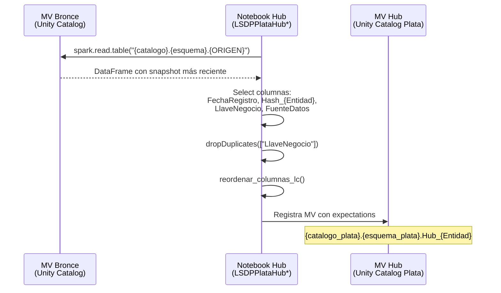
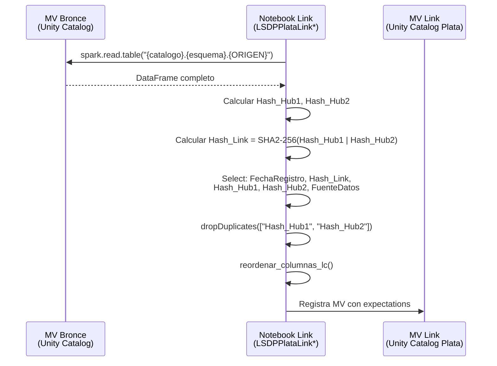
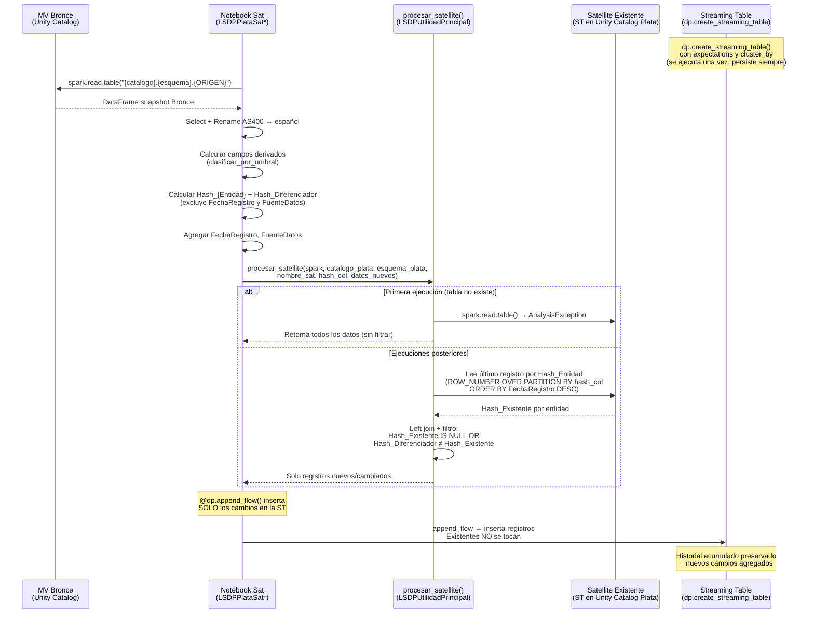

# Documento de Diseño Técnico — plata-data-vault-notebooks

## Visión General

**Propósito**: Este incremento entrega la **Medalla de Plata** completa del pipeline LSDP, implementando el modelo **Data Vault 2.0** (3 Hubs, 2 Links, 9 Satellites) que transforma las tablas de Bronce en entidades normalizadas con historial inmutable, registradas en Unity Catalog bajo el catálogo y esquema de Plata.

**Usuarios**: Ingenieros de datos que desarrollan y mantienen el pipeline LSDP del Data Warehouse bancario sobre Databricks Free Edition Serverless.

**Impacto**: Agrega 8 notebooks de transformación y 2 funciones nuevas de utilidad al pipeline existente, creando 14 tablas de Plata — 5 Materialized Views (3 Hubs + 2 Links) y 9 Streaming Tables Acumulativas (Satellites) — con 7 campos calculados y detección de cambios Append-Only real en todos los Satellites.

### Objetivos

- Implementar 3 Hubs (Hub_Cliente, Hub_Operacion, Hub_Transaccion) con hashes SHA2-256 determinísticos sobre llaves de negocio.
- Implementar 2 Links (Link_Cliente_Operacion, Link_Cliente_Transaccion) con hashes de enlace compuestos.
- Implementar 9 Satellites agrupados por tasa de cambio con detección de cambios Append-Only vía `Hash_Diferenciador` SHA2-512.
- Crear 7 campos calculados en Satellites basados en umbrales de negocio centralizados.
- Agregar funciones reutilizables de detección de cambios y clasificación por umbrales en `utilities/`.

### No-Objetivos

- Implementación de tablas de Oro (Dimensiones, Hechos) — corresponde a un incremento posterior.
- Modificación de las tablas de Bronce existentes ni de las utilidades del Incremento 1 (salvo adición de funciones nuevas).
- Creación o modificación del JSON de definición del pipeline (Lakeflow Job) — es configuración de infraestructura.
- Tests unitarios — se evaluarán en fase de validación post-implementación.

---

## Arquitectura

### Análisis de Arquitectura Existente

El Incremento 1 estableció:

- **Utilities** (`LSDPConfiguracion.py`, `LSDPUtilidadPrincipal.py`): Configuración centralizada con `obtener_configuracion(spark)`, constantes de negocio (`UMBRAL_*`, `HASH_*`, `TIPO_*`), funciones helper (`calcular_hash_hub`, `calcular_hash_diferenciador`, `reordenar_columnas_lc`).
- **Bronce** (3 notebooks → 6 tablas): Patrón Streaming Table temporal + Materialized View snapshot. Las MV de Bronce (`{catalogo}.{esquema}.CMSTFL/TRXPFL/BLNCFL`) son las fuentes de datos para Plata.
- **Patrón de imports**: Cada notebook importa `obtener_configuracion` desde `utilities.LSDPConfiguracion` y funciones helper desde `utilities.LSDPUtilidadPrincipal`.

**Restricciones a respetar**: El patrón de nombrado `LSDPPlata{Entidad}`, el uso de decoradores LSDP con nombre de 3 partes (`@dp.materialized_view()` para Hubs/Links, `dp.create_streaming_table()` + `@dp.append_flow()` para Satellites), la parametrización vía diccionario de configuración, y todas las prohibiciones Serverless (sin cache, sin RDD, sin UDFs).

### Patrón Arquitectónico y Mapa de Fronteras

El incremento extiende el patrón **Pipeline Declarativo por Capas** (Medallón) agregando la capa de Plata entre Bronce y Oro.

```mermaid
graph TB
    subgraph "Bronce — Materialized Views (Unity Catalog)"
        MV_C["{catalogo}.{esquema}.CMSTFL<br/>70 cols · 4M registros"]
        MV_T["{catalogo}.{esquema}.TRXPFL<br/>60 cols · 7M registros"]
        MV_B["{catalogo}.{esquema}.BLNCFL<br/>100 cols · 4M registros"]
    end

    subgraph "Utilities (Python Puro)"
        CONF["LSDPConfiguracion.py<br/>obtener_configuracion(spark)<br/>+ Constantes UMBRAL_*"]
        UTIL["LSDPUtilidadPrincipal.py<br/>calcular_hash_hub()<br/>calcular_hash_diferenciador()<br/>reordenar_columnas_lc()<br/>+ procesar_satellite() ← NUEVO<br/>+ clasificar_por_umbral() ← NUEVO"]
    end

    subgraph "Plata — Hubs · MV (Unity Catalog)"
        HUB_C["Hub_Cliente<br/>MV · 4 cols · LC: FechaRegistro, Hash_Cliente"]
        HUB_O["Hub_Operacion<br/>MV · 5 cols · LC: FechaRegistro, Hash_Operacion"]
        HUB_T["Hub_Transaccion<br/>MV · 4 cols · LC: FechaRegistro, Hash_Transaccion"]
    end

    subgraph "Plata — Links · MV (Unity Catalog)"
        LNK_CO["Link_Cliente_Operacion<br/>MV · 5 cols"]
        LNK_CT["Link_Cliente_Transaccion<br/>MV · 5 cols"]
    end

    subgraph "Plata — Satellites Cliente · ST Acumulativa (Unity Catalog)"
        SAT_CDE["Sat_Cliente_DatosEstables<br/>ST · 17 cols · append_flow"]
        SAT_CCO["Sat_Cliente_Contacto<br/>ST · 19 cols · append_flow"]
        SAT_CCL["Sat_Cliente_Clasificacion<br/>ST · 23 cols · append_flow"]
        SAT_CFI["Sat_Cliente_Financiero<br/>ST · 28 cols · append_flow"]
    end

    subgraph "Plata — Satellites Operación · ST Acumulativa (Unity Catalog)"
        SAT_ODE["Sat_Operacion_DatosEstables<br/>ST · 36 cols · append_flow"]
        SAT_OMO["Sat_Operacion_Montos<br/>ST · 38 cols · append_flow"]
        SAT_OFE["Sat_Operacion_FechasEvento<br/>ST · 23 cols · append_flow"]
    end

    subgraph "Plata — Satellites Transacción · ST Acumulativa (Unity Catalog)"
        SAT_TDE["Sat_Transaccion_DatosEstables<br/>ST · 34 cols · append_flow"]
        SAT_TMO["Sat_Transaccion_Montos<br/>ST · 36 cols · append_flow"]
    end

    MV_C -->|spark.read.table| HUB_C
    MV_B -->|spark.read.table| HUB_O
    MV_T -->|spark.read.table| HUB_T
    MV_B -->|spark.read.table| LNK_CO
    MV_T -->|spark.read.table| LNK_CT
    MV_C -->|"spark.read.table + append_flow"| SAT_CDE
    MV_C -->|"spark.read.table + append_flow"| SAT_CCO
    MV_C -->|"spark.read.table + append_flow"| SAT_CCL
    MV_C -->|"spark.read.table + append_flow"| SAT_CFI
    MV_B -->|"spark.read.table + append_flow"| SAT_ODE
    MV_B -->|"spark.read.table + append_flow"| SAT_OMO
    MV_B -->|"spark.read.table + append_flow"| SAT_OFE
    MV_T -->|"spark.read.table + append_flow"| SAT_TDE
    MV_T -->|"spark.read.table + append_flow"| SAT_TMO

    CONF -.->|"config dict"| HUB_C
    CONF -.->|"config dict"| HUB_O
    CONF -.->|"config dict"| HUB_T
    UTIL -.->|"hash + LC + satellite + umbral"| SAT_CDE
    UTIL -.->|"hash + LC + satellite + umbral"| SAT_TMO

    HUB_C -.->|"alimenta"| ORO["Oro (futuro)"]
    LNK_CO -.->|"alimenta"| ORO
    SAT_CDE -.->|"alimenta"| ORO
```



**Integración Arquitectónica**:

- **Patrón seleccionado**: Pipeline Declarativo por Capas (Medallón) — Plata lee de MV de Bronce y produce tablas registradas bajo `{catalogo_plata}.{esquema_plata}`.
- **Patrón por tipo de entidad Data Vault**:
  - **Hubs / Links → `@dp.materialized_view()`**: Tablas de referencia idempotentes con `dropDuplicates`. Recalcular con MV es correcto porque siempre producen el mismo resultado.
  - **Satellites → `dp.create_streaming_table()` + `@dp.append_flow()`**: Streaming Tables Acumulativas que preservan historial permanentemente. Solo se insertan registros nuevos/cambiados detectados por `procesar_satellite()`. Este patrón es el correcto por la semántica Append-Only de Data Vault 2.0: una Materialized View recalcularía la tabla completa en cada ejecución, destruyendo el historial acumulado.
- **Fronteras de dominio**: Los 8 notebooks de Plata pertenecen al dominio `transformations/`; las 2 funciones nuevas extienden `utilities/` (Python puro, sin importar LSDP).
- **Patrones existentes preservados**: Imports de `obtener_configuracion(spark)`, funciones helper sin LSDP, nombre de 3 partes en todos los decoradores, Liquid Clustering en primeras posiciones.
- **Justificación de componentes nuevos**: Cada notebook materializa los requisitos de su entidad Data Vault; las funciones nuevas eliminan duplicación de código transversal.
- **Cumplimiento con steering**: Alineado con `structure.md` (patrón `LSDPPlata{Entidad}`), `tech.md` (decoradores LSDP con nombre 3 partes, SHA2, restricciones Serverless) y `product.md` (Data Vault 2.0 en Plata).

### Stack Tecnológico

| Capa | Elección / Versión | Rol en el Feature | Notas |
|------|--------------------|-------------------|-------|
| Lenguaje | PySpark (Python) | Todo el código del pipeline | Único lenguaje soportado en Free Edition |
| Framework Pipeline | LSDP (`from pyspark import pipelines as dp`) | Decoradores declarativos para MV y ST | Antes conocido como DLT |
| Almacenamiento | Delta Lake | Formato de todas las tablas de Plata | Soporta Liquid Clustering |
| Catálogo | Unity Catalog | Registro de 5 MV + 9 ST de Plata | Nombre de 3 partes obligatorio |
| Infraestructura | Databricks Free Edition Serverless | Ejecución sin clusters gestionados | Ver restricciones completas en tech.md |

---

## Flujos del Sistema

### Flujo de Procesamiento de Hub



### Flujo de Procesamiento de Link



### Flujo de Procesamiento de Satellite (Streaming Table Acumulativa con Append Flow)



---

## Trazabilidad de Requisitos

| Requisito | Resumen | Componentes | Interfaces | Flujos |
|-----------|---------|-------------|------------|--------|
| 1.1–1.6 | Organización y nombrado de notebooks | 8 notebooks de Plata | Imports de utilities | N/A |
| 2.1–2.4 | Hub_Cliente | LSDPPlataHubCliente | MV Hub_Cliente | Flujo Hub |
| 3.1–3.4 | Hub_Operacion | LSDPPlataHubOperacion | MV Hub_Operacion | Flujo Hub |
| 4.1–4.4 | Hub_Transaccion | LSDPPlataHubTransaccion | MV Hub_Transaccion | Flujo Hub |
| 5.1–5.4 | Link_Cliente_Operacion | LSDPPlataLinkClienteOperacion | MV Link_Cliente_Operacion | Flujo Link |
| 6.1–6.4 | Link_Cliente_Transaccion | LSDPPlataLinkClienteTransaccion | MV Link_Cliente_Transaccion | Flujo Link |
| 7.1–7.8 | Satellites de Cliente (4) | LSDPPlataSatCliente | 4 ST Acumulativas Sat_Cliente_* | Flujo Satellite (ST+AppendFlow) |
| 8.1–8.7 | Satellites de Operación (3) | LSDPPlataSatOperacion | 3 ST Acumulativas Sat_Operacion_* | Flujo Satellite (ST+AppendFlow) |
| 9.1–9.6 | Satellites de Transacción (2) | LSDPPlataSatTransaccion | 2 ST Acumulativas Sat_Transaccion_* | Flujo Satellite (ST+AppendFlow) |
| 10.1–10.5 | Detección de cambios Append-Only | procesar_satellite() en LSDPUtilidadPrincipal | Función Python → DataFrame (solo cambios) | Flujo Satellite (ST+AppendFlow) |
| 11.1–11.7 | Campos calculados en Satellites | clasificar_por_umbral() en LSDPUtilidadPrincipal | Función Python → Column | Dentro de Flujo Satellite |
| 12.1–12.6 | Expectations de calidad | Transversal (todos los notebooks) | Decoradores @dp.expect_* | N/A |
| 13.1–13.7 | Compatibilidad Serverless | Transversal (todo el código) | N/A | N/A |
| 14.1–14.5 | Integración con utilidades | LSDPUtilidadPrincipal (existente + nuevas funciones) | Funciones Python | N/A |

---

## Componentes e Interfaces

### Resumen de Componentes

| Componente | Dominio / Capa | Propósito | Requisitos | Dependencias Clave | Contratos |
|------------|----------------|-----------|------------|-------------------|-----------|
| LSDPUtilidadPrincipal.py (extensión) | Utilities (externo) | 2 funciones nuevas: `procesar_satellite`, `clasificar_por_umbral` | 10.1–10.5, 11.1–11.7, 14.3–14.5 | pyspark.sql.functions, LSDPConfiguracion | Funciones |
| LSDPPlataHubCliente | Transformations / Plata | MV Hub_Cliente desde CMSTFL | 1.*, 2.1–2.4, 12.1, 12.6, 13.* | LSDPConfiguracion, LSDPUtilidadPrincipal | MV |
| LSDPPlataHubOperacion | Transformations / Plata | MV Hub_Operacion desde BLNCFL | 1.*, 3.1–3.4, 12.1, 12.6, 13.* | LSDPConfiguracion, LSDPUtilidadPrincipal | MV |
| LSDPPlataHubTransaccion | Transformations / Plata | MV Hub_Transaccion desde TRXPFL | 1.*, 4.1–4.4, 12.2, 12.6, 13.* | LSDPConfiguracion, LSDPUtilidadPrincipal | MV |
| LSDPPlataLinkClienteOperacion | Transformations / Plata | MV Link_Cliente_Operacion desde BLNCFL | 1.*, 5.1–5.4, 13.* | LSDPConfiguracion, LSDPUtilidadPrincipal | MV |
| LSDPPlataLinkClienteTransaccion | Transformations / Plata | MV Link_Cliente_Transaccion desde TRXPFL | 1.*, 6.1–6.4, 13.* | LSDPConfiguracion, LSDPUtilidadPrincipal | MV |
| LSDPPlataSatCliente | Transformations / Plata | 4 ST Acumulativas Sat_Cliente_* desde CMSTFL | 1.*, 7.1–7.8, 10.*, 11.1–11.2, 12.3, 12.5, 13.* | LSDPConfiguracion, LSDPUtilidadPrincipal | 4 ST |
| LSDPPlataSatOperacion | Transformations / Plata | 3 ST Acumulativas Sat_Operacion_* desde BLNCFL | 1.*, 8.1–8.7, 10.*, 11.3, 12.5, 13.* | LSDPConfiguracion, LSDPUtilidadPrincipal | 3 ST |
| LSDPPlataSatTransaccion | Transformations / Plata | 2 ST Acumulativas Sat_Transaccion_* desde TRXPFL | 1.*, 9.1–9.6, 10.*, 11.4–11.5, 12.4–12.5, 13.* | LSDPConfiguracion, LSDPUtilidadPrincipal | 2 ST |

---

### Capa: Utilities (Extensión)

#### LSDPUtilidadPrincipal.py — Funciones Nuevas

| Campo | Detalle |
|-------|---------|
| Propósito | Agregar 2 funciones reutilizables para el procesamiento de la capa de Plata: detección de cambios en Satellites y clasificación por umbrales |
| Requisitos | 10.1–10.5, 11.1–11.7, 14.3–14.5 |

**Responsabilidades y Restricciones**

- Exponer `procesar_satellite()` para detección de cambios Append-Only.
- Exponer `clasificar_por_umbral()` para generar campos calculados basados en diccionarios `UMBRAL_*`.
- **No contener** imports de LSDP (`from pyspark import pipelines as dp`) — es módulo Python puro.
- Usar exclusivamente funciones nativas de `pyspark.sql.functions` (sin UDFs).
- Las funciones reciben `spark` como parámetro cuando necesitan acceder a tablas.

**Dependencias**

- Inbound: Notebooks de Plata — invocan ambas funciones (P0)
- Outbound: `pyspark.sql.functions` — funciones nativas de Spark (P0)
- Outbound: `LSDPConfiguracion` — constantes `HASH_SEPARATOR`, `HASH_SATELLITE_BITS` (P0)

**Contratos**: Service [x]

##### Contrato de Servicio — `procesar_satellite`

```python
def procesar_satellite(
    spark,
    catalogo_plata: str,
    esquema_plata: str,
    nombre_sat: str,
    hash_col: str,
    datos_nuevos: DataFrame,
) -> DataFrame:
    """
    Detección de cambios Append-Only para Satellites Data Vault.

    Compara Hash_Diferenciador entre datos entrantes y último registro
    existente por llave hash de entidad. Retorna DataFrame con SOLO
    los registros nuevos o con cambios detectados (NO incluye los
    registros existentes del Satellite — el framework LSDP maneja
    el append vía @dp.append_flow()).

    Parámetros:
        spark: SparkSession (necesario para leer tabla existente)
        catalogo_plata: Catálogo UC de Plata
        esquema_plata: Esquema UC de Plata
        nombre_sat: Nombre del Satellite (ej: "Sat_Cliente_DatosEstables")
        hash_col: Nombre de la columna hash de la entidad padre (ej: "Hash_Cliente")
        datos_nuevos: DataFrame con los registros a evaluar (incluye Hash_Diferenciador)

    Retorna:
        DataFrame con SOLO los registros nuevos/cambiados para inserción.
        - Primera ejecución (tabla no existe): retorna todos los registros entrantes.
        - Ejecuciones posteriores: retorna solo registros donde Hash_Diferenciador
          difiere del último registro existente o entidades completamente nuevas.

    Precondiciones:
        - datos_nuevos contiene columna "Hash_Diferenciador"
        - datos_nuevos contiene columna hash_col
        - datos_nuevos contiene columna "FechaRegistro"

    Postcondiciones:
        - DataFrame resultante no contiene columnas auxiliares (_rn, Hash_Existente)
        - Registros existentes del Satellite NO están incluidos en el resultado
        - Si no hay cambios, retorna DataFrame vacío (0 registros)

    Manejo de errores:
        - AnalysisException (tabla no existe): retorna datos_nuevos sin filtrar
        - Cualquier otra excepción se propaga sin enmascarar
    """
```

##### Contrato de Servicio — `clasificar_por_umbral`

```python
def clasificar_por_umbral(
    columna: Column,
    umbrales: dict[str, tuple],
) -> Column:
    """
    Clasifica un valor numérico según rangos definidos en un diccionario de umbrales.

    Genera una cadena de F.when().when()...otherwise("DESCONOCIDO") comparando
    el valor de la columna contra los rangos (min, max) de cada categoría.

    Parámetros:
        columna: Column de PySpark con el valor numérico a clasificar
        umbrales: Diccionario {nombre_categoria: (min, max)} con rangos inclusivos.
                  Debe tener la misma estructura que los UMBRAL_* de LSDPConfiguracion.

    Retorna:
        Column de tipo StringType con el nombre de la categoría correspondiente.

    Ejemplo:
        clasificar_por_umbral(F.col("edad_cliente"), UMBRAL_RANGO_ETARIO)
        → Column con valores "JOVEN_ADULTO", "ADULTO", "ADULTO_MEDIO", etc.

    Precondiciones:
        - La columna es de tipo numérico (IntegerType, LongType, DoubleType)
        - El diccionario tiene al menos una entrada
        - Los rangos no se solapan

    Postcondiciones:
        - Valores fuera de todos los rangos retornan "DESCONOCIDO"
        - Valores nulos retornan null (comportamiento nativo de F.when)
    """
```

**Notas de Implementación**

- `procesar_satellite` usa `Window.partitionBy(hash_col).orderBy(F.col("FechaRegistro").desc())` + `F.row_number() == 1` para obtener el último registro existente por entidad. Retorna SOLO los cambios detectados (no incluye registros existentes — `@dp.append_flow()` maneja la inserción incremental en la Streaming Table).
- `clasificar_por_umbral` itera sobre el diccionario construyendo la cadena `F.when().when()` dinámicamente. Usa `F.col().between(min, max)` para rangos inclusivos.
- Ambas funciones NO usan `.cache()`, `.persist()`, RDDs, UDFs ni threading — 100% compatibles con Serverless.

---

### Capa: Transformations / Plata — Hubs

#### LSDPPlataHubCliente

| Campo | Detalle |
|-------|---------|
| Propósito | Registrar cada llave de negocio de cliente única con hash SHA2-256 determinístico |
| Requisitos | 2.1, 2.2, 2.3, 2.4 |

**Responsabilidades y Restricciones**

- Leer de `{catalogo}.{esquema}.CMSTFL` via `spark.read.table()`.
- Producir 4 columnas exactas: `FechaRegistro`, `Hash_Cliente`, `IdentificadorCliente`, `FuenteDatos`.
- Deduplicar por `IdentificadorCliente` con `dropDuplicates()`.
- Excluir columnas de Bronce (`año`, `mes`, `dia`, `FechaRegistroParquet`, `_rescued_data`).

**Dependencias**

- Inbound: MV Bronce `{catalogo}.{esquema}.CMSTFL` — fuente de datos (P0)
- Outbound: `LSDPConfiguracion.obtener_configuracion(spark)` — parámetros de catálogo/esquema (P0)
- Outbound: `LSDPUtilidadPrincipal.calcular_hash_hub()` — cálculo de hash (P0)
- Outbound: `LSDPUtilidadPrincipal.reordenar_columnas_lc()` — reordenamiento LC (P1)

**Contratos**: Batch [x]

##### Contrato Batch — MV Hub_Cliente

| Aspecto | Detalle |
|---------|---------|
| Trigger | Ejecución del pipeline LSDP |
| Input | `{catalogo}.{esquema}.CMSTFL` (4M registros, 70 cols) |
| Output | `{catalogo_plata}.{esquema_plata}.Hub_Cliente` (4M registros, 4 cols) |
| Liquid Clustering | `FechaRegistro`, `Hash_Cliente` |
| Expectations | `id_cliente_positivo` (DROP): `IdentificadorCliente > 0`; `hash_cliente_no_nulo` (FAIL): `Hash_Cliente IS NOT NULL` |
| Idempotencia | Sí — MV se recalcula completamente; `dropDuplicates` garantiza unicidad |

##### Esquema de Salida — Hub_Cliente

| Posición | Columna | Tipo | Origen | Cálculo |
|----------|---------|------|--------|---------|
| 1 | `FechaRegistro` | TimestampType | Generado | `F.current_timestamp()` |
| 2 | `Hash_Cliente` | StringType | CUSTID | `calcular_hash_hub([F.col("CUSTID")])` → SHA2-256 |
| 3 | `IdentificadorCliente` | LongType | CUSTID | `F.col("CUSTID").alias("IdentificadorCliente")` |
| 4 | `FuenteDatos` | StringType | Generado | `F.lit(f"{catalogo}.{esquema}.CMSTFL")` |

---

#### LSDPPlataHubOperacion

| Campo | Detalle |
|-------|---------|
| Propósito | Registrar cada llave de negocio compuesta de operación (CUSTID + BLSQ) con hash SHA2-256 |
| Requisitos | 3.1, 3.2, 3.3, 3.4 |

**Responsabilidades y Restricciones**

- Leer de `{catalogo}.{esquema}.BLNCFL` vía `spark.read.table()`.
- Producir 5 columnas exactas: `FechaRegistro`, `Hash_Operacion`, `IdentificadorCliente`, `SecuenciaSaldo`, `FuenteDatos`.
- Deduplicar por combinación (`IdentificadorCliente`, `SecuenciaSaldo`).
- Hash compuesto: `calcular_hash_hub([F.col("CUSTID"), F.col("BLSQ")])` → SHA2-256 con separador `|`.

**Dependencias**

- Inbound: MV Bronce `{catalogo}.{esquema}.BLNCFL` — fuente de datos (P0)
- Outbound: `LSDPConfiguracion`, `LSDPUtilidadPrincipal` — helper functions (P0)

**Contratos**: Batch [x]

##### Contrato Batch — MV Hub_Operacion

| Aspecto | Detalle |
|---------|---------|
| Input | `{catalogo}.{esquema}.BLNCFL` (4M registros, 100 cols) |
| Output | `{catalogo_plata}.{esquema_plata}.Hub_Operacion` (4M registros, 5 cols) |
| Liquid Clustering | `FechaRegistro`, `Hash_Operacion` |
| Expectations | `id_cliente_positivo` (DROP): `IdentificadorCliente > 0`; `hash_operacion_no_nulo` (FAIL): `Hash_Operacion IS NOT NULL` |

##### Esquema de Salida — Hub_Operacion

| Posición | Columna | Tipo | Origen | Cálculo |
|----------|---------|------|--------|---------|
| 1 | `FechaRegistro` | TimestampType | Generado | `F.current_timestamp()` |
| 2 | `Hash_Operacion` | StringType | CUSTID + BLSQ | `calcular_hash_hub([F.col("CUSTID"), F.col("BLSQ")])` |
| 3 | `IdentificadorCliente` | LongType | CUSTID | Directa |
| 4 | `SecuenciaSaldo` | LongType | BLSQ | Directa |
| 5 | `FuenteDatos` | StringType | Generado | `F.lit(f"{catalogo}.{esquema}.BLNCFL")` |

---

#### LSDPPlataHubTransaccion

| Campo | Detalle |
|-------|---------|
| Propósito | Registrar cada llave de negocio de transacción única (TRXID) con hash SHA2-256 |
| Requisitos | 4.1, 4.2, 4.3, 4.4 |

**Responsabilidades y Restricciones**

- Leer de `{catalogo}.{esquema}.TRXPFL` vía `spark.read.table()`.
- Producir 4 columnas: `FechaRegistro`, `Hash_Transaccion`, `IdentificadorTransaccion`, `FuenteDatos`.
- `TRXID` es **StringType nativo** → `calcular_hash_hub([F.col("TRXID")])` sin cast adicional (la función aplica `.cast("string")` internamente pero es no-op para StringType).
- Deduplicar por `IdentificadorTransaccion`.

**Contratos**: Batch [x]

##### Contrato Batch — MV Hub_Transaccion

| Aspecto | Detalle |
|---------|---------|
| Input | `{catalogo}.{esquema}.TRXPFL` (7M registros, 60 cols) |
| Output | `{catalogo_plata}.{esquema_plata}.Hub_Transaccion` (7M registros, 4 cols) |
| Liquid Clustering | `FechaRegistro`, `Hash_Transaccion` |
| Expectations | `id_transaccion_no_nulo` (FAIL): `IdentificadorTransaccion IS NOT NULL`; `hash_transaccion_no_nulo` (FAIL): `Hash_Transaccion IS NOT NULL` |

##### Esquema de Salida — Hub_Transaccion

| Posición | Columna | Tipo | Origen | Cálculo |
|----------|---------|------|--------|---------|
| 1 | `FechaRegistro` | TimestampType | Generado | `F.current_timestamp()` |
| 2 | `Hash_Transaccion` | StringType | TRXID | `calcular_hash_hub([F.col("TRXID")])` — StringType nativo |
| 3 | `IdentificadorTransaccion` | StringType | TRXID | Directa |
| 4 | `FuenteDatos` | StringType | Generado | `F.lit(f"{catalogo}.{esquema}.TRXPFL")` |

---

### Capa: Transformations / Plata — Links

#### LSDPPlataLinkClienteOperacion

| Campo | Detalle |
|-------|---------|
| Propósito | Capturar la relación Hub_Cliente ↔ Hub_Operacion con hash de enlace compuesto |
| Requisitos | 5.1, 5.2, 5.3, 5.4 |

**Responsabilidades y Restricciones**

- Leer de `{catalogo}.{esquema}.BLNCFL` — contiene CUSTID (→ Hash_Cliente) y CUSTID+BLSQ (→ Hash_Operacion).
- Calcular ambos hashes desde los campos AS400 originales (no lee de los Hubs).
- Producir 5 columnas: `FechaRegistro`, `Hash_Link_Cliente_Operacion`, `Hash_Cliente`, `Hash_Operacion`, `FuenteDatos`.
- Deduplicar por combinación (`Hash_Cliente`, `Hash_Operacion`).

**Contratos**: Batch [x]

##### Esquema de Salida — Link_Cliente_Operacion

| Posición | Columna | Tipo | Cálculo |
|----------|---------|------|---------|
| 1 | `FechaRegistro` | TimestampType | `F.current_timestamp()` |
| 2 | `Hash_Cliente` | StringType | `calcular_hash_hub([F.col("CUSTID")])` |
| 3 | `Hash_Operacion` | StringType | `calcular_hash_hub([F.col("CUSTID"), F.col("BLSQ")])` |
| 4 | `Hash_Link_Cliente_Operacion` | StringType | `calcular_hash_hub([Hash_Cliente_col, Hash_Operacion_col])` |
| 5 | `FuenteDatos` | StringType | `F.lit(f"{catalogo}.{esquema}.BLNCFL")` |

| Aspecto | Detalle |
|---------|---------|
| Liquid Clustering | `FechaRegistro`, `Hash_Cliente`, `Hash_Operacion` |
| Expectations | Ninguna adicional (hashes derivados de Hubs ya validados) |

---

#### LSDPPlataLinkClienteTransaccion

| Campo | Detalle |
|-------|---------|
| Propósito | Capturar la relación Hub_Cliente ↔ Hub_Transaccion con hash de enlace compuesto |
| Requisitos | 6.1, 6.2, 6.3, 6.4 |

**Responsabilidades y Restricciones**

- Leer de `{catalogo}.{esquema}.TRXPFL` — contiene CUSTID (→ Hash_Cliente) y TRXID (→ Hash_Transaccion).
- El 5.7% de clientes sin transacciones no genera registros (comportamiento correcto).

##### Esquema de Salida — Link_Cliente_Transaccion

| Posición | Columna | Tipo | Cálculo |
|----------|---------|------|---------|
| 1 | `FechaRegistro` | TimestampType | `F.current_timestamp()` |
| 2 | `Hash_Cliente` | StringType | `calcular_hash_hub([F.col("CUSTID")])` |
| 3 | `Hash_Transaccion` | StringType | `calcular_hash_hub([F.col("TRXID")])` |
| 4 | `Hash_Link_Cliente_Transaccion` | StringType | `calcular_hash_hub([Hash_Cliente_col, Hash_Transaccion_col])` |
| 5 | `FuenteDatos` | StringType | `F.lit(f"{catalogo}.{esquema}.TRXPFL")` |

| Aspecto | Detalle |
|---------|---------|
| Liquid Clustering | `FechaRegistro`, `Hash_Cliente`, `Hash_Transaccion` |

---

### Capa: Transformations / Plata — Satellites

#### LSDPPlataSatCliente (4 Satellites en 1 notebook)

| Campo | Detalle |
|-------|---------|
| Propósito | Definir 4 Streaming Tables Acumulativas (Satellite) para Hub_Cliente, agrupados por tasa de cambio, con detección de cambios Append-Only real vía `dp.create_streaming_table()` + `@dp.append_flow()` |
| Requisitos | 7.1–7.8, 10.1–10.5, 11.1–11.2, 12.3, 12.5 |

**Responsabilidades y Restricciones**

- Una sola lectura de `{catalogo}.{esquema}.CMSTFL` compartida entre las 4 funciones de append_flow.
- Renombrar campos AS400 a español usando `.alias()`.
- Calcular `Hash_Cliente` con `calcular_hash_hub([F.col("CUSTID")])`.
- Calcular campos derivados: `RangoEtario` (Sat_DatosEstables), `CategoriaIngresos` (Sat_DatosEstables).
- Calcular `Hash_Diferenciador` con `calcular_hash_diferenciador(hash_entidad, *campos_de_negocio)` — **excluyendo** `FechaRegistro` y `FuenteDatos`.
- Agregar `FechaRegistro` y `FuenteDatos` DESPUÉS del cálculo de `Hash_Diferenciador`.
- Invocar `procesar_satellite()` para detección de cambios — retorna SOLO registros nuevos/cambiados.
- **Patrón LSDP**: `dp.create_streaming_table()` define la tabla con expectations y cluster_by; `@dp.append_flow()` inserta solo los cambios detectados. NO se usa `reordenar_columnas_lc()` — el orden de columnas se define en el `select()` del DataFrame retornado por `procesar_satellite()`.

**Dependencias**

- Inbound: MV Bronce `{catalogo}.{esquema}.CMSTFL` (P0)
- Outbound: `obtener_configuracion(spark)` (P0), `calcular_hash_hub` (P0), `calcular_hash_diferenciador` (P0), `procesar_satellite` (P0), `clasificar_por_umbral` (P0)
- Outbound: Constantes `UMBRAL_RANGO_ETARIO`, `UMBRAL_CATEGORIA_INGRESOS` (P0)

**Contratos**: Streaming Table Acumulativa [x]

##### Esquema de Salida — Sat_Cliente_DatosEstables

| Pos | Columna | Tipo | AS400 | Nota |
|-----|---------|------|-------|------|
| 1 | `FechaRegistro` | TimestampType | — | LC col 1 |
| 2 | `Hash_Cliente` | StringType | CUSTID | LC col 2, hash SHA2-256 |
| 3 | `sexo_cliente` | StringType | CUSSX | |
| 4 | `tratamiento_cliente` | StringType | CUSTT | |
| 5 | `fecha_nacimiento` | DateType | CUSDB | |
| 6 | `anio_nacimiento` | LongType | CUSYR | |
| 7 | `edad_cliente` | LongType | CUSAG2 | |
| 8 | `pais_residencia` | StringType | CUSCN | |
| 9 | `nacionalidad_cliente` | StringType | CUSNA | |
| 10 | `numero_licencia_conducir` | StringType | CUSDL | |
| 11 | `tipo_documento_pasaporte` | StringType | CUSDP | |
| 12 | `cantidad_pasaportes` | LongType | CUSDP2 | |
| 13 | `idioma_preferido` | StringType | CUSLG | |
| 14 | `RangoEtario` | StringType | Calculado | `clasificar_por_umbral(edad_cliente, UMBRAL_RANGO_ETARIO)` |
| 15 | `CategoriaIngresos` | StringType | Calculado | `clasificar_por_umbral(ingresos_cliente, UMBRAL_CATEGORIA_INGRESOS)` — nota: `ingresos_cliente` se lee de CMSTFL pero NO se persiste en este satellite |
| 16 | `Hash_Diferenciador` | StringType | Calculado | SHA2-512 de (Hash_Cliente + cols 3-15) |
| 17 | `FuenteDatos` | StringType | Generado | No participa en Hash_Diferenciador |

**Tipo LSDP**: `dp.create_streaming_table()` + `@dp.append_flow()`
**Expectations** (en `create_streaming_table`): `expect_all_or_fail={"hash_diferenciador_no_nulo": "Hash_Diferenciador IS NOT NULL"}`
**Liquid Clustering**: `FechaRegistro`, `Hash_Cliente`

##### Esquema de Salida — Sat_Cliente_Contacto

| Pos | Columna | Tipo | AS400 |
|-----|---------|------|-------|
| 1 | `FechaRegistro` | TimestampType | — |
| 2 | `Hash_Cliente` | StringType | CUSTID |
| 3 | `nombre_cliente` | StringType | CUSNM |
| 4 | `apellido_cliente` | StringType | CUSLN |
| 5 | `nombre_medio_cliente` | StringType | CUSMD |
| 6 | `nombre_completo_cliente` | StringType | CUSFN |
| 7 | `direccion_calle` | StringType | CUSAD |
| 8 | `direccion_apartamento` | StringType | CUSA2 |
| 9 | `ciudad_residencia` | StringType | CUSCT |
| 10 | `estado_provincia` | StringType | CUSST |
| 11 | `codigo_postal` | StringType | CUSZP |
| 12 | `telefono_principal` | StringType | CUSPH |
| 13 | `telefono_movil` | StringType | CUSMB |
| 14 | `correo_electronico` | StringType | CUSEM |
| 15 | `estado_civil` | StringType | CUSMS |
| 16 | `ocupacion_cliente` | StringType | CUSOC |
| 17 | `nivel_educativo` | StringType | CUSED |
| 18 | `Hash_Diferenciador` | StringType | Calculado |
| 19 | `FuenteDatos` | StringType | Generado |

**Tipo LSDP**: `dp.create_streaming_table()` + `@dp.append_flow()`
**Expectations** (en `create_streaming_table`): `expect_all_or_fail={"hash_diferenciador_no_nulo": "Hash_Diferenciador IS NOT NULL"}`
**Liquid Clustering**: `FechaRegistro`, `Hash_Cliente`

##### Esquema de Salida — Sat_Cliente_Clasificacion

| Pos | Columna | Tipo | AS400 |
|-----|---------|------|-------|
| 1 | `FechaRegistro` | TimestampType | — |
| 2 | `Hash_Cliente` | StringType | CUSTID |
| 3 | `tipo_cliente` | StringType | CUSTP |
| 4 | `segmento_cliente` | StringType | CUSSG |
| 5 | `region_geografica` | StringType | CUSRG |
| 6 | `sucursal_principal` | StringType | CUSBR |
| 7 | `gerente_asignado` | StringType | CUSMG |
| 8 | `referencia_interna` | StringType | CUSRF |
| 9 | `fuente_referencia` | StringType | CUSRS |
| 10 | `grupo_afinidad` | StringType | CUSAG |
| 11 | `preferencia_comunicacion` | StringType | CUSPC |
| 12 | `nivel_riesgo` | StringType | CUSRK |
| 13 | `indicador_vip` | StringType | CUSVP |
| 14 | `estado_perfil` | StringType | CUSPF |
| 15 | `estado_kyc` | StringType | CUSKT |
| 16 | `indicador_flags` | StringType | CUSFM |
| 17 | `ultimo_canal` | StringType | CUSLC |
| 18 | `calificacion_crediticia` | StringType | CUSCR |
| 19 | `cuenta_activa` | StringType | CUSAC |
| 20 | `clasificacion_interna` | StringType | CUSCL |
| 21 | `nota_cliente` | StringType | CUSNT |
| 22 | `Hash_Diferenciador` | StringType | Calculado |
| 23 | `FuenteDatos` | StringType | Generado |

**Tipo LSDP**: `dp.create_streaming_table()` + `@dp.append_flow()`
**Expectations** (en `create_streaming_table`): `expect_all_or_fail={"hash_diferenciador_no_nulo": "Hash_Diferenciador IS NOT NULL"}`
**Liquid Clustering**: `FechaRegistro`, `Hash_Cliente`

##### Esquema de Salida — Sat_Cliente_Financiero

| Pos | Columna | Tipo | AS400 | Nota |
|-----|---------|------|-------|------|
| 1 | `FechaRegistro` | TimestampType | — | |
| 2 | `Hash_Cliente` | StringType | CUSTID | |
| 3 | `cantidad_cuentas` | LongType | CUSAC2 | |
| 4 | `cantidad_transacciones` | LongType | CUSTX | |
| 5 | `score_cliente` | LongType | CUSSC | |
| 6 | `ranking_prestamos` | LongType | CUSLR | |
| 7 | `cantidad_registros` | LongType | CUSRC | |
| 8 | `ingresos_cliente` | DoubleType | CUSIN | |
| 9 | `saldo_disponible_maestro` | DoubleType | CUSBL | |
| 10 | `fecha_apertura_relacion` | DateType | CUSOD | |
| 11 | `fecha_cierre_relacion` | DateType | CUSCD | |
| 12 | `fecha_ultima_visita` | DateType | CUSLV | |
| 13 | `fecha_ultima_actualizacion` | DateType | CUSUD | |
| 14 | `fecha_verificacion_kyc` | DateType | CUSKD | |
| 15 | `fecha_renovacion` | DateType | CUSRD | |
| 16 | `fecha_expiracion` | DateType | CUSXD | |
| 17 | `fecha_primer_producto` | DateType | CUSFD | |
| 18 | `fecha_ultimo_producto` | DateType | CUSLD | |
| 19 | `fecha_migracion` | DateType | CUSMD2 | |
| 20 | `fecha_activacion` | DateType | CUSAD2 | |
| 21 | `fecha_bloqueo` | DateType | CUSBD | |
| 22 | `fecha_verificacion` | DateType | CUSVD | |
| 23 | `fecha_promocion` | DateType | CUSPD | |
| 24 | `fecha_desactivacion` | DateType | CUSDD | |
| 25 | `fecha_educacion_financiera` | DateType | CUSED2 | |
| 26 | `fecha_notificacion` | DateType | CUSND | |
| 27 | `Hash_Diferenciador` | StringType | Calculado | SHA2-512 de (Hash_Cliente + cols 3-26) |
| 28 | `FuenteDatos` | StringType | Generado | |

**Tipo LSDP**: `dp.create_streaming_table()` + `@dp.append_flow()`
**Expectations** (en `create_streaming_table`): `expect_all={"score_cliente_en_rango": "score_cliente BETWEEN 300 AND 1150"}`, `expect_all_or_fail={"hash_diferenciador_no_nulo": "Hash_Diferenciador IS NOT NULL"}`
**Liquid Clustering**: `FechaRegistro`, `Hash_Cliente`

---

#### LSDPPlataSatOperacion (3 Satellites en 1 notebook)

| Campo | Detalle |
|-------|---------|
| Propósito | Definir 3 Streaming Tables Acumulativas (Satellite) para Hub_Operacion con detección de cambios Append-Only real vía `dp.create_streaming_table()` + `@dp.append_flow()` |
| Requisitos | 8.1–8.7, 10.1–10.5, 11.3, 12.5 |

**Responsabilidades y Restricciones**

- Una sola lectura de `{catalogo}.{esquema}.BLNCFL`.
- Calcular `Hash_Operacion` con `calcular_hash_hub([F.col("CUSTID"), F.col("BLSQ")])`.
- Campos calculados en Sat_Operacion_DatosEstables: `CategoriaSaldo`, `EstadoUtilizacionCredito`, `IndicadorSobregiro`.
- Hash_Diferenciador **excluye** `FechaRegistro` y `FuenteDatos`.
- Invocar `procesar_satellite()` para detección de cambios — retorna SOLO registros nuevos/cambiados.
- **Patrón LSDP**: `dp.create_streaming_table()` define la tabla; `@dp.append_flow()` inserta solo los cambios.

**Contratos**: Streaming Table Acumulativa [x]

##### Esquema de Salida — Sat_Operacion_DatosEstables

| Pos | Columna | Tipo | AS400 | Nota |
|-----|---------|------|-------|------|
| 1 | `FechaRegistro` | TimestampType | — | |
| 2 | `Hash_Operacion` | StringType | CUSTID+BLSQ | |
| 3 | `tipo_cuenta` | StringType | BLACT | |
| 4 | `numero_cuenta` | StringType | BLACN | |
| 5 | `moneda_cuenta` | StringType | BLCUR | |
| 6 | `estado_cuenta` | StringType | BLST | |
| 7 | `sucursal_cuenta` | StringType | BLBR | |
| 8 | `producto_cuenta` | StringType | BLPR | |
| 9 | `subproducto_cuenta` | StringType | BLSP | |
| 10 | `nombre_cuenta` | StringType | BLNM | |
| 11 | `clase_cuenta` | StringType | BLCL | |
| 12 | `riesgo_cuenta` | StringType | BLRK | |
| 13 | `tipo_producto_cuenta` | StringType | BLTP | |
| 14 | `gerente_cuenta` | StringType | BLMG | |
| 15 | `referencia_cuenta` | StringType | BLRF | |
| 16 | `centro_costos_cuenta` | StringType | BLCC | |
| 17 | `grupo_afinidad_cuenta` | StringType | BLAG | |
| 18 | `plan_cuenta` | StringType | BLPL | |
| 19 | `region_cuenta` | StringType | BLRG | |
| 20 | `sufijo_cuenta` | StringType | BLSF | |
| 21 | `nota_cuenta` | StringType | BLNT | |
| 22 | `ultimo_canal_cuenta` | StringType | BLLC | |
| 23 | `perfil_cuenta` | StringType | BLPF | |
| 24 | `autorizado_cuenta` | StringType | BLAU | |
| 25 | `texto_cuenta` | StringType | BLTX | |
| 26 | `grupo_cuenta` | StringType | BLGR | |
| 27 | `email_cuenta` | StringType | BLEM | |
| 28 | `frecuencia_cuenta` | StringType | BLFR | |
| 29 | `clave_cuenta` | StringType | BLKY | |
| 30 | `vip_cuenta` | StringType | BLVP | |
| 31 | `factor_cuenta` | StringType | BLFC | |
| 32 | `CategoriaSaldo` | StringType | Calculado | `clasificar_por_umbral(saldo_disponible, UMBRAL_CATEGORIA_SALDO)` — `saldo_disponible` (BLAV) se lee pero NO se persiste aquí |
| 33 | `EstadoUtilizacionCredito` | StringType | Calculado | `clasificar_por_umbral(ratio_cuenta, UMBRAL_UTILIZACION_CREDITO)` — `ratio_cuenta` (BLRT) se lee pero NO se persiste aquí |
| 34 | `IndicadorSobregiro` | StringType | Calculado | `clasificar_por_umbral(valor_sobregiro, UMBRAL_SOBREGIRO)` — `valor_sobregiro` (BLOV) se lee pero NO se persiste aquí |
| 35 | `Hash_Diferenciador` | StringType | Calculado | SHA2-512 de (Hash_Operacion + cols 3-34) |
| 36 | `FuenteDatos` | StringType | Generado | |

**Tipo LSDP**: `dp.create_streaming_table()` + `@dp.append_flow()`
**Expectations** (en `create_streaming_table`): `expect_all_or_fail={"hash_diferenciador_no_nulo": "Hash_Diferenciador IS NOT NULL"}`
**Liquid Clustering**: `FechaRegistro`, `Hash_Operacion`

##### Esquema de Salida — Sat_Operacion_Montos

| Pos | Columna | Tipo | AS400 |
|-----|---------|------|-------|
| 1 | `FechaRegistro` | TimestampType | — |
| 2 | `Hash_Operacion` | StringType | CUSTID+BLSQ |
| 3 | `saldo_disponible` | DoubleType | BLAV |
| 4 | `saldo_total` | DoubleType | BLTB |
| 5 | `saldo_reservado` | DoubleType | BLRV |
| 6 | `saldo_bloqueado` | DoubleType | BLBK |
| 7 | `limite_credito` | DoubleType | BLCR |
| 8 | `credito_utilizado` | DoubleType | BLCU |
| 9 | `credito_disponible` | DoubleType | BLCD |
| 10 | `valor_sobregiro` | DoubleType | BLOV |
| 11 | `limite_sobregiro` | DoubleType | BLOL |
| 12 | `depositos_pendientes` | DoubleType | BLPD |
| 13 | `cargos_pendientes` | DoubleType | BLPC |
| 14 | `ajustes_pendientes` | DoubleType | BLPA |
| 15 | `depositos_ingreso` | DoubleType | BLDI |
| 16 | `retenciones_cuenta` | DoubleType | BLWI |
| 17 | `transferencias_ingreso` | DoubleType | BLTI |
| 18 | `cargos_transferencia` | DoubleType | BLTC |
| 19 | `comisiones_anuales` | DoubleType | BLCA |
| 20 | `intereses_mensuales` | DoubleType | BLIM |
| 21 | `reembolsos_cuenta` | DoubleType | BLRF2 |
| 22 | `penalidades_cuenta` | DoubleType | BLPN |
| 23 | `bonificaciones_cuenta` | DoubleType | BLBN |
| 24 | `ajustes_positivos` | DoubleType | BLAP |
| 25 | `ajustes_miscelaneos` | DoubleType | BLAM |
| 26 | `ajustes_anuales` | DoubleType | BLAY |
| 27 | `marca_alta_saldo` | DoubleType | BLHI |
| 28 | `marca_baja_saldo` | DoubleType | BLLO |
| 29 | `varianza_saldo` | DoubleType | BLVR |
| 30 | `ratio_cuenta` | DoubleType | BLRT |
| 31 | `porcentaje_aporte` | DoubleType | BLCP |
| 32 | `ingresos_aporte` | DoubleType | BLCI |
| 33 | `saldo_minimo` | DoubleType | BLMN |
| 34 | `saldo_maximo` | DoubleType | BLMX |
| 35 | `tasa_interes` | DoubleType | BLIR |
| 36 | `multiplicador_penalidad` | DoubleType | BLPM |
| 37 | `Hash_Diferenciador` | StringType | Calculado |
| 38 | `FuenteDatos` | StringType | Generado |

**Tipo LSDP**: `dp.create_streaming_table()` + `@dp.append_flow()`
**Expectations** (en `create_streaming_table`): `expect_all_or_fail={"hash_diferenciador_no_nulo": "Hash_Diferenciador IS NOT NULL"}`
**Liquid Clustering**: `FechaRegistro`, `Hash_Operacion`

##### Esquema de Salida — Sat_Operacion_FechasEvento

| Pos | Columna | Tipo | AS400 |
|-----|---------|------|-------|
| 1 | `FechaRegistro` | TimestampType | — |
| 2 | `Hash_Operacion` | StringType | CUSTID+BLSQ |
| 3 | `fecha_apertura_cuenta` | DateType | BLOD |
| 4 | `fecha_expiracion_cuenta` | DateType | BLXD |
| 5 | `fecha_actualizacion_cuenta` | DateType | BLUD |
| 6 | `fecha_ultimo_movimiento` | DateType | BLLD |
| 7 | `fecha_estado_cuenta` | DateType | BLSD |
| 8 | `fecha_penalidad` | DateType | BLPD2 |
| 9 | `fecha_renovacion_cuenta` | DateType | BLRD |
| 10 | `fecha_maduracion` | DateType | BLMD |
| 11 | `fecha_cierre_cuenta` | DateType | BLCD2 |
| 12 | `fecha_bloqueo_cuenta` | DateType | BLBD |
| 13 | `fecha_fondeo` | DateType | BLFD |
| 14 | `fecha_gracia` | DateType | BLGD |
| 15 | `fecha_historica` | DateType | BLHD |
| 16 | `fecha_interes` | DateType | BLID |
| 17 | `fecha_ajuste` | DateType | BLJD |
| 18 | `fecha_kyc_cuenta` | DateType | BLKD |
| 19 | `fecha_notificacion_cuenta` | DateType | BLND |
| 20 | `fecha_transferencia` | DateType | BLTD |
| 21 | `fecha_verificacion_cuenta` | DateType | BLVD |
| 22 | `Hash_Diferenciador` | StringType | Calculado |
| 23 | `FuenteDatos` | StringType | Generado |

**Tipo LSDP**: `dp.create_streaming_table()` + `@dp.append_flow()`
**Expectations** (en `create_streaming_table`): `expect_all_or_fail={"hash_diferenciador_no_nulo": "Hash_Diferenciador IS NOT NULL"}`
**Liquid Clustering**: `FechaRegistro`, `Hash_Operacion`

---

#### LSDPPlataSatTransaccion (2 Satellites en 1 notebook)

| Campo | Detalle |
|-------|---------|
| Propósito | Definir 2 Streaming Tables Acumulativas (Satellite) para Hub_Transaccion con detección de cambios Append-Only real vía `dp.create_streaming_table()` + `@dp.append_flow()` |
| Requisitos | 9.1–9.6, 10.1–10.5, 11.4–11.5, 12.4–12.5 |

**Responsabilidades y Restricciones**

- Una sola lectura de `{catalogo}.{esquema}.TRXPFL`.
- Calcular `Hash_Transaccion` con `calcular_hash_hub([F.col("TRXID")])` — TRXID es StringType nativo.
- Campos calculados: `ClasificacionCanalATM` (Sat_DatosEstables), `RangoMontoTransaccion` y `NivelRiesgoFraude` (Sat_Montos).
- `ClasificacionCanalATM` no usa `clasificar_por_umbral()` — es lógica condicional sobre tipo/canal.
- Hash_Diferenciador **excluye** `FechaRegistro` y `FuenteDatos`.
- Invocar `procesar_satellite()` para detección de cambios — retorna SOLO registros nuevos/cambiados.
- **Patrón LSDP**: `dp.create_streaming_table()` define la tabla; `@dp.append_flow()` inserta solo los cambios.

**Contratos**: Streaming Table Acumulativa [x]

##### Esquema de Salida — Sat_Transaccion_DatosEstables

| Pos | Columna | Tipo | AS400 | Nota |
|-----|---------|------|-------|------|
| 1 | `FechaRegistro` | TimestampType | — | |
| 2 | `Hash_Transaccion` | StringType | TRXID | |
| 3 | `tipo_transaccion` | StringType | TRXTYP | |
| 4 | `moneda_transaccion` | StringType | TRXCUR | |
| 5 | `estado_transaccion` | StringType | TRXST | |
| 6 | `canal_transaccion` | StringType | TRXCH | |
| 7 | `descripcion_transaccion` | StringType | TRXDSC | |
| 8 | `referencia_externa` | StringType | TRXREF | |
| 9 | `secuencia_transaccion` | LongType | TRXSQ | |
| 10 | `monto_maximo` | DoubleType | TRXMX | |
| 11 | `monto_minimo` | DoubleType | TRXMN | |
| 12 | `fecha_valor` | DateType | TRXVD | |
| 13 | `fecha_procesamiento` | DateType | TRXPD | |
| 14 | `fecha_liquidacion` | DateType | TRXSD | |
| 15 | `fecha_compensacion` | DateType | TRXCD | |
| 16 | `fecha_efectiva` | DateType | TRXED | |
| 17 | `fecha_reverso` | DateType | TRXRD | |
| 18 | `fecha_autorizacion` | DateType | TRXAD | |
| 19 | `fecha_notificacion_trx` | DateType | TRXND | |
| 20 | `fecha_expiracion_trx` | DateType | TRXXD | |
| 21 | `fecha_fondeo_trx` | DateType | TRXFD | |
| 22 | `fecha_gracia_trx` | DateType | TRXGD | |
| 23 | `fecha_historica_trx` | DateType | TRXHD | |
| 24 | `fecha_bloqueo_trx` | DateType | TRXBD | |
| 25 | `fecha_maduracion_trx` | DateType | TRXMD | |
| 26 | `fecha_limite_trx` | DateType | TRXLD | |
| 27 | `fecha_actualizacion_trx` | DateType | TRXUD | |
| 28 | `fecha_origen_trx` | DateType | TRXOD | |
| 29 | `fecha_kyc_trx` | DateType | TRXKD | |
| 30 | `timestamp_transaccion` | TimestampType | TRXTS | |
| 31 | `timestamp_actualizacion` | TimestampType | TRXUS | |
| 32 | `ClasificacionCanalATM` | StringType | Calculado | Lógica: DATM→RETIRO_ATM, CATM→DEPOSITO_ATM, ATM+otro→OTRA_OP_ATM, else→NO_ATM |
| 33 | `Hash_Diferenciador` | StringType | Calculado | SHA2-512 de (Hash_Transaccion + cols 3-32) |
| 34 | `FuenteDatos` | StringType | Generado | |

**Tipo LSDP**: `dp.create_streaming_table()` + `@dp.append_flow()`
**Expectations** (en `create_streaming_table`): `expect_all_or_fail={"hash_diferenciador_no_nulo": "Hash_Diferenciador IS NOT NULL"}`
**Liquid Clustering**: `FechaRegistro`, `Hash_Transaccion`

##### Esquema de Salida — Sat_Transaccion_Montos

| Pos | Columna | Tipo | AS400 | Nota |
|-----|---------|------|-------|------|
| 1 | `FechaRegistro` | TimestampType | — | |
| 2 | `Hash_Transaccion` | StringType | TRXID | |
| 3 | `identificador_cliente` | LongType | CUSTID | |
| 4 | `fecha_transaccion` | DateType | TRXDT | |
| 5 | `monto_principal` | DoubleType | TRXAMT | |
| 6 | `comision_transaccion` | DoubleType | TRXCM | |
| 7 | `saldo_posterior` | DoubleType | TRXBA | |
| 8 | `saldo_anterior` | DoubleType | TRXBP | |
| 9 | `cargo_fiscal` | DoubleType | TRXTC | |
| 10 | `monto_local` | DoubleType | TRXAL | |
| 11 | `monto_pago` | DoubleType | TRXPN | |
| 12 | `beneficio_transaccion` | DoubleType | TRXBF | |
| 13 | `perdida_tasa` | DoubleType | TRXRL | |
| 14 | `monto_promedio` | DoubleType | TRXAV | |
| 15 | `desviacion_monto` | DoubleType | TRXDV | |
| 16 | `riesgo_transaccion` | DoubleType | TRXRK | |
| 17 | `riesgo_fraude` | DoubleType | TRXFR | Escala 0-100 |
| 18 | `limite_transaccion` | DoubleType | TRXLM | |
| 19 | `porcentaje_limite` | DoubleType | TRXLP | |
| 20 | `cargo_plataforma` | DoubleType | TRXCP | |
| 21 | `cargo_institucion` | DoubleType | TRXCI | |
| 22 | `cargo_extranjero` | DoubleType | TRXCF | |
| 23 | `cargo_varianza` | DoubleType | TRXCV | |
| 24 | `subtotal_transaccion` | DoubleType | TRXSB | |
| 25 | `total_transaccion` | DoubleType | TRXTL | |
| 26 | `residuo_transaccion` | DoubleType | TRXRS | |
| 27 | `margen_interes` | DoubleType | TRXIM | |
| 28 | `monto_neto` | DoubleType | TRXNT | |
| 29 | `monto_original` | DoubleType | TRXAO | |
| 30 | `monto_inversion` | DoubleType | TRXIN | |
| 31 | `descuento_transaccion` | DoubleType | TRXDS | |
| 32 | `monto_principal_prestamo` | DoubleType | TRXPT | |
| 33 | `RangoMontoTransaccion` | StringType | Calculado | `clasificar_por_umbral(monto_principal, UMBRAL_RANGO_MONTO)` |
| 34 | `NivelRiesgoFraude` | StringType | Calculado | `clasificar_por_umbral(riesgo_fraude, UMBRAL_RIESGO_FRAUDE)` — escala 0-100 |
| 35 | `Hash_Diferenciador` | StringType | Calculado | SHA2-512 de (Hash_Transaccion + cols 3-34) |
| 36 | `FuenteDatos` | StringType | Generado | |

**Tipo LSDP**: `dp.create_streaming_table()` + `@dp.append_flow()`
**Expectations** (en `create_streaming_table`): `expect_all_or_drop={"monto_transaccion_positivo": "monto_principal > 0"}`, `expect_all_or_fail={"hash_diferenciador_no_nulo": "Hash_Diferenciador IS NOT NULL"}`
**Liquid Clustering**: `FechaRegistro`, `Hash_Transaccion`

---

## Modelo de Datos

### Modelo de Dominio

El modelo Data Vault 2.0 de Plata separa la información bancaria en 3 dimensiones:

```mermaid
erDiagram
    Hub_Cliente ||--o{ Sat_Cliente_DatosEstables : "1:N historial"
    Hub_Cliente ||--o{ Sat_Cliente_Contacto : "1:N historial"
    Hub_Cliente ||--o{ Sat_Cliente_Clasificacion : "1:N historial"
    Hub_Cliente ||--o{ Sat_Cliente_Financiero : "1:N historial"
    Hub_Cliente ||--o{ Link_Cliente_Operacion : "1:N"
    Hub_Cliente ||--o{ Link_Cliente_Transaccion : "1:N"

    Hub_Operacion ||--o{ Sat_Operacion_DatosEstables : "1:N historial"
    Hub_Operacion ||--o{ Sat_Operacion_Montos : "1:N historial"
    Hub_Operacion ||--o{ Sat_Operacion_FechasEvento : "1:N historial"
    Hub_Operacion ||--o{ Link_Cliente_Operacion : "1:N"

    Hub_Transaccion ||--o{ Sat_Transaccion_DatosEstables : "1:N historial"
    Hub_Transaccion ||--o{ Sat_Transaccion_Montos : "1:N historial"
    Hub_Transaccion ||--o{ Link_Cliente_Transaccion : "1:N"

    Hub_Cliente {
        TimestampType FechaRegistro
        StringType Hash_Cliente PK
        LongType IdentificadorCliente BK
        StringType FuenteDatos
    }

    Hub_Operacion {
        TimestampType FechaRegistro
        StringType Hash_Operacion PK
        LongType IdentificadorCliente BK
        LongType SecuenciaSaldo BK
        StringType FuenteDatos
    }

    Hub_Transaccion {
        TimestampType FechaRegistro
        StringType Hash_Transaccion PK
        StringType IdentificadorTransaccion BK
        StringType FuenteDatos
    }

    Link_Cliente_Operacion {
        TimestampType FechaRegistro
        StringType Hash_Link_Cliente_Operacion PK
        StringType Hash_Cliente FK
        StringType Hash_Operacion FK
        StringType FuenteDatos
    }

    Link_Cliente_Transaccion {
        TimestampType FechaRegistro
        StringType Hash_Link_Cliente_Transaccion PK
        StringType Hash_Cliente FK
        StringType Hash_Transaccion FK
        StringType FuenteDatos
    }
```

### Modelo Lógico de Datos

**Relaciones y Cardinalidades**:

| Relación | Cardinalidad | Notas |
|----------|--------------|-------|
| Hub_Cliente → Sat_Cliente_* | 1:N | N registros de historial por cada cambio detectado |
| Hub_Operacion → Sat_Operacion_* | 1:N | Misma lógica de historial |
| Hub_Transaccion → Sat_Transaccion_* | 1:N | Misma lógica de historial |
| Hub_Cliente ↔ Hub_Operacion | N:M vía Link | 100% cobertura (todos los clientes tienen saldos) |
| Hub_Cliente ↔ Hub_Transaccion | N:M vía Link | 94.3% cobertura (5.7% de clientes sin transacciones) |

**Reglas de Integridad**:

- Los Hubs solo contienen llaves de negocio únicas — `dropDuplicates()` garantiza unicidad. Son MV que se recalculan idempotentemente.
- Los Satellites son Streaming Tables Acumulativas estrictamente Append-Only — `@dp.append_flow()` inserta SOLO registros nuevos/cambiados detectados por `procesar_satellite()`. Los registros existentes NUNCA se eliminan, actualizan ni reprocesar. La tabla crece indefinidamente con el historial de cambios.
- Los Links capturan relaciones observadas — solo existen si ambas entidades relacionadas tienen datos en las fuentes de Bronce. Son MV idempotentes.
- `Hash_Diferenciador` excluye `FechaRegistro` y `FuenteDatos` (columnas obligatorias DV2.0 que no son atributos de negocio).

### Modelo Físico de Datos

**Almacenamiento**: Delta Lake sobre Unity Catalog, ejecutado en Databricks Free Edition Serverless.

| Tabla | Tipo LSDP | Columnas | Registros Estimados | Liquid Clustering | Table Properties |
|-------|-----------|----------|---------------------|-------------------|------------------|
| Hub_Cliente | MV | 4 | 4M | FechaRegistro, Hash_Cliente | autoCompact, optimizeWrite, CDF, retención 30/60 días |
| Hub_Operacion | MV | 5 | 4M | FechaRegistro, Hash_Operacion | ídem |
| Hub_Transaccion | MV | 4 | 7M | FechaRegistro, Hash_Transaccion | ídem |
| Link_Cliente_Operacion | MV | 5 | 4M | FechaRegistro, Hash_Cliente, Hash_Operacion | ídem |
| Link_Cliente_Transaccion | MV | 5 | 7M | FechaRegistro, Hash_Cliente, Hash_Transaccion | ídem |
| Sat_Cliente_DatosEstables | ST Acumulativa | 17 | 4M+ (crece con cambios) | FechaRegistro, Hash_Cliente | ídem |
| Sat_Cliente_Contacto | ST Acumulativa | 19 | 4M+ (crece con cambios) | FechaRegistro, Hash_Cliente | ídem |
| Sat_Cliente_Clasificacion | ST Acumulativa | 23 | 4M+ (crece con cambios) | FechaRegistro, Hash_Cliente | ídem |
| Sat_Cliente_Financiero | ST Acumulativa | 28 | 4M+ (crece con cambios) | FechaRegistro, Hash_Cliente | ídem |
| Sat_Operacion_DatosEstables | ST Acumulativa | 36 | 4M+ (crece con cambios) | FechaRegistro, Hash_Operacion | ídem |
| Sat_Operacion_Montos | ST Acumulativa | 38 | 4M+ (crece con cambios) | FechaRegistro, Hash_Operacion | ídem |
| Sat_Operacion_FechasEvento | ST Acumulativa | 23 | 4M+ (crece con cambios) | FechaRegistro, Hash_Operacion | ídem |
| Sat_Transaccion_DatosEstables | ST Acumulativa | 34 | 7M+ (crece con cambios) | FechaRegistro, Hash_Transaccion | ídem |
| Sat_Transaccion_Montos | ST Acumulativa | 36 | 7M+ (crece con cambios) | FechaRegistro, Hash_Transaccion | ídem |

---

## Incremento OPT-001 — Linaje transaccional sobre Change Data Feed

**Fecha:** 2026-04-28 · **Estado:** implementado · **Disparador:** análisis del log `0904d79f-23aa-4bbd-9530-3f44e07eee64`.

### Contexto y causa raíz

En la última ejecución del pipeline los Satellites transaccionales tardaron ~18 min cargando 11,7 M de filas, pese a estar declarados como `@dp.append_flow`. El análisis del log detectó que dentro de cada microbatch los flujos `Hub_Transaccion`, `Link_Cliente_Transaccion`, `Sat_Transaccion_DatosEstables` y `Sat_Transaccion_Montos` ejecutaban un **LEFT ANTI JOIN batch contra el snapshot completo de la propia tabla destino** vía `procesar_hub`, `procesar_link` y `procesar_satellite_transaccional`. Esto introducía dos `Exchange hashpartitioning(Hash_Transaccion)` por microbatch sobre llaves SHA2-256 (64 B) y, en los Sat, un cómputo SHA2-512 sobre 30 columnas por fila. Adicionalmente, los 4 consumidores abrían 4 `DeltaSource[TRXPFL]` independientes en paralelo.

### Premisa del dominio

`TRXID` es **globalmente único entre ejecuciones** del generador (no se repite ni en re-ingestas ni en cargas posteriores). Por lo tanto la deduplicación cross-batch es **estructuralmente innecesaria** en el linaje transaccional. La única defensa requerida es la propia garantía de *exactly-once* de AutoLoader sobre TRXPFL.

### Solución

Se introduce una **vista compartida `vista_trxpfl_cdf`** (`@dp.view`, no materializada) que lee TRXPFL a través de su Change Data Feed (`delta.enableChangeDataFeed = "true"`, ya activo):

```python
spark.readStream
    .option("readChangeFeed", "true")
    .table("{catalogo}.{esquema}.TRXPFL")
    .filter(col("_change_type").isin("insert", "update_postimage"))
    .withColumn("VersionCarga", col("_commit_version"))
    .withColumn("FechaCargaBronce", col("_commit_timestamp"))
    .drop("_change_type", "_commit_version", "_commit_timestamp")
```

Los 4 flujos transaccionales pasan a leer `dp.read_stream("vista_trxpfl_cdf")` y eliminan las llamadas a los helpers de deduplicación. Los 2 Satellites añaden `VersionCarga` (long) y `FechaCargaBronce` (timestamp) al `select` final, aportando trazabilidad end-to-end del commit de Bronce que originó cada fila Data Vault.

### Diagrama lógico

```
TRXPFL (Bronce ST + CDF habilitado)
        │
        ▼  spark.readStream.option("readChangeFeed","true")
vista_trxpfl_cdf  (@dp.view, fuente única del linaje transaccional)
        │
        ├─► Hub_Transaccion          (@dp.append_flow, append puro)
        ├─► Link_Cliente_Transaccion (@dp.append_flow, append puro)
        ├─► Sat_Transaccion_DatosEstables (@dp.append_flow, append puro)
        └─► Sat_Transaccion_Montos        (@dp.append_flow, append puro)
```

### Reglas y alcance

- **Solo aplica al linaje transaccional (TRXPFL)**. Maestros (CMSTFL, BLNCFL) conservan `procesar_satellite`, `procesar_hub` y `procesar_link` porque sus snapshots día a día sí pueden contener filas duplicadas y/o cambios.
- Las funciones `procesar_satellite_transaccional`, `procesar_hub`, `procesar_link` permanecen en `LSDPUtilidadPrincipal.py` para uso del linaje maestro.
- `expect_all_or_fail` y `expect_all_or_drop` de los Sat se conservan sin cambios (validación por fila al escribir).
- `cluster_by` y `table_properties` de las tablas destino se conservan sin cambios.

### Esquema enriquecido en los Satellites

| Columna | Tipo | Origen | Propósito |
|---|---|---|---|
| `VersionCarga` | long | `_commit_version` del CDF de TRXPFL | Identifica el commit Delta de Bronce que originó la fila. |
| `FechaCargaBronce` | timestamp | `_commit_timestamp` del CDF de TRXPFL | Timestamp del commit de Bronce (independiente de `FechaRegistro`, que es el momento de escritura en Plata). |

### Impacto esperado

- Eliminación de los `Exchange hashpartitioning(Hash_Transaccion)` que dominaban el plan de cada microbatch.
- Reducción de ~18 min a 1–2 min en la primera carga; en cargas incrementales el CDF entrega únicamente las filas del commit nuevo, llevando el tiempo a segundos.
- Una sola lectura compartida (`vista_trxpfl_cdf`) en vez de 4 `DeltaSource[TRXPFL]`.
- Trazabilidad nativa a nivel de commit Delta en los Satellites.

### Tests

`tests/test_notebooks_plata.py` actualizado: se relajaron `test_hubs_usan_procesar_hub`, `test_links_usan_procesar_link` y `test_satellites_usan_procesar_satellite` para excluir el linaje transaccional, y se añadieron 5 tests OPT-001 que verifican existencia/forma de la vista CDF, lectura desde `vista_trxpfl_cdf`, propagación de `VersionCarga`/`FechaCargaBronce` y ausencia de los helpers de deduplicación en los consumidores. Suite completa: 241/241 pasando.
