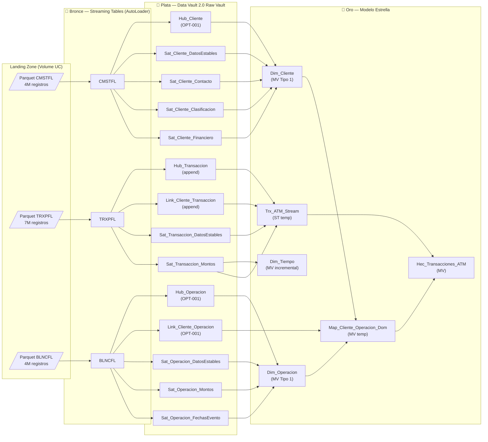
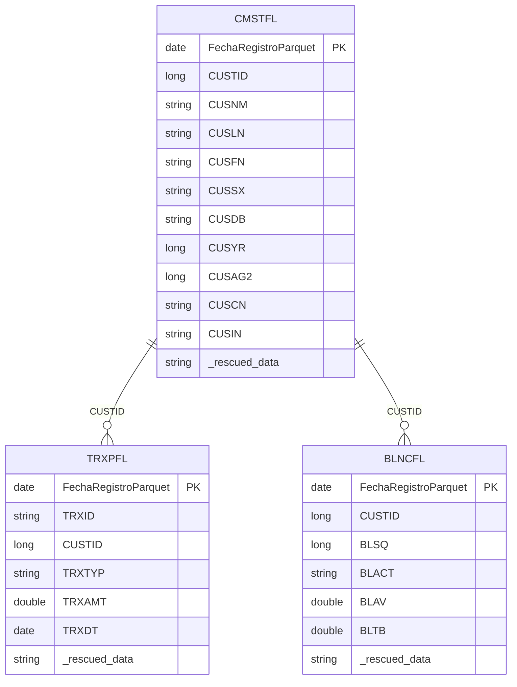
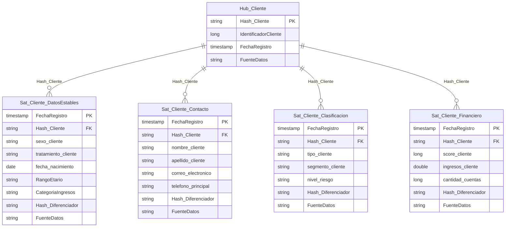
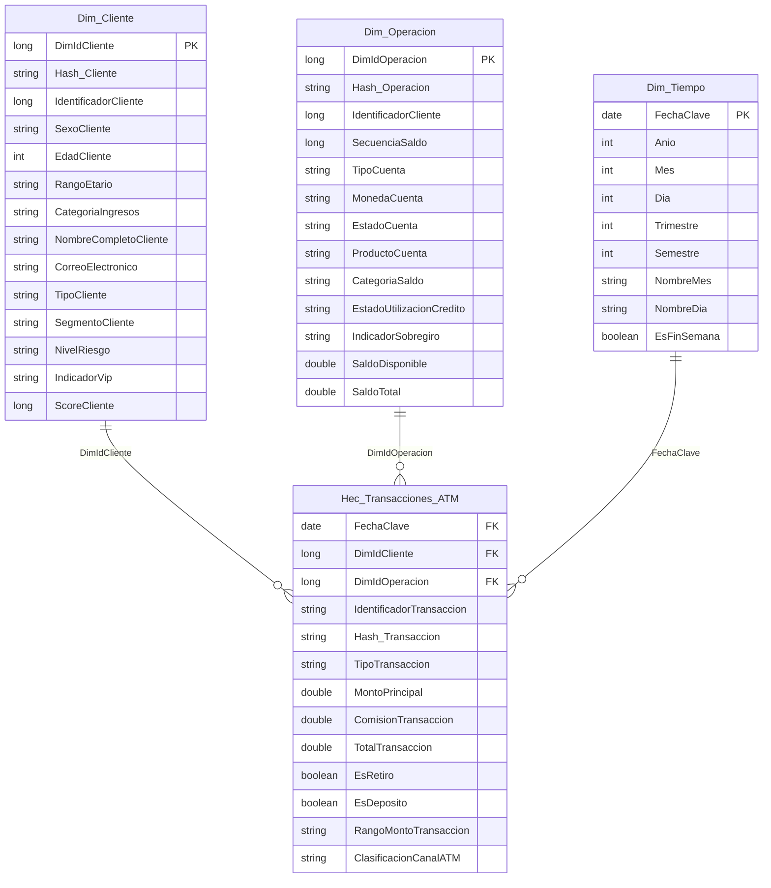
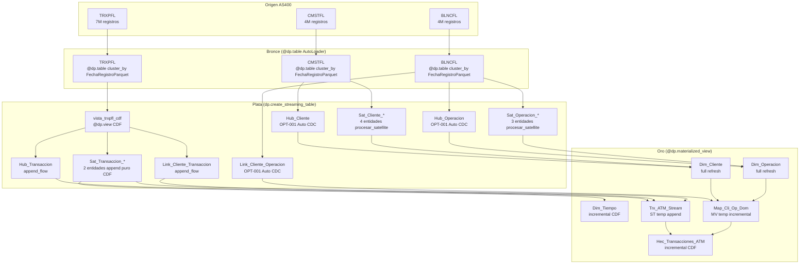

# Modelo de Datos — LSDP Lab DataVault DWH

**Proyecto**: LSDP Lab DataVault DWH  
**Autor**: LSDP Lab DataVault DWH  
**Fecha**: 2026-05-01  
**Spec activo**: [documentacion-consolidada-y-metadata](../.kiro/specs/documentacion-consolidada-y-metadata/spec.json)  
**Plataforma**: Databricks Free Edition · Serverless Compute · Unity Catalog

> **Dependencia**: Este catálogo es la fuente de verdad documental para los comentarios de
> Unity Catalog. El notebook
> [src/LSDP_Lab_DataVault_DWH/explorations/Metadata/NbComentariosTablas.py](../src/LSDP_Lab_DataVault_DWH/explorations/Metadata/NbComentariosTablas.py)
> aplica los comentarios definidos aquí sobre cada tabla y columna. Ambos artefactos deben
> mantenerse sincronizados.

---

## Índice

1. [Arquitectura de Datos](#1-arquitectura-de-datos)
2. [Medalla de Bronce — Ingesta Incremental](#2-medalla-de-bronce--ingesta-incremental)
3. [Medalla de Plata — Data Vault 2.0 Raw Vault](#3-medalla-de-plata--data-vault-20-raw-vault)
4. [Medalla de Oro — Modelo Estrella](#4-medalla-de-oro--modelo-estrella)
5. [Linaje Macro Bronce → Plata → Oro](#5-linaje-macro-bronce--plata--oro)
6. [Sincronización con NbComentariosTablas.py](#6-sincronizaci%C3%B3n-con-nbcomentariostablaspyy)

---

## 1. Arquitectura de Datos

### Diagrama de flujo macro



---

## 2. Medalla de Bronce — Ingesta Incremental

### Descripción general

Tres Streaming Tables persistentes creadas con `@dp.table()` sobre AutoLoader (`cloudFiles`).
Cada tabla acumula todos los Parquets incremetales del origen AS400 correspondiente.

**Propiedades comunes**:
- Tipo LSDP: Streaming Table persistente (`@dp.table()`)
- Ingesta: AutoLoader `cloudFiles.format=parquet` con `schemaEvolutionMode=addNewColumns`
- Liquid Clustering: `["FechaRegistroParquet"]`
- Columna derivada: `FechaRegistroParquet` (DATE) = año + mes + dia de la partición física
- Columna automática: `_rescued_data` (StringType) — generada por AutoLoader

---

### 2.1 CMSTFL — Maestro de Clientes

**Fuente AS400**: Sistema maestro de clientes bancarios  
**Registros**: ~4.000.000  
**Llave primaria**: `CUSTID` (LongType)

#### Diagrama relacional Bronce



#### Catálogo completo de columnas — 75 columnas

**Infraestructura** (5): `FechaRegistroParquet`, `año`, `mes`, `dia`, `_rescued_data`  
**Datos AS400** (70): 9 LONG · 41 STRING · 18 DATE · 2 DOUBLE

> El diagrama erDiagram muestra columnas representativas. Esta tabla documenta el esquema completo.

| Columna | Tipo | Descripción |
|---------|------|-------------|
| `FechaRegistroParquet` | DATE | **Liquid Clustering key.** Fecha derivada de las particiones de ruta `año/mes/dia`. |
| `año` | INT | Año de la partición física del Landing Zone. |
| `mes` | INT | Mes de la partición física del Landing Zone. |
| `dia` | INT | Día de la partición física del Landing Zone. |
| `_rescued_data` | STRING | Columna automática AutoLoader — captura campos no mapeados por schema evolution. |
| `CUSTID` | LONG | Identificador único de cliente en sistema AS400. Llave de negocio primaria. |
| `CUSNM` | STRING | Nombre de pila del cliente. |
| `CUSLN` | STRING | Apellido del cliente. |
| `CUSMD` | STRING | Nombre medio del cliente. |
| `CUSFN` | STRING | Nombre completo (CUSNM + CUSMD + CUSLN). |
| `CUSSX` | STRING | Sexo del cliente. Valores: `M`, `F`. |
| `CUSTT` | STRING | Tratamiento. Valores: `Mr`, `Mrs`, `Ms`, `Dr`. |
| `CUSAD` | STRING | Dirección postal línea 1 (calle y número). |
| `CUSA2` | STRING | Dirección postal línea 2 (apartamento). |
| `CUSCT` | STRING | Ciudad de residencia. |
| `CUSST` | STRING | Estado o provincia de residencia. |
| `CUSZP` | STRING | Código postal (5 dígitos). |
| `CUSCN` | STRING | País de residencia. |
| `CUSPH` | STRING | Número de teléfono fijo (formato +1-XXXXXXXXXX). |
| `CUSMB` | STRING | Número de teléfono móvil (formato +1-XXXXXXXXXX). |
| `CUSEM` | STRING | Dirección de correo electrónico. |
| `CUSTP` | STRING | Tipo de persona. Valores: `IND` (Individual), `COR` (Corporativo). |
| `CUSSG` | STRING | Segmento del cliente. Valores: `PREM`, `STD`, `BAS`. |
| `CUSMS` | STRING | Estado civil. Valores: `SNG`, `MRD`, `DIV`, `WDW`. |
| `CUSOC` | STRING | Ocupación del cliente. |
| `CUSED` | STRING | Nivel educativo. Valores: `PHD`, `MST`, `BSC`, `HSC`, `OTH`. |
| `CUSNA` | STRING | Nacionalidad del cliente. |
| `CUSDL` | STRING | Número de documento de identidad (9 dígitos). |
| `CUSDP` | STRING | Tipo de documento. Valores: `PASS`, `NAID`, `DRVL`. |
| `CUSRG` | STRING | Región geográfica. Valores: Norte, Sur, Centro, Este, Oeste, Nordeste, Noroeste, Sureste. |
| `CUSBR` | STRING | Código de sucursal bancaria asignada (BRN001–BRN008). |
| `CUSMG` | STRING | Código del gerente asignado (MGR001–MGR005). |
| `CUSRF` | STRING | Código de referencia interno del cliente (REF + 8 dígitos). |
| `CUSRS` | STRING | Fuente de referencia. Valores: `WEB`, `MOBILE`, `BRANCH`, `ATM`, `REFERRAL`, `SOCIAL`. |
| `CUSLG` | STRING | Idioma preferido. Valores: `HEB`, `ARA`, `ENG`. |
| `CUSNT` | STRING | Notas internas del cliente. |
| `CUSAG` | STRING | Grupo de afinidad. Valores: `AHORRO`, `INVERSION`, `CREDITO`, `NOMINA`, `SEGURO`. |
| `CUSPC` | STRING | Preferencia de comunicación. Valores: `EML`, `SMS`, `PHL`, `MIL`. |
| `CUSRK` | STRING | Nivel de riesgo crediticio. Valores: `LOW`, `MED`, `HIG`, `CRT`. |
| `CUSVP` | STRING | Indicador de cliente VIP. Valores: `Y`, `N`. |
| `CUSPF` | STRING | Indicador PEP / cliente preferencial. Valores: `Y`, `N`. |
| `CUSKT` | STRING | Estado del proceso KYC. Valores: `COMP`, `PEND`, `EXPD`. |
| `CUSFM` | STRING | Indicador de fraude. Valores: `Y`, `N`. |
| `CUSLC` | STRING | Último canal de contacto. Valores: `BRN`, `ATM`, `ONL`, `MOB`. |
| `CUSCR` | STRING | Calificación crediticia. Valores: `AAA`, `AA`, `A`, `BBB`, `BB`, `B`, `CCC`, `D`. |
| `CUSAC` | STRING | Estado de cuenta activa. Valores: `A` (Activo), `I` (Inactivo), `S` (Suspendido). |
| `CUSCL` | STRING | Clasificación interna del cliente (CLF01–CLF05). |
| `CUSDB` | DATE | Fecha de nacimiento del cliente (rango 1970–2007). |
| `CUSOD` | DATE | Fecha de apertura de la relación bancaria. |
| `CUSCD` | DATE | Fecha de cierre de la relación. |
| `CUSLV` | DATE | Fecha de última visita a sucursal. |
| `CUSUD` | DATE | Fecha de última actualización de datos. |
| `CUSKD` | DATE | Fecha de última verificación KYC. |
| `CUSRD` | DATE | Fecha de última revisión de riesgo. |
| `CUSXD` | DATE | Fecha de expiración del documento de identidad. |
| `CUSFD` | DATE | Fecha de apertura del primer producto bancario. |
| `CUSLD` | DATE | Fecha de cierre del último producto bancario. |
| `CUSMD2` | DATE | Fecha de migración de datos al sistema. |
| `CUSAD2` | DATE | Fecha de activación del cliente. |
| `CUSBD` | DATE | Fecha de bloqueo de cuenta. |
| `CUSVD` | DATE | Fecha de verificación de identidad. |
| `CUSPD` | DATE | Fecha de última penalización. |
| `CUSDD` | DATE | Fecha de desactivación del cliente. |
| `CUSED2` | DATE | Fecha de última sesión de educación financiera. |
| `CUSND` | DATE | Fecha de nueva incorporación / notificación. |
| `CUSYR` | LONG | Año de nacimiento (derivado de `CUSDB`). |
| `CUSAG2` | LONG | Edad calculada a la fecha del snapshot (2026 − CUSYR). |
| `CUSDP2` | LONG | Cantidad de dependientes (0–5). |
| `CUSAC2` | LONG | Número de cuentas activas (1–5). |
| `CUSTX` | LONG | Cantidad histórica de transacciones (1–500). |
| `CUSSC` | LONG | Score crediticio del cliente (rango 300–1150). |
| `CUSLR` | LONG | Nivel de lealtad (0–9). |
| `CUSRC` | LONG | Cantidad de reclamos históricos (0–49). |
| `CUSIN` | DOUBLE | Ingresos mensuales estimados del cliente (en USD). |
| `CUSBL` | DOUBLE | Balance total estimado del cliente (en USD). |

---

### 2.2 TRXPFL — Transacciones

**Fuente AS400**: Sistema transaccional (OLTP bancario)  
**Registros**: ~7.000.000  
**Llave primaria**: `TRXID` (StringType — cadena alfanumérica AS400)

#### Catálogo completo de columnas — 65 columnas

**Infraestructura** (5): `FechaRegistroParquet`, `año`, `mes`, `dia`, `_rescued_data`  
**Datos AS400** (60): 7 STRING · 2 LONG · 19 DATE · 2 TIMESTAMP · 30 DOUBLE

| Columna | Tipo | Descripción |
|---------|------|-------------|
| `FechaRegistroParquet` | DATE | **Liquid Clustering key.** Fecha derivada de las particiones de ruta `año/mes/dia`. |
| `año` | INT | Año de la partición física del Landing Zone. |
| `mes` | INT | Mes de la partición física del Landing Zone. |
| `dia` | INT | Día de la partición física del Landing Zone. |
| `_rescued_data` | STRING | Columna automática AutoLoader — captura campos no mapeados por schema evolution. |
| `TRXID` | STRING | Identificador único global de transacción (tipo TRXTYP + 8 dígitos). Llave primaria de negocio. |
| `CUSTID` | LONG | FK hacia CMSTFL — identificador del cliente que realizó la transacción. |
| `TRXTYP` | STRING | Tipo de transacción. `CATM`=depósito ATM, `DATM`=retiro ATM, `CMPR`=compra, `TINT`=transferencia int., `DPST`=depósito, `PGSL`=pago servicio, `TEXT`=transferencia ext., `RTRO`=retiro, `PGSV`=pago servicios, `NMNA`=nómina, `INTR`=interés, `ADSL`=adelanto efectivo, `IMPT`=impuesto, `DMCL`=domiciliación, `CMSN`=comisión. |
| `TRXAMT` | DOUBLE | Monto principal de la transacción (métrica financiera primaria). |
| `TRXCUR` | STRING | Moneda de la transacción (ISO 4217). Valores: `USD`, `EUR`, `ILS`, `EGP`, `GBP`. |
| `TRXST` | STRING | Estado de la transacción. Valores: `APPR`, `DECL`, `PEND`, `REVS`. |
| `TRXCH` | STRING | Canal de la transacción. Valores: `ATM`, `BRN`, `ONL`, `MOB`, `POS`. |
| `TRXDSC` | STRING | Descripción textual de la transacción. |
| `TRXREF` | STRING | Referencia externa de la transacción (EXT + 10 dígitos). |
| `TRXSQ` | LONG | Número de secuencia global único de la transacción. Irrepetible entre ejecuciones. |
| `TRXDT` | DATE | Fecha de la transacción (fecha de corte del snapshot AS400). Clave hacia Dim_Tiempo. |
| `TRXVD` | DATE | Fecha valor de la transacción. |
| `TRXPD` | DATE | Fecha de procesamiento. |
| `TRXSD` | DATE | Fecha de liquidación. |
| `TRXCD` | DATE | Fecha de compensación. |
| `TRXED` | DATE | Fecha efectiva. |
| `TRXRD` | DATE | Fecha de reverso. |
| `TRXAD` | DATE | Fecha de autorización. |
| `TRXND` | DATE | Fecha de notificación. |
| `TRXXD` | DATE | Fecha de expiración. |
| `TRXFD` | DATE | Fecha de fondeo. |
| `TRXGD` | DATE | Fecha de gracia. |
| `TRXHD` | DATE | Fecha histórica. |
| `TRXBD` | DATE | Fecha de bloqueo. |
| `TRXMD` | DATE | Fecha de maduración. |
| `TRXLD` | DATE | Fecha límite. |
| `TRXUD` | DATE | Fecha de actualización. |
| `TRXOD` | DATE | Fecha de origen. |
| `TRXKD` | DATE | Fecha de KYC. |
| `TRXTS` | TIMESTAMP | Timestamp de creación de la transacción. |
| `TRXUS` | TIMESTAMP | Timestamp de última actualización. |
| `TRXBA` | DOUBLE | Saldo posterior a la transacción. |
| `TRXBP` | DOUBLE | Saldo previo a la transacción. |
| `TRXCM` | DOUBLE | Comisión aplicada a la transacción. |
| `TRXIM` | DOUBLE | Margen de interés. |
| `TRXNT` | DOUBLE | Monto neto de la transacción (`TRXAMT − TRXCM − TRXIM`). |
| `TRXTC` | DOUBLE | Cargo fiscal (rango 0.5–5.0). |
| `TRXAO` | DOUBLE | Monto original de la operación. |
| `TRXAL` | DOUBLE | Monto en moneda local. |
| `TRXIN` | DOUBLE | Monto de inversión. |
| `TRXPN` | DOUBLE | Monto de pago. |
| `TRXDS` | DOUBLE | Descuento aplicado. |
| `TRXBF` | DOUBLE | Beneficio de la transacción. |
| `TRXPT` | DOUBLE | Monto de cuota de préstamo. |
| `TRXRL` | DOUBLE | Pérdida por tipo de cambio (rango 0.0–0.25). |
| `TRXMX` | DOUBLE | Monto máximo del intervalo (`montoMaximo × 1.1`). |
| `TRXMN` | DOUBLE | Monto mínimo del intervalo. |
| `TRXAV` | DOUBLE | Monto promedio histórico. |
| `TRXDV` | DOUBLE | Desviación del monto respecto al promedio (`TRXAMT − TRXAV`). |
| `TRXRK` | DOUBLE | Puntaje de riesgo de la transacción (escala 0–100). |
| `TRXFR` | DOUBLE | Indicador de riesgo de fraude (escala 0–100). |
| `TRXLM` | DOUBLE | Límite de la transacción. |
| `TRXLP` | DOUBLE | Porcentaje del límite utilizado (`TRXLM − TRXAMT`). |
| `TRXCP` | DOUBLE | Cargo por plataforma. |
| `TRXCI` | DOUBLE | Cargo por institución. |
| `TRXCF` | DOUBLE | Cargo por divisa extranjera. |
| `TRXCV` | DOUBLE | Cargo por varianza. |
| `TRXSB` | DOUBLE | Subtotal sin comisión (`TRXAMT − TRXCM`). |
| `TRXTL` | DOUBLE | Total de la transacción (`TRXAMT + TRXCP + TRXCI`). |
| `TRXRS` | DOUBLE | Residuo de la transacción. |

---

### 2.3 BLNCFL — Saldos / Operaciones

**Fuente AS400**: Sistema de saldos bancarios  
**Registros**: ~4.000.000  
**Llave primaria compuesta**: `CUSTID` + `BLSQ` (LongType + LongType)

#### Catálogo completo de columnas — 105 columnas

**Infraestructura** (5): `FechaRegistroParquet`, `año`, `mes`, `dia`, `_rescued_data`  
**Datos AS400** (100): 2 LONG · 29 STRING · 34 DOUBLE · 35 DATE

| Columna | Tipo | Descripción |
|---------|------|-------------|
| `FechaRegistroParquet` | DATE | **Liquid Clustering key.** Fecha derivada de las particiones de ruta `año/mes/dia`. |
| `año` | INT | Año de la partición física del Landing Zone. |
| `mes` | INT | Mes de la partición física del Landing Zone. |
| `dia` | INT | Día de la partición física del Landing Zone. |
| `_rescued_data` | STRING | Columna automática AutoLoader — captura campos no mapeados por schema evolution. |
| `CUSTID` | LONG | FK hacia CMSTFL — identificador del cliente propietario de la cuenta. Parte 1 de la llave compuesta. |
| `BLSQ` | LONG | Secuencia de saldo — diferenciador de operación por cliente. Parte 2 de la llave compuesta. |
| `BLACT` | STRING | Tipo de cuenta bancaria. Valores: `AHRO` (Ahorro 40%), `CRTE` (Corriente 30%), `PRES` (Préstamo 20%), `INVR` (Inversión 10%). |
| `BLACN` | STRING | Número de cuenta bancaria (ACC + 10 dígitos de CUSTID). |
| `BLCUR` | STRING | Moneda de la cuenta (ISO 4217). Valores: `USD`, `EUR`, `ILS`, `EGP`, `GBP`. |
| `BLST` | STRING | Estado de la cuenta. Valores: `ACTV`, `INAC`, `SUSP`, `CERR`. |
| `BLBR` | STRING | Código de sucursal bancaria asociada (BRN001–BRN005). |
| `BLPR` | STRING | Código del producto bancario asociado. |
| `BLSP` | STRING | Código del subproducto bancario (SUB-01–SUB-04). |
| `BLNM` | STRING | Nombre descriptivo de la cuenta. |
| `BLCL` | STRING | Clasificación de la cuenta (CLF01–CLF04). |
| `BLRK` | STRING | Nivel de riesgo de la cuenta. Valores: `LOW`, `MED`, `HIG`. |
| `BLTP` | STRING | Tipo de titular. Valores: `PRI` (Principal), `SEC` (Secundario), `AUT` (Autorizado). |
| `BLMG` | STRING | Código del gerente de cuenta asignado (MGR001–MGR005). |
| `BLRF` | STRING | Referencia de la cuenta (REF-BL-001 a REF-BL-004). |
| `BLCC` | STRING | Centro de costos asociado (CC001–CC004). |
| `BLAG` | STRING | Grupo de afinidad de la cuenta (GRP-AHORRO, GRP-CREDITO, GRP-INVERSION, GRP-NOMINA). |
| `BLPL` | STRING | Plan asociado a la cuenta (PLAN-A/PLAN-B/PLAN-C/PLAN-D). |
| `BLRG` | STRING | Región geográfica de la cuenta (Norte/Sur/Centro/Este/Oeste). |
| `BLSF` | STRING | Sufijo de la cuenta (2 dígitos, 01–99). |
| `BLNT` | STRING | Notas internas de la cuenta. |
| `BLLC` | STRING | Último canal de acceso. Valores: `ATM`, `BRN`, `ONL`, `MOB`. |
| `BLPF` | STRING | Indicador de perfil (Y/N). |
| `BLAU` | STRING | Indicador de autorización (Y/N). |
| `BLTX` | STRING | Indicador de texto (Y/N). |
| `BLGR` | STRING | Indicador de grupo (Y/N). |
| `BLEM` | STRING | Indicador de email (Y/N). |
| `BLFR` | STRING | Indicador de frecuencia (Y/N). |
| `BLKY` | STRING | Estado de clave. Valores: `COMP`, `PEND`. |
| `BLVP` | STRING | Indicador VIP (Y/N). |
| `BLFC` | STRING | Frecuencia de estado de cuenta. Valores: `MEN`, `TRI`, `SEM`, `ANU`. |
| `BLAV` | DOUBLE | Saldo disponible para transacciones. |
| `BLTB` | DOUBLE | Saldo total de la cuenta. |
| `BLRV` | DOUBLE | Saldo reservado. |
| `BLBK` | DOUBLE | Saldo bloqueado. |
| `BLMN` | DOUBLE | Saldo mínimo configurado. |
| `BLMX` | DOUBLE | Saldo máximo configurado. |
| `BLIR` | DOUBLE | Tasa de interés anual (0.0–0.25). |
| `BLPM` | DOUBLE | Multiplicador de penalidad (0.0–0.15). |
| `BLCR` | DOUBLE | Límite de crédito de la cuenta. |
| `BLCU` | DOUBLE | Crédito utilizado actualmente. |
| `BLCD` | DOUBLE | Crédito disponible (`BLCR − BLCU`). |
| `BLOV` | DOUBLE | Valor de sobregiro actual. |
| `BLOL` | DOUBLE | Límite de sobregiro permitido. |
| `BLPD` | DOUBLE | Depósitos pendientes. |
| `BLPC` | DOUBLE | Cargos pendientes. |
| `BLPA` | DOUBLE | Ajustes pendientes. |
| `BLDI` | DOUBLE | Depósitos del período (ingresos). |
| `BLWI` | DOUBLE | Retenciones de la cuenta. |
| `BLTI` | DOUBLE | Transferencias del período (ingresos). |
| `BLTC` | DOUBLE | Cargos de transferencia. |
| `BLCA` | DOUBLE | Comisiones anuales. |
| `BLIM` | DOUBLE | Intereses mensuales. |
| `BLRF2` | DOUBLE | Reembolsos de la cuenta. |
| `BLPN` | DOUBLE | Penalidades de la cuenta. |
| `BLBN` | DOUBLE | Bonificaciones de la cuenta. |
| `BLAP` | DOUBLE | Ajustes positivos. |
| `BLAM` | DOUBLE | Ajustes misceláneos. |
| `BLAY` | DOUBLE | Ajustes anuales. |
| `BLHI` | DOUBLE | Marca de saldo máximo histórico. |
| `BLLO` | DOUBLE | Marca de saldo mínimo histórico. |
| `BLVR` | DOUBLE | Varianza del saldo. |
| `BLRT` | DOUBLE | Ratio de utilización de la cuenta (0.0–0.20). |
| `BLCP` | DOUBLE | Porcentaje de aporte. |
| `BLCI` | DOUBLE | Ingresos de aporte. |
| `BLOD` | DATE | Fecha de apertura de la cuenta. |
| `BLXD` | DATE | Fecha de expiración de la cuenta. |
| `BLUD` | DATE | Fecha de última actualización. |
| `BLLD` | DATE | Fecha del último movimiento. |
| `BLSD` | DATE | Fecha de estado de cuenta. |
| `BLPD2` | DATE | Fecha de penalidad. |
| `BLRD` | DATE | Fecha de renovación de la cuenta. |
| `BLMD` | DATE | Fecha de maduración. |
| `BLCD2` | DATE | Fecha de cierre de la cuenta. |
| `BLBD` | DATE | Fecha de bloqueo de la cuenta. |
| `BLFD` | DATE | Fecha de fondeo. |
| `BLGD` | DATE | Fecha de gracia. |
| `BLHD` | DATE | Fecha histórica. |
| `BLID` | DATE | Fecha de interés. |
| `BLJD` | DATE | Fecha de ajuste. |
| `BLKD` | DATE | Fecha de KYC de la cuenta. |
| `BLND` | DATE | Fecha de notificación. |
| `BLTD` | DATE | Fecha de transferencia. |
| `BLVD` | DATE | Fecha de verificación de la cuenta. |
| `BLWD` | DATE | Fecha de revisión interna. |
| `BLYD` | DATE | Fecha de sincronización anual. |
| `BLZD` | DATE | Fecha de cierre de ejercicio. |
| `BLED` | DATE | Fecha de educación financiera. |
| `BLAD2` | DATE | Fecha de activación adicional. |
| `BLDD` | DATE | Fecha de desactivación de la cuenta. |
| `BLFP` | DATE | Fecha de primer pago. |
| `BLLP` | DATE | Fecha de último pago. |
| `BLMP` | DATE | Fecha de modificación del plan. |
| `BLNP` | DATE | Fecha de notificación de pago. |
| `BLOP` | DATE | Fecha de apertura del período. |
| `BLPP` | DATE | Fecha de cierre del período. |
| `BLQP` | DATE | Fecha de pago programado. |
| `BLRP` | DATE | Fecha de reversión de pago. |
| `BLSP2` | DATE | Fecha de inicio del servicio. |
| `BLTP2` | DATE | Fecha de terminación del plan. |

---

## 3. Medalla de Plata — Data Vault 2.0 Raw Vault

### Descripción general

14 entidades organizadas en Hubs, Links y Satellites. Todas son Streaming Tables Acumulativas
(`dp.create_streaming_table()`). Patrón de deduplicación varía por tipo de entidad.

**Columnas técnicas obligatorias**:
- `FechaRegistro` (TIMESTAMP) — momento de inserción (Load Date de Data Vault 2.0)
- `FuenteDatos` (STRING) — nombre de 3 partes de la tabla Bronce origen
- `Hash_Diferenciador` (STRING) — SHA2-512 sobre todos los campos de negocio (solo Satellites)

**Propiedades Delta comunes a todas las entidades Plata**:
```
delta.autoOptimize.autoCompact = true
delta.autoOptimize.optimizeWrite = true
delta.enableChangeDataFeed = true
delta.deletedFileRetentionDuration = interval 30 days
delta.logRetentionDuration = interval 60 days
```

---

### 3.1 Hub_Cliente

**Entidad**: Llave de negocio de Cliente  
**Estrategia**: OPT-001 — `dp.create_auto_cdc_flow(stored_as_scd_type=1)` via `@dp.view`  
**Fuente**: `CMSTFL`  
**Liquid Clustering**: `["Hash_Cliente", "FechaRegistro"]`



| Columna | Tipo | Descripción | Rol DV2.0 |
|---------|------|-------------|----------|
| `Hash_Cliente` | STRING | SHA2-256 de `CUSTID` | Hash de Hub |
| `IdentificadorCliente` | LONG | `CUSTID` — llave de negocio original | Llave de negocio |
| `FechaRegistro` | TIMESTAMP | Momento de inserción / última vez vista | Fecha carga |
| `FuenteDatos` | STRING | `{catalogo}.{esquema}.CMSTFL` | Fuente |

---

### 3.2 Hub_Transaccion

**Estrategia**: `@dp.append_flow()` puro sobre `vista_trxpfl_cdf`  
**Fuente**: `vista_trxpfl_cdf` (CDF sobre TRXPFL)  
**Liquid Clustering**: `["FechaRegistro", "Hash_Transaccion"]`

| Columna | Tipo | Descripción | Rol DV2.0 |
|---------|------|-------------|----------|
| `FechaRegistro` | TIMESTAMP | Momento de inserción | Fecha carga |
| `Hash_Transaccion` | STRING | SHA2-256 de `TRXID` | Hash de Hub |
| `IdentificadorTransaccion` | STRING | `TRXID` — llave de negocio | Llave de negocio |
| `FuenteDatos` | STRING | `{catalogo}.{esquema}.TRXPFL` | Fuente |

---

### 3.3 Hub_Operacion

**Estrategia**: OPT-001 — `dp.create_auto_cdc_flow(stored_as_scd_type=1)` via `@dp.view`  
**Fuente**: `BLNCFL`  
**Liquid Clustering**: `["Hash_Operacion", "FechaRegistro"]`

| Columna | Tipo | Descripción | Rol DV2.0 |
|---------|------|-------------|----------|
| `Hash_Operacion` | STRING | SHA2-256 de `CUSTID\|BLSQ` | Hash de Hub |
| `IdentificadorCliente` | LONG | `CUSTID` — parte de la llave compuesta | Llave de negocio |
| `SecuenciaSaldo` | LONG | `BLSQ` — parte de la llave compuesta | Llave de negocio |
| `FechaRegistro` | TIMESTAMP | Momento de inserción / última vez vista | Fecha carga |
| `FuenteDatos` | STRING | `{catalogo}.{esquema}.BLNCFL` | Fuente |

---

### 3.4 Link_Cliente_Operacion

**Estrategia**: OPT-001 — `dp.create_auto_cdc_flow(stored_as_scd_type=1)`  
**Fuente**: `BLNCFL`  
**Liquid Clustering**: `["Hash_Cliente", "Hash_Operacion", "FechaRegistro"]`

| Columna | Tipo | Descripción | Rol DV2.0 |
|---------|------|-------------|----------|
| `Hash_Cliente` | STRING | SHA2-256 de `CUSTID` | Hash Hub 1 |
| `Hash_Operacion` | STRING | SHA2-256 de `CUSTID\|BLSQ` | Hash Hub 2 |
| `Hash_Link_Cliente_Operacion` | STRING | SHA2-256 de `Hash_Cliente\|Hash_Operacion` | Hash de Link |
| `FechaRegistro` | TIMESTAMP | Momento de inserción / última vez vista | Fecha carga |
| `FuenteDatos` | STRING | `{catalogo}.{esquema}.BLNCFL` | Fuente |

---

### 3.5 Link_Cliente_Transaccion

**Estrategia**: `@dp.append_flow()` puro sobre `vista_trxpfl_cdf`  
**Fuente**: `vista_trxpfl_cdf`  
**Liquid Clustering**: `["FechaRegistro", "Hash_Cliente", "Hash_Transaccion"]`

| Columna | Tipo | Descripción | Rol DV2.0 |
|---------|------|-------------|----------|
| `FechaRegistro` | TIMESTAMP | Momento de inserción | Fecha carga |
| `Hash_Cliente` | STRING | SHA2-256 de `CUSTID` | Hash Hub 1 |
| `Hash_Transaccion` | STRING | SHA2-256 de `TRXID` | Hash Hub 2 |
| `Hash_Link_Cliente_Transaccion` | STRING | SHA2-256 de `Hash_Cliente\|Hash_Transaccion` | Hash de Link |
| `FuenteDatos` | STRING | `{catalogo}.{esquema}.TRXPFL` | Fuente |

---

### 3.6 Satellites de Cliente (4 entidades)

**Estrategia**: `@dp.append_flow()` + `procesar_satellite()` (LEFT JOIN por `Hash_Diferenciador`)  
**Fuente**: `CMSTFL`  
**Liquid Clustering**: `["FechaRegistro", "Hash_Cliente"]` en todos

**Columnas técnicas presentes en TODOS los Satellites de Cliente**:  
`FechaRegistro` (TIMESTAMP) · `Hash_Cliente` (STRING, SHA2-256 de CUSTID) · `Hash_Diferenciador` (STRING, SHA2-512) · `FuenteDatos` (STRING)

#### Sat_Cliente_DatosEstables — 17 columnas

| Columna | Tipo | Descripción |
|---------|------|-------------|
| `FechaRegistro` | TIMESTAMP | Fecha de carga (Load Date DV2.0). Momento de inserción. |
| `Hash_Cliente` | STRING | SHA2-256 de `CUSTID`. Llave de Hub. FK hacia Hub_Cliente. |
| `sexo_cliente` | STRING | Sexo del cliente. Derivado de `CUSSX`. Valores: M, F. |
| `tratamiento_cliente` | STRING | Tratamiento. Derivado de `CUSTT`. Valores: Mr, Mrs, Ms, Dr. |
| `fecha_nacimiento` | DATE | Fecha de nacimiento. Derivado de `CUSDB`. |
| `anio_nacimiento` | LONG | Año de nacimiento. Derivado de `CUSYR`. |
| `edad_cliente` | LONG | Edad calculada. Derivado de `CUSAG2`. |
| `pais_residencia` | STRING | País de residencia. Derivado de `CUSCN`. |
| `nacionalidad_cliente` | STRING | Nacionalidad. Derivado de `CUSNA`. |
| `numero_licencia_conducir` | STRING | Número de documento de identidad. Derivado de `CUSDL`. |
| `tipo_documento_pasaporte` | STRING | Tipo de documento. Derivado de `CUSDP`. Valores: PASS, NAID, DRVL. |
| `cantidad_pasaportes` | LONG | Número de dependientes. Derivado de `CUSDP2`. |
| `idioma_preferido` | STRING | Idioma preferido. Derivado de `CUSLG`. Valores: HEB, ARA, ENG. |
| `RangoEtario` | STRING | Categoría de edad calculada. Derivado de `edad_cliente` via `clasificar_por_umbral`. |
| `CategoriaIngresos` | STRING | Categoría de ingresos mensuales. Derivado de `CUSIN` via `clasificar_por_umbral`. |
| `Hash_Diferenciador` | STRING | SHA2-512 de todos los campos de negocio del satellite. Detecta cambios (SCD2). |
| `FuenteDatos` | STRING | Nombre de 3 partes de la tabla Bronce origen. |

#### Sat_Cliente_Contacto — 19 columnas

| Columna | Tipo | Descripción |
|---------|------|-------------|
| `FechaRegistro` | TIMESTAMP | Fecha de carga (Load Date DV2.0). Momento de inserción. |
| `Hash_Cliente` | STRING | SHA2-256 de `CUSTID`. Llave de Hub. FK hacia Hub_Cliente. |
| `nombre_cliente` | STRING | Nombre de pila. Derivado de `CUSNM`. |
| `apellido_cliente` | STRING | Apellido. Derivado de `CUSLN`. |
| `nombre_medio_cliente` | STRING | Nombre medio. Derivado de `CUSMD`. |
| `nombre_completo_cliente` | STRING | Nombre completo (CUSNM + CUSMD + CUSLN). Derivado de `CUSFN`. |
| `direccion_calle` | STRING | Dirección postal línea 1. Derivado de `CUSAD`. |
| `direccion_apartamento` | STRING | Dirección postal línea 2. Derivado de `CUSA2`. |
| `ciudad_residencia` | STRING | Ciudad de residencia. Derivado de `CUSCT`. |
| `estado_provincia` | STRING | Estado o provincia. Derivado de `CUSST`. |
| `codigo_postal` | STRING | Código postal (5 dígitos). Derivado de `CUSZP`. |
| `telefono_principal` | STRING | Teléfono fijo. Derivado de `CUSPH`. |
| `telefono_movil` | STRING | Teléfono móvil. Derivado de `CUSMB`. |
| `correo_electronico` | STRING | Correo electrónico. Derivado de `CUSEM`. |
| `estado_civil` | STRING | Estado civil. Derivado de `CUSMS`. Valores: SNG, MRD, DIV, WDW. |
| `ocupacion_cliente` | STRING | Ocupación. Derivado de `CUSOC`. |
| `nivel_educativo` | STRING | Nivel educativo. Derivado de `CUSED`. Valores: PHD, MST, BSC, HSC, OTH. |
| `Hash_Diferenciador` | STRING | SHA2-512 de todos los campos de negocio del satellite. Detecta cambios (SCD2). |
| `FuenteDatos` | STRING | Nombre de 3 partes de la tabla Bronce origen. |

#### Sat_Cliente_Clasificacion — 23 columnas

| Columna | Tipo | Descripción |
|---------|------|-------------|
| `FechaRegistro` | TIMESTAMP | Fecha de carga (Load Date DV2.0). Momento de inserción. |
| `Hash_Cliente` | STRING | SHA2-256 de `CUSTID`. Llave de Hub. FK hacia Hub_Cliente. |
| `tipo_cliente` | STRING | Tipo de persona. Derivado de `CUSTP`. Valores: IND, COR. |
| `segmento_cliente` | STRING | Segmento. Derivado de `CUSSG`. Valores: PREM, STD, BAS. |
| `region_geografica` | STRING | Región geográfica. Derivado de `CUSRG`. |
| `sucursal_principal` | STRING | Sucursal asignada. Derivado de `CUSBR`. |
| `gerente_asignado` | STRING | Gerente asignado. Derivado de `CUSMG`. |
| `referencia_interna` | STRING | Código de referencia interno. Derivado de `CUSRF`. |
| `fuente_referencia` | STRING | Fuente de referencia. Derivado de `CUSRS`. Valores: WEB, MOBILE, BRANCH, ATM, REFERRAL, SOCIAL. |
| `grupo_afinidad` | STRING | Grupo de afinidad. Derivado de `CUSAG`. Valores: AHORRO, INVERSION, CREDITO, NOMINA, SEGURO. |
| `preferencia_comunicacion` | STRING | Preferencia de comunicación. Derivado de `CUSPC`. Valores: EML, SMS, PHL, MIL. |
| `nivel_riesgo` | STRING | Nivel de riesgo crediticio. Derivado de `CUSRK`. Valores: LOW, MED, HIG, CRT. |
| `indicador_vip` | STRING | Indicador VIP. Derivado de `CUSVP`. Valores: Y, N. |
| `estado_perfil` | STRING | Indicador PEP / preferencial. Derivado de `CUSPF`. Valores: Y, N. |
| `estado_kyc` | STRING | Estado proceso KYC. Derivado de `CUSKT`. Valores: COMP, PEND, EXPD. |
| `indicador_flags` | STRING | Indicador de fraude. Derivado de `CUSFM`. Valores: Y, N. |
| `ultimo_canal` | STRING | Último canal de contacto. Derivado de `CUSLC`. Valores: BRN, ATM, ONL, MOB. |
| `calificacion_crediticia` | STRING | Calificación crediticia. Derivado de `CUSCR`. Valores: AAA, AA, A, BBB, BB, B, CCC, D. |
| `cuenta_activa` | STRING | Estado de cuenta activa. Derivado de `CUSAC`. Valores: A, I, S. |
| `clasificacion_interna` | STRING | Clasificación interna. Derivado de `CUSCL`. |
| `nota_cliente` | STRING | Notas internas. Derivado de `CUSNT`. |
| `Hash_Diferenciador` | STRING | SHA2-512 de todos los campos de negocio del satellite. Detecta cambios (SCD2). |
| `FuenteDatos` | STRING | Nombre de 3 partes de la tabla Bronce origen. |

#### Sat_Cliente_Financiero — 28 columnas

| Columna | Tipo | Descripción |
|---------|------|-------------|
| `FechaRegistro` | TIMESTAMP | Fecha de carga (Load Date DV2.0). Momento de inserción. |
| `Hash_Cliente` | STRING | SHA2-256 de `CUSTID`. Llave de Hub. FK hacia Hub_Cliente. |
| `cantidad_cuentas` | LONG | Número de cuentas activas. Derivado de `CUSAC2`. |
| `cantidad_transacciones` | LONG | Cantidad histórica de transacciones. Derivado de `CUSTX`. |
| `score_cliente` | LONG | Score crediticio (300–1150). Derivado de `CUSSC`. |
| `ranking_prestamos` | LONG | Nivel de lealtad (0–9). Derivado de `CUSLR`. |
| `cantidad_registros` | LONG | Cantidad de reclamos históricos (0–49). Derivado de `CUSRC`. |
| `ingresos_cliente` | DOUBLE | Ingresos mensuales estimados. Derivado de `CUSIN`. |
| `saldo_disponible_maestro` | DOUBLE | Balance total estimado. Derivado de `CUSBL`. |
| `fecha_apertura_relacion` | DATE | Fecha de apertura de la relación bancaria. Derivado de `CUSOD`. |
| `fecha_cierre_relacion` | DATE | Fecha de cierre de la relación. Derivado de `CUSCD`. |
| `fecha_ultima_visita` | DATE | Fecha de última visita. Derivado de `CUSLV`. |
| `fecha_ultima_actualizacion` | DATE | Fecha de última actualización. Derivado de `CUSUD`. |
| `fecha_verificacion_kyc` | DATE | Fecha de última verificación KYC. Derivado de `CUSKD`. |
| `fecha_renovacion` | DATE | Fecha de última revisión de riesgo. Derivado de `CUSRD`. |
| `fecha_expiracion` | DATE | Fecha de expiración del documento. Derivado de `CUSXD`. |
| `fecha_primer_producto` | DATE | Fecha de apertura del primer producto. Derivado de `CUSFD`. |
| `fecha_ultimo_producto` | DATE | Fecha de cierre del último producto. Derivado de `CUSLD`. |
| `fecha_migracion` | DATE | Fecha de migración de datos. Derivado de `CUSMD2`. |
| `fecha_activacion` | DATE | Fecha de activación del cliente. Derivado de `CUSAD2`. |
| `fecha_bloqueo` | DATE | Fecha de bloqueo de cuenta. Derivado de `CUSBD`. |
| `fecha_verificacion` | DATE | Fecha de verificación de identidad. Derivado de `CUSVD`. |
| `fecha_promocion` | DATE | Fecha de última penalización. Derivado de `CUSPD`. |
| `fecha_desactivacion` | DATE | Fecha de desactivación. Derivado de `CUSDD`. |
| `fecha_educacion_financiera` | DATE | Fecha de última educación financiera. Derivado de `CUSED2`. |
| `fecha_notificacion` | DATE | Fecha de nueva incorporación / notificación. Derivado de `CUSND`. |
| `Hash_Diferenciador` | STRING | SHA2-512 de todos los campos de negocio del satellite. Detecta cambios (SCD2). |
| `FuenteDatos` | STRING | Nombre de 3 partes de la tabla Bronce origen. |

---

### 3.7 Satellites de Operación (3 entidades)

**Estrategia**: `@dp.append_flow()` + `procesar_satellite()` (LEFT JOIN por `Hash_Diferenciador`)  
**Fuente**: `BLNCFL`  
**Liquid Clustering**: `["FechaRegistro", "Hash_Operacion"]` en todos

**Columnas técnicas presentes en TODOS los Satellites de Operación**:  
`FechaRegistro` (TIMESTAMP) · `Hash_Operacion` (STRING, SHA2-256 de CUSTID|BLSQ) · `Hash_Diferenciador` (STRING, SHA2-512) · `FuenteDatos` (STRING)

#### Sat_Operacion_DatosEstables — 36 columnas

| Columna | Tipo | Descripción |
|---------|------|-------------|
| `FechaRegistro` | TIMESTAMP | Fecha de carga (Load Date DV2.0). Momento de inserción. |
| `Hash_Operacion` | STRING | SHA2-256 de `CUSTID\|BLSQ`. Llave de Hub. FK hacia Hub_Operacion. |
| `tipo_cuenta` | STRING | Tipo de cuenta bancaria. Derivado de `BLACT`. Valores: AHRO, CRTE, PRES, INVR. |
| `numero_cuenta` | STRING | Número de cuenta bancaria. Derivado de `BLACN`. |
| `moneda_cuenta` | STRING | Moneda (ISO 4217). Derivado de `BLCUR`. |
| `estado_cuenta` | STRING | Estado de la cuenta. Derivado de `BLST`. Valores: ACTV, INAC, SUSP, CERR. |
| `sucursal_cuenta` | STRING | Sucursal asociada. Derivado de `BLBR`. |
| `producto_cuenta` | STRING | Producto bancario. Derivado de `BLPR`. |
| `subproducto_cuenta` | STRING | Subproducto bancario. Derivado de `BLSP`. |
| `nombre_cuenta` | STRING | Nombre descriptivo de la cuenta. Derivado de `BLNM`. |
| `clase_cuenta` | STRING | Clasificación de la cuenta. Derivado de `BLCL`. |
| `riesgo_cuenta` | STRING | Nivel de riesgo. Derivado de `BLRK`. Valores: LOW, MED, HIG. |
| `tipo_producto_cuenta` | STRING | Tipo de titular. Derivado de `BLTP`. Valores: PRI, SEC, AUT. |
| `gerente_cuenta` | STRING | Gerente de cuenta asignado. Derivado de `BLMG`. |
| `referencia_cuenta` | STRING | Referencia de la cuenta. Derivado de `BLRF`. |
| `centro_costos_cuenta` | STRING | Centro de costos. Derivado de `BLCC`. |
| `grupo_afinidad_cuenta` | STRING | Grupo de afinidad. Derivado de `BLAG`. |
| `plan_cuenta` | STRING | Plan asociado. Derivado de `BLPL`. |
| `region_cuenta` | STRING | Región geográfica. Derivado de `BLRG`. |
| `sufijo_cuenta` | STRING | Sufijo de la cuenta. Derivado de `BLSF`. |
| `nota_cuenta` | STRING | Notas internas. Derivado de `BLNT`. |
| `ultimo_canal_cuenta` | STRING | Último canal de acceso. Derivado de `BLLC`. Valores: ATM, BRN, ONL, MOB. |
| `perfil_cuenta` | STRING | Indicador de perfil (Y/N). Derivado de `BLPF`. |
| `autorizado_cuenta` | STRING | Indicador de autorización (Y/N). Derivado de `BLAU`. |
| `texto_cuenta` | STRING | Indicador de texto (Y/N). Derivado de `BLTX`. |
| `grupo_cuenta` | STRING | Indicador de grupo (Y/N). Derivado de `BLGR`. |
| `email_cuenta` | STRING | Indicador de email (Y/N). Derivado de `BLEM`. |
| `frecuencia_cuenta` | STRING | Indicador de frecuencia (Y/N). Derivado de `BLFR`. |
| `clave_cuenta` | STRING | Estado de clave. Derivado de `BLKY`. Valores: COMP, PEND. |
| `vip_cuenta` | STRING | Indicador VIP (Y/N). Derivado de `BLVP`. |
| `factor_cuenta` | STRING | Frecuencia de estado de cuenta. Derivado de `BLFC`. Valores: MEN, TRI, SEM, ANU. |
| `CategoriaSaldo` | STRING | Categoría del saldo disponible. Derivado de `BLAV` via `clasificar_por_umbral`. |
| `EstadoUtilizacionCredito` | STRING | Estado de uso del crédito. Derivado de `BLRT` via `clasificar_por_umbral`. |
| `IndicadorSobregiro` | STRING | Indicador de sobregiro. Derivado de `BLOV` via `clasificar_por_umbral`. |
| `Hash_Diferenciador` | STRING | SHA2-512 de todos los campos de negocio del satellite. Detecta cambios (SCD2). |
| `FuenteDatos` | STRING | Nombre de 3 partes de la tabla Bronce origen. |

#### Sat_Operacion_Montos — 38 columnas

| Columna | Tipo | Descripción |
|---------|------|-------------|
| `FechaRegistro` | TIMESTAMP | Fecha de carga (Load Date DV2.0). Momento de inserción. |
| `Hash_Operacion` | STRING | SHA2-256 de `CUSTID\|BLSQ`. Llave de Hub. FK hacia Hub_Operacion. |
| `saldo_disponible` | DOUBLE | Saldo disponible para transacciones. Derivado de `BLAV`. |
| `saldo_total` | DOUBLE | Saldo total de la cuenta. Derivado de `BLTB`. |
| `saldo_reservado` | DOUBLE | Saldo reservado. Derivado de `BLRV`. |
| `saldo_bloqueado` | DOUBLE | Saldo bloqueado. Derivado de `BLBK`. |
| `limite_credito` | DOUBLE | Límite de crédito de la cuenta. Derivado de `BLCR`. |
| `credito_utilizado` | DOUBLE | Crédito utilizado actualmente. Derivado de `BLCU`. |
| `credito_disponible` | DOUBLE | Crédito disponible (BLCR − BLCU). Derivado de `BLCD`. |
| `valor_sobregiro` | DOUBLE | Valor de sobregiro actual. Derivado de `BLOV`. |
| `limite_sobregiro` | DOUBLE | Límite de sobregiro permitido. Derivado de `BLOL`. |
| `depositos_pendientes` | DOUBLE | Depósitos pendientes. Derivado de `BLPD`. |
| `cargos_pendientes` | DOUBLE | Cargos pendientes. Derivado de `BLPC`. |
| `ajustes_pendientes` | DOUBLE | Ajustes pendientes. Derivado de `BLPA`. |
| `depositos_ingreso` | DOUBLE | Depósitos del período (ingresos). Derivado de `BLDI`. |
| `retenciones_cuenta` | DOUBLE | Retenciones de la cuenta. Derivado de `BLWI`. |
| `transferencias_ingreso` | DOUBLE | Transferencias del período (ingresos). Derivado de `BLTI`. |
| `cargos_transferencia` | DOUBLE | Cargos de transferencia. Derivado de `BLTC`. |
| `comisiones_anuales` | DOUBLE | Comisiones anuales. Derivado de `BLCA`. |
| `intereses_mensuales` | DOUBLE | Intereses mensuales. Derivado de `BLIM`. |
| `reembolsos_cuenta` | DOUBLE | Reembolsos de la cuenta. Derivado de `BLRF2`. |
| `penalidades_cuenta` | DOUBLE | Penalidades de la cuenta. Derivado de `BLPN`. |
| `bonificaciones_cuenta` | DOUBLE | Bonificaciones de la cuenta. Derivado de `BLBN`. |
| `ajustes_positivos` | DOUBLE | Ajustes positivos. Derivado de `BLAP`. |
| `ajustes_miscelaneos` | DOUBLE | Ajustes misceláneos. Derivado de `BLAM`. |
| `ajustes_anuales` | DOUBLE | Ajustes anuales. Derivado de `BLAY`. |
| `marca_alta_saldo` | DOUBLE | Marca de saldo máximo histórico. Derivado de `BLHI`. |
| `marca_baja_saldo` | DOUBLE | Marca de saldo mínimo histórico. Derivado de `BLLO`. |
| `varianza_saldo` | DOUBLE | Varianza del saldo. Derivado de `BLVR`. |
| `ratio_cuenta` | DOUBLE | Ratio de utilización de la cuenta (0.0–0.20). Derivado de `BLRT`. |
| `porcentaje_aporte` | DOUBLE | Porcentaje de aporte. Derivado de `BLCP`. |
| `ingresos_aporte` | DOUBLE | Ingresos de aporte. Derivado de `BLCI`. |
| `saldo_minimo` | DOUBLE | Saldo mínimo configurado. Derivado de `BLMN`. |
| `saldo_maximo` | DOUBLE | Saldo máximo configurado. Derivado de `BLMX`. |
| `tasa_interes` | DOUBLE | Tasa de interés anual (0.0–0.25). Derivado de `BLIR`. |
| `multiplicador_penalidad` | DOUBLE | Multiplicador de penalidad (0.0–0.15). Derivado de `BLPM`. |
| `Hash_Diferenciador` | STRING | SHA2-512 de todos los campos de negocio del satellite. Detecta cambios (SCD2). |
| `FuenteDatos` | STRING | Nombre de 3 partes de la tabla Bronce origen. |

#### Sat_Operacion_FechasEvento — 23 columnas

| Columna | Tipo | Descripción |
|---------|------|-------------|
| `FechaRegistro` | TIMESTAMP | Fecha de carga (Load Date DV2.0). Momento de inserción. |
| `Hash_Operacion` | STRING | SHA2-256 de `CUSTID\|BLSQ`. Llave de Hub. FK hacia Hub_Operacion. |
| `fecha_apertura_cuenta` | DATE | Fecha de apertura de la cuenta. Derivado de `BLOD`. |
| `fecha_expiracion_cuenta` | DATE | Fecha de expiración de la cuenta. Derivado de `BLXD`. |
| `fecha_actualizacion_cuenta` | DATE | Fecha de última actualización. Derivado de `BLUD`. |
| `fecha_ultimo_movimiento` | DATE | Fecha del último movimiento. Derivado de `BLLD`. |
| `fecha_estado_cuenta` | DATE | Fecha de estado de cuenta. Derivado de `BLSD`. |
| `fecha_penalidad` | DATE | Fecha de penalidad. Derivado de `BLPD2`. |
| `fecha_renovacion_cuenta` | DATE | Fecha de renovación de la cuenta. Derivado de `BLRD`. |
| `fecha_maduracion` | DATE | Fecha de maduración. Derivado de `BLMD`. |
| `fecha_cierre_cuenta` | DATE | Fecha de cierre de la cuenta. Derivado de `BLCD2`. |
| `fecha_bloqueo_cuenta` | DATE | Fecha de bloqueo. Derivado de `BLBD`. |
| `fecha_fondeo` | DATE | Fecha de fondeo. Derivado de `BLFD`. |
| `fecha_gracia` | DATE | Fecha de gracia. Derivado de `BLGD`. |
| `fecha_historica` | DATE | Fecha histórica. Derivado de `BLHD`. |
| `fecha_interes` | DATE | Fecha de interés. Derivado de `BLID`. |
| `fecha_ajuste` | DATE | Fecha de ajuste. Derivado de `BLJD`. |
| `fecha_kyc_cuenta` | DATE | Fecha de KYC de la cuenta. Derivado de `BLKD`. |
| `fecha_notificacion_cuenta` | DATE | Fecha de notificación. Derivado de `BLND`. |
| `fecha_transferencia` | DATE | Fecha de transferencia. Derivado de `BLTD`. |
| `fecha_verificacion_cuenta` | DATE | Fecha de verificación de la cuenta. Derivado de `BLVD`. |
| `Hash_Diferenciador` | STRING | SHA2-512 de todos los campos de negocio del satellite. Detecta cambios (SCD2). |
| `FuenteDatos` | STRING | Nombre de 3 partes de la tabla Bronce origen. |

---

### 3.8 Satellites de Transacción (2 entidades)

**Estrategia**: `@dp.append_flow()` puro sobre `vista_trxpfl_cdf` (sin helper de deduplicación)  
**Fuente**: `vista_trxpfl_cdf` (CDF sobre TRXPFL)  
**Liquid Clustering**: `["FechaRegistro", "Hash_Transaccion"]` en ambos

**Columnas técnicas presentes en TODOS los Satellites de Transacción**:  
`FechaRegistro` (TIMESTAMP) · `Hash_Transaccion` (STRING, SHA2-256 de TRXID) · `VersionCarga` (LONG, CDF `_commit_version`) · `FechaCargaBronce` (TIMESTAMP, CDF `_commit_timestamp`) · `Hash_Diferenciador` (STRING, SHA2-512) · `FuenteDatos` (STRING)

#### Sat_Transaccion_DatosEstables — 37 columnas

| Columna | Tipo | Descripción |
|---------|------|-------------|
| `FechaRegistro` | TIMESTAMP | Fecha de carga (Load Date DV2.0). Momento de inserción. |
| `Hash_Transaccion` | STRING | SHA2-256 de `TRXID`. Llave de Hub. FK hacia Hub_Transaccion. |
| `fecha_transaccion` | DATE | Fecha de la transacción (TRXDT). Clave FK hacia Dim_Tiempo. |
| `tipo_transaccion` | STRING | Tipo de transacción. Derivado de `TRXTYP`. |
| `moneda_transaccion` | STRING | Moneda (ISO 4217). Derivado de `TRXCUR`. |
| `estado_transaccion` | STRING | Estado de la transacción. Derivado de `TRXST`. Valores: APPR, DECL, PEND, REVS. |
| `canal_transaccion` | STRING | Canal de la transacción. Derivado de `TRXCH`. Valores: ATM, BRN, ONL, MOB, POS. |
| `descripcion_transaccion` | STRING | Descripción textual. Derivado de `TRXDSC`. |
| `referencia_externa` | STRING | Referencia externa. Derivado de `TRXREF`. |
| `secuencia_transaccion` | LONG | Número de secuencia global. Derivado de `TRXSQ`. |
| `monto_maximo` | DOUBLE | Monto máximo del intervalo. Derivado de `TRXMX`. |
| `monto_minimo` | DOUBLE | Monto mínimo del intervalo. Derivado de `TRXMN`. |
| `fecha_valor` | DATE | Fecha valor. Derivado de `TRXVD`. |
| `fecha_procesamiento` | DATE | Fecha de procesamiento. Derivado de `TRXPD`. |
| `fecha_liquidacion` | DATE | Fecha de liquidación. Derivado de `TRXSD`. |
| `fecha_compensacion` | DATE | Fecha de compensación. Derivado de `TRXCD`. |
| `fecha_efectiva` | DATE | Fecha efectiva. Derivado de `TRXED`. |
| `fecha_reverso` | DATE | Fecha de reverso. Derivado de `TRXRD`. |
| `fecha_autorizacion` | DATE | Fecha de autorización. Derivado de `TRXAD`. |
| `fecha_notificacion_trx` | DATE | Fecha de notificación. Derivado de `TRXND`. |
| `fecha_expiracion_trx` | DATE | Fecha de expiración. Derivado de `TRXXD`. |
| `fecha_fondeo_trx` | DATE | Fecha de fondeo. Derivado de `TRXFD`. |
| `fecha_gracia_trx` | DATE | Fecha de gracia. Derivado de `TRXGD`. |
| `fecha_historica_trx` | DATE | Fecha histórica. Derivado de `TRXHD`. |
| `fecha_bloqueo_trx` | DATE | Fecha de bloqueo. Derivado de `TRXBD`. |
| `fecha_maduracion_trx` | DATE | Fecha de maduración. Derivado de `TRXMD`. |
| `fecha_limite_trx` | DATE | Fecha límite. Derivado de `TRXLD`. |
| `fecha_actualizacion_trx` | DATE | Fecha de actualización. Derivado de `TRXUD`. |
| `fecha_origen_trx` | DATE | Fecha de origen. Derivado de `TRXOD`. |
| `fecha_kyc_trx` | DATE | Fecha de KYC. Derivado de `TRXKD`. |
| `timestamp_transaccion` | TIMESTAMP | Timestamp de creación. Derivado de `TRXTS`. |
| `timestamp_actualizacion` | TIMESTAMP | Timestamp de última actualización. Derivado de `TRXUS`. |
| `ClasificacionCanalATM` | STRING | Clasificación de canal ATM. Lógica condicional sobre `TRXTYP` y `TRXCH`. Valores: RETIRO_ATM, DEPOSITO_ATM, OTRA_OP_ATM, NO_ATM. |
| `VersionCarga` | LONG | Versión Delta (`_commit_version`) de TRXPFL al momento de la carga. Trazabilidad CDF. |
| `FechaCargaBronce` | TIMESTAMP | Timestamp Delta (`_commit_timestamp`) de TRXPFL al momento de la carga. Trazabilidad CDF. |
| `Hash_Diferenciador` | STRING | SHA2-512 de todos los campos de negocio del satellite. |
| `FuenteDatos` | STRING | Nombre de 3 partes de la tabla Bronce origen. |

#### Sat_Transaccion_Montos — 38 columnas

| Columna | Tipo | Descripción |
|---------|------|-------------|
| `FechaRegistro` | TIMESTAMP | Fecha de carga (Load Date DV2.0). Momento de inserción. |
| `Hash_Transaccion` | STRING | SHA2-256 de `TRXID`. Llave de Hub. FK hacia Hub_Transaccion. |
| `identificador_cliente` | LONG | FK hacia CMSTFL. Derivado de `CUSTID`. |
| `fecha_transaccion` | DATE | Fecha de la transacción (TRXDT). |
| `monto_principal` | DOUBLE | Monto principal de la transacción. Derivado de `TRXAMT`. Métrica primaria. |
| `comision_transaccion` | DOUBLE | Comisión aplicada. Derivado de `TRXCM`. |
| `saldo_posterior` | DOUBLE | Saldo posterior a la transacción. Derivado de `TRXBA`. |
| `saldo_anterior` | DOUBLE | Saldo previo a la transacción. Derivado de `TRXBP`. |
| `cargo_fiscal` | DOUBLE | Cargo fiscal (0.5–5.0). Derivado de `TRXTC`. |
| `monto_local` | DOUBLE | Monto en moneda local. Derivado de `TRXAL`. |
| `monto_pago` | DOUBLE | Monto de pago. Derivado de `TRXPN`. |
| `beneficio_transaccion` | DOUBLE | Beneficio de la transacción. Derivado de `TRXBF`. |
| `perdida_tasa` | DOUBLE | Pérdida por tipo de cambio (0.0–0.25). Derivado de `TRXRL`. |
| `monto_promedio` | DOUBLE | Monto promedio histórico. Derivado de `TRXAV`. |
| `desviacion_monto` | DOUBLE | Desviación del monto respecto al promedio. Derivado de `TRXDV`. |
| `riesgo_transaccion` | DOUBLE | Puntaje de riesgo de la transacción (0–100). Derivado de `TRXRK`. |
| `riesgo_fraude` | DOUBLE | Indicador de riesgo de fraude (0–100). Derivado de `TRXFR`. |
| `limite_transaccion` | DOUBLE | Límite de la transacción. Derivado de `TRXLM`. |
| `porcentaje_limite` | DOUBLE | Porcentaje del límite utilizado. Derivado de `TRXLP`. |
| `cargo_plataforma` | DOUBLE | Cargo por plataforma. Derivado de `TRXCP`. |
| `cargo_institucion` | DOUBLE | Cargo por institución. Derivado de `TRXCI`. |
| `cargo_extranjero` | DOUBLE | Cargo por divisa extranjera. Derivado de `TRXCF`. |
| `cargo_varianza` | DOUBLE | Cargo por varianza. Derivado de `TRXCV`. |
| `subtotal_transaccion` | DOUBLE | Subtotal sin comisión (TRXAMT − TRXCM). Derivado de `TRXSB`. |
| `total_transaccion` | DOUBLE | Total de la transacción (TRXAMT + TRXCP + TRXCI). Derivado de `TRXTL`. |
| `residuo_transaccion` | DOUBLE | Residuo de la transacción. Derivado de `TRXRS`. |
| `margen_interes` | DOUBLE | Margen de interés. Derivado de `TRXIM`. |
| `monto_neto` | DOUBLE | Monto neto (TRXAMT − TRXCM − TRXIM). Derivado de `TRXNT`. |
| `monto_original` | DOUBLE | Monto original de la operación. Derivado de `TRXAO`. |
| `monto_inversion` | DOUBLE | Monto de inversión. Derivado de `TRXIN`. |
| `descuento_transaccion` | DOUBLE | Descuento aplicado. Derivado de `TRXDS`. |
| `monto_principal_prestamo` | DOUBLE | Monto de cuota de préstamo. Derivado de `TRXPT`. |
| `RangoMontoTransaccion` | STRING | Categoría del monto. Derivado de `TRXAMT` via `clasificar_por_umbral`. Valores: MICRO, PEQUEÑA, MEDIANA, GRANDE, MUY_GRANDE. |
| `NivelRiesgoFraude` | STRING | Nivel de riesgo de fraude. Derivado de `TRXFR` via `clasificar_por_umbral`. Valores: SIN_RIESGO, RIESGO_BAJO, RIESGO_MEDIO, RIESGO_ALTO. |
| `VersionCarga` | LONG | Versión Delta (`_commit_version`) de TRXPFL al momento de la carga. Trazabilidad CDF. |
| `FechaCargaBronce` | TIMESTAMP | Timestamp Delta (`_commit_timestamp`) de TRXPFL al momento de la carga. Trazabilidad CDF. |
| `Hash_Diferenciador` | STRING | SHA2-512 de todos los campos de negocio del satellite. |
| `FuenteDatos` | STRING | Nombre de 3 partes de la tabla Bronce origen. |

---

### 3.9 vista\_trxpfl\_cdf — Vista CDF de TRXPFL

**Tipo LSDP**: `@dp.view` (no materializada — compartida en el pipeline)  
**Fuente**: `TRXPFL` vía Change Data Feed (`readChangeFeed=true`)  
**Consumidores**: Hub_Transaccion, Link_Cliente_Transaccion, Sat_Transaccion_DatosEstables, Sat_Transaccion_Montos  
**Filtro**: `_change_type IN ('insert', 'update_postimage')`

Expone **todas las columnas de TRXPFL** (65 cols) más dos columnas de trazabilidad CDF, restando las columnas internas del CDF de Delta. Total: **67 columnas**.

| Columna | Tipo | Descripción |
|---------|------|-------------|
| `FechaRegistroParquet` | DATE | Liquid Clustering key de TRXPFL. Heredada de la Streaming Table. |
| `año` | INT | Partición física del Landing Zone. Heredada de TRXPFL. |
| `mes` | INT | Partición física del Landing Zone. Heredada de TRXPFL. |
| `dia` | INT | Partición física del Landing Zone. Heredada de TRXPFL. |
| `_rescued_data` | STRING | Columna automática AutoLoader. Heredada de TRXPFL. |
| `TRXID` | STRING | Identificador único global de transacción. Heredado de TRXPFL. |
| `CUSTID` | LONG | FK hacia CMSTFL. Heredado de TRXPFL. |
| `TRXTYP` | STRING | Tipo de transacción. Heredado de TRXPFL. |
| `TRXAMT` | DOUBLE | Monto principal. Heredado de TRXPFL. |
| `TRXCUR` | STRING | Moneda (ISO 4217). Heredado de TRXPFL. |
| `TRXST` | STRING | Estado de la transacción. Heredado de TRXPFL. |
| `TRXCH` | STRING | Canal de la transacción. Heredado de TRXPFL. |
| `TRXDSC` | STRING | Descripción textual. Heredado de TRXPFL. |
| `TRXREF` | STRING | Referencia externa. Heredado de TRXPFL. |
| `TRXSQ` | LONG | Número de secuencia global. Heredado de TRXPFL. |
| `TRXDT` | DATE | Fecha de la transacción. Heredado de TRXPFL. |
| `TRXVD` | DATE | Fecha valor. Heredado de TRXPFL. |
| `TRXPD` | DATE | Fecha de procesamiento. Heredado de TRXPFL. |
| `TRXSD` | DATE | Fecha de liquidación. Heredado de TRXPFL. |
| `TRXCD` | DATE | Fecha de compensación. Heredado de TRXPFL. |
| `TRXED` | DATE | Fecha efectiva. Heredado de TRXPFL. |
| `TRXRD` | DATE | Fecha de reverso. Heredado de TRXPFL. |
| `TRXAD` | DATE | Fecha de autorización. Heredado de TRXPFL. |
| `TRXND` | DATE | Fecha de notificación. Heredado de TRXPFL. |
| `TRXXD` | DATE | Fecha de expiración. Heredado de TRXPFL. |
| `TRXFD` | DATE | Fecha de fondeo. Heredado de TRXPFL. |
| `TRXGD` | DATE | Fecha de gracia. Heredado de TRXPFL. |
| `TRXHD` | DATE | Fecha histórica. Heredado de TRXPFL. |
| `TRXBD` | DATE | Fecha de bloqueo. Heredado de TRXPFL. |
| `TRXMD` | DATE | Fecha de maduración. Heredado de TRXPFL. |
| `TRXLD` | DATE | Fecha límite. Heredado de TRXPFL. |
| `TRXUD` | DATE | Fecha de actualización. Heredado de TRXPFL. |
| `TRXOD` | DATE | Fecha de origen. Heredado de TRXPFL. |
| `TRXKD` | DATE | Fecha de KYC. Heredado de TRXPFL. |
| `TRXTS` | TIMESTAMP | Timestamp de creación. Heredado de TRXPFL. |
| `TRXUS` | TIMESTAMP | Timestamp de última actualización. Heredado de TRXPFL. |
| `TRXBA` | DOUBLE | Saldo posterior. Heredado de TRXPFL. |
| `TRXBP` | DOUBLE | Saldo previo. Heredado de TRXPFL. |
| `TRXCM` | DOUBLE | Comisión. Heredado de TRXPFL. |
| `TRXIM` | DOUBLE | Margen de interés. Heredado de TRXPFL. |
| `TRXNT` | DOUBLE | Monto neto. Heredado de TRXPFL. |
| `TRXTC` | DOUBLE | Cargo fiscal. Heredado de TRXPFL. |
| `TRXAO` | DOUBLE | Monto original. Heredado de TRXPFL. |
| `TRXAL` | DOUBLE | Monto en moneda local. Heredado de TRXPFL. |
| `TRXIN` | DOUBLE | Monto de inversión. Heredado de TRXPFL. |
| `TRXPN` | DOUBLE | Monto de pago. Heredado de TRXPFL. |
| `TRXDS` | DOUBLE | Descuento. Heredado de TRXPFL. |
| `TRXBF` | DOUBLE | Beneficio. Heredado de TRXPFL. |
| `TRXPT` | DOUBLE | Cuota de préstamo. Heredado de TRXPFL. |
| `TRXRL` | DOUBLE | Pérdida tasa de cambio. Heredado de TRXPFL. |
| `TRXMX` | DOUBLE | Monto máximo. Heredado de TRXPFL. |
| `TRXMN` | DOUBLE | Monto mínimo. Heredado de TRXPFL. |
| `TRXAV` | DOUBLE | Monto promedio. Heredado de TRXPFL. |
| `TRXDV` | DOUBLE | Desviación monto. Heredado de TRXPFL. |
| `TRXRK` | DOUBLE | Puntaje riesgo transacción. Heredado de TRXPFL. |
| `TRXFR` | DOUBLE | Indicador riesgo fraude. Heredado de TRXPFL. |
| `TRXLM` | DOUBLE | Límite transacción. Heredado de TRXPFL. |
| `TRXLP` | DOUBLE | Porcentaje límite. Heredado de TRXPFL. |
| `TRXCP` | DOUBLE | Cargo plataforma. Heredado de TRXPFL. |
| `TRXCI` | DOUBLE | Cargo institución. Heredado de TRXPFL. |
| `TRXCF` | DOUBLE | Cargo divisa extranjera. Heredado de TRXPFL. |
| `TRXCV` | DOUBLE | Cargo varianza. Heredado de TRXPFL. |
| `TRXSB` | DOUBLE | Subtotal sin comisión. Heredado de TRXPFL. |
| `TRXTL` | DOUBLE | Total transacción. Heredado de TRXPFL. |
| `TRXRS` | DOUBLE | Residuo transacción. Heredado de TRXPFL. |
| `VersionCarga` | LONG | Promovido de `_commit_version` del CDF Delta de TRXPFL. Trazabilidad de carga. |
| `FechaCargaBronce` | TIMESTAMP | Promovido de `_commit_timestamp` del CDF Delta de TRXPFL. Trazabilidad de carga. |

---

## 4. Medalla de Oro — Modelo Estrella

### Descripción general

6 entidades de Oro: 3 dimensiones, 1 tabla de hechos y 2 datasets auxiliares temporales.
Todas son Vistas Materializadas (`@dp.materialized_view`) excepto `Trx_ATM_Stream`
(`@dp.table(temporary=True)`).



---

### 4.1 Dim_Cliente

**Tipo LSDP**: `@dp.materialized_view` — refresh completo  
**Fuentes**: `Hub_Cliente` + 4 Satellites de Cliente  
**Liquid Clustering**: `["DimIdCliente"]`  
**Expectations**: `DimIdCliente IS NOT NULL` (FAIL), `Hash_Cliente IS NOT NULL` (FAIL)

| Columna | Tipo | Descripción | Origen Plata |
|---------|------|-------------|-------------|
| `DimIdCliente` | LONG | Llave subrogada = `xxhash64(Hash_Cliente).cast("long")` | Calculada en Oro |
| `Hash_Cliente` | STRING | Hash de negocio de cliente | Hub_Cliente |
| `IdentificadorCliente` | LONG | `CUSTID` original | Hub_Cliente |
| `SexoCliente` | STRING | Sexo (M/F/O) | Sat_DatosEstables |
| `EdadCliente` | LONG | Edad calculada | Sat_DatosEstables |
| `FechaNacimiento` | DATE | — | Sat_DatosEstables |
| `PaisResidencia` | STRING | País ISO 3166 | Sat_DatosEstables |
| `RangoEtario` | STRING | JOVEN_ADULTO / ADULTO / ... | Sat_DatosEstables |
| `CategoriaIngresos` | STRING | BAJO / MEDIO / ALTO / ... | Sat_DatosEstables |
| `NombreCompletoCliente` | STRING | — | Sat_Contacto |
| `CorreoElectronico` | STRING | — | Sat_Contacto |
| `TelefonoPrincipal` | STRING | — | Sat_Contacto |
| `CiudadResidencia` | STRING | — | Sat_Contacto |
| `EstadoCivil` | STRING | — | Sat_Contacto |
| `OcupacionCliente` | STRING | — | Sat_Contacto |
| `TipoCliente` | STRING | RETAIL / CORP / PYME | Sat_Clasificacion |
| `SegmentoCliente` | STRING | PREMIUM / STANDARD / ... | Sat_Clasificacion |
| `RegionGeografica` | STRING | — | Sat_Clasificacion |
| `NivelRiesgo` | STRING | BAJO / MEDIO / ALTO | Sat_Clasificacion |
| `IndicadorVip` | STRING | S/N | Sat_Clasificacion |
| `EstadoKyc` | STRING | COMPLETO / PENDIENTE | Sat_Clasificacion |
| `CalificacionCrediticia` | STRING | — | Sat_Clasificacion |
| `ScoreCliente` | LONG | 300–1150 | Sat_Financiero |
| `IngresosCliente` | DOUBLE | Ingresos mensuales | Sat_Financiero |
| `CantidadCuentas` | LONG | Cuentas activas | Sat_Financiero |
| `CantidadTransacciones` | LONG | Históricas | Sat_Financiero |
| `FechaAperturaRelacion` | DATE | — | Sat_Financiero |
| `FechaUltimaActualizacion` | DATE | — | Sat_Financiero |

---

### 4.2 Dim_Operacion

**Tipo LSDP**: `@dp.materialized_view` — refresh completo  
**Fuentes**: `Hub_Operacion` + 3 Satellites de Operación  
**Liquid Clustering**: `["DimIdOperacion"]`  
**Expectations**: `DimIdOperacion IS NOT NULL` (FAIL), `Hash_Operacion IS NOT NULL` (FAIL)

| Columna | Tipo | Descripción |
|---------|------|-------------|
| `DimIdOperacion` | LONG | `xxhash64(Hash_Operacion).cast("long")` |
| `Hash_Operacion` | STRING | Hash de negocio de operación |
| `IdentificadorCliente` | LONG | `CUSTID` |
| `SecuenciaSaldo` | LONG | `BLSQ` |
| `TipoCuenta` | STRING | AHORRO / CORRIENTE |
| `MonedaCuenta` | STRING | ISO 4217 |
| `EstadoCuenta` | STRING | ACTIVA / BLOQUEADA |
| `ProductoCuenta` | STRING | Código de producto bancario |
| `SubproductoCuenta` | STRING | — |
| `RiesgoCuenta` | STRING | — |
| `RegionCuenta` | STRING | — |
| `CategoriaSaldo` | STRING | BAJO / MEDIO / ALTO / ... |
| `EstadoUtilizacionCredito` | STRING | SIN_USO / USO_BAJO / ... |
| `IndicadorSobregiro` | STRING | SIN_SOBREGIRO / SOBREGIRO_LEVE / ... |
| `SaldoDisponible` | DOUBLE | — |
| `SaldoTotal` | DOUBLE | — |
| `LimiteCredito` | DOUBLE | — |
| `CreditoUtilizado` | DOUBLE | — |
| `RatioCuenta` | DOUBLE | — |
| `TasaInteres` | DOUBLE | — |
| `FechaAperturaCuenta` | DATE | — |
| `FechaUltimoMovimiento` | DATE | — |
| `FechaCierreCuenta` | DATE | — |
| `FechaActualizacionCuenta` | DATE | — |

---

### 4.3 Dim_Tiempo

**Tipo LSDP**: `@dp.materialized_view` — refresh **incremental** (Enzyme CDF)  
**Fuente**: `Sat_Transaccion_Montos.fecha_transaccion` (valores distintos)  
**Liquid Clustering**: `["FechaClave"]`  
**Expectations**: `FechaClave IS NOT NULL` (FAIL), `Mes BETWEEN 1 AND 12` (FAIL), `Anio BETWEEN 1900 AND 2100` (WARN)

| Columna | Tipo | Descripción |
|---------|------|-------------|
| `FechaClave` | DATE | Fecha de transacción (llave primaria de la dimensión) |
| `Anio` | INT | Año |
| `Mes` | INT | Mes (1–12) |
| `Dia` | INT | Día del mes |
| `Trimestre` | INT | Trimestre (1–4) |
| `Semestre` | INT | Semestre (1–2) |
| `DiaSemana` | INT | Día de la semana (1=domingo, 7=sábado) |
| `NombreDia` | STRING | Lunes / Martes / ... / Domingo |
| `NombreMes` | STRING | Enero / Febrero / ... |
| `EsFinSemana` | BOOLEAN | `true` si DiaSemana IN (1, 7) |
| `DiaDelAnio` | INT | Día del año (1–366) |
| `SemanaDelAnio` | INT | Semana ISO del año |

---

### 4.4 Hec_Transacciones_ATM

**Tipo LSDP**: `@dp.materialized_view` — refresh incremental (elegible por CDF)  
**Fuente única**: `Trx_ATM_Stream` (ST auxiliar temporal)  
**Liquid Clustering**: `["FechaClave", "DimIdCliente"]`  
**Expectations**: `DimIdCliente IS NOT NULL` (FAIL), `IdentificadorTransaccion IS NOT NULL` (FAIL), `FechaClave IS NOT NULL` (FAIL), `TipoTransaccion IN ('DATM','CATM')` (FAIL), `DimIdOperacion IS NOT NULL` (WARN)  
**Grano**: Una fila por transacción ATM (DATM=retiro, CATM=depósito)

| Columna | Tipo | Descripción |
|---------|------|-------------|
| `FechaClave` | DATE | FK → Dim_Tiempo |
| `DimIdCliente` | LONG | FK → Dim_Cliente |
| `DimIdOperacion` | LONG | FK → Dim_Operacion |
| `IdentificadorTransaccion` | STRING | `TRXID` — degenerada |
| `Hash_Transaccion` | STRING | Hash de negocio de transacción |
| `TipoTransaccion` | STRING | `DATM` o `CATM` |
| `MonedaTransaccion` | STRING | ISO 4217 |
| `EstadoTransaccion` | STRING | APROBADA / REVERTIDA |
| `CanalTransaccion` | STRING | ATM / WEB / ... |
| `RangoMontoTransaccion` | STRING | MICRO / PEQUEÑA / MEDIANA / GRANDE / MUY_GRANDE |
| `ClasificacionCanalATM` | STRING | RETIRO_ATM / DEPOSITO_ATM / OTRA_OP_ATM / NO_ATM |
| `MontoPrincipal` | DOUBLE | Monto de la transacción (métrica principal) |
| `ComisionTransaccion` | DOUBLE | — |
| `TotalTransaccion` | DOUBLE | Monto + Comisión |
| `EsRetiro` | BOOLEAN | `true` si `TipoTransaccion = 'DATM'` |
| `EsDeposito` | BOOLEAN | `true` si `TipoTransaccion = 'CATM'` |

---

### 4.5 Datasets Auxiliares de Oro (no publicados en Unity Catalog)

Dos datasets intermedios temporales que desacoplan la lógica de Hec_Transacciones_ATM.

#### Trx_ATM_Stream — 15 columnas

**Tipo LSDP**: `@dp.table(temporary=True)` — Streaming Table temporal (no persiste en UC)  
**Fuente**: Sat_Transaccion_DatosEstables JOIN Sat_Transaccion_Montos + Hub_Transaccion + Link_Cliente_Transaccion  
**Filtro**: `tipo_transaccion IN ('DATM', 'CATM')`  
**Propósito**: Pre-compone las FK dimensionales resueltas para que Hec_Transacciones_ATM sea un SELECT sin joins.

| Columna | Tipo | Descripción |
|---------|------|-------------|
| `Hash_Transaccion` | STRING | SHA2-256 de `TRXID`. FK DV2.0 hacia Hub_Transaccion. |
| `Hash_Cliente` | STRING | SHA2-256 de `CUSTID`. FK DV2.0 hacia Hub_Cliente. |
| `IdentificadorTransaccion` | STRING | `TRXID` — llave de negocio original de la transacción. |
| `FechaClave` | DATE | Fecha de la transacción (TRXDT). FK hacia Dim_Tiempo. |
| `TipoTransaccion` | STRING | Tipo de transacción. Valores posibles: DATM (retiro), CATM (depósito). |
| `MonedaTransaccion` | STRING | Moneda de la transacción (ISO 4217). |
| `EstadoTransaccion` | STRING | Estado de la transacción. Valores: APPR, DECL, PEND, REVS. |
| `CanalTransaccion` | STRING | Canal de la transacción. Para ATM siempre es ATM. |
| `ClasificacionCanalATM` | STRING | Clasificación detallada. Valores: RETIRO_ATM, DEPOSITO_ATM, OTRA_OP_ATM. |
| `MontoPrincipal` | DOUBLE | Monto principal de la transacción ATM. Métrica principal de la tabla de hechos. |
| `ComisionTransaccion` | DOUBLE | Comisión aplicada a la transacción ATM. |
| `TotalTransaccion` | DOUBLE | Total de la transacción (MontoPrincipal + ComisionTransaccion + cargo institución). |
| `RangoMontoTransaccion` | STRING | Categoría del monto. Valores: MICRO, PEQUEÑA, MEDIANA, GRANDE, MUY_GRANDE. |
| `DimIdCliente` | LONG | Surrogate key de Dim_Cliente. FK hacia la dimensión de cliente. |
| `DimIdOperacion` | LONG | Surrogate key de Dim_Operacion. FK hacia la dimensión de operación (cuenta dominante del cliente). |

#### Map_Cliente_Operacion_Dominante — 4 columnas

**Tipo LSDP**: `@dp.materialized_view(temporary=True)` — Vista Materializada temporal (no persiste en UC)  
**Fuente**: Link_Cliente_Operacion JOIN Hub_Cliente JOIN Hub_Operacion JOIN Dim_Cliente JOIN Dim_Operacion  
**Lógica**: `groupBy(Hash_Cliente).agg(max(struct(Hash_Operacion, DimIdCliente, DimIdOperacion)))` — selecciona la operación con mayor Hash_Operacion lexicográfico como operación dominante  
**Propósito**: Resuelve la FK entre cliente y operación dominante para la tabla de hechos.

| Columna | Tipo | Descripción |
|---------|------|-------------|
| `Hash_Cliente` | STRING | SHA2-256 de `CUSTID`. Llave de agrupación. FK DV2.0 hacia Hub_Cliente. |
| `Hash_Operacion` | STRING | SHA2-256 de `CUSTID\|BLSQ` de la operación dominante del cliente. |
| `DimIdCliente` | LONG | Surrogate key de Dim_Cliente correspondiente al Hash_Cliente. |
| `DimIdOperacion` | LONG | Surrogate key de Dim_Operacion correspondiente al Hash_Operacion dominante. |

---

## 5. Linaje Macro Bronce → Plata → Oro



---

## 6. Sincronización con NbComentariosTablas.py

Este catálogo y el notebook de metadatos
[NbComentariosTablas.py](../src/LSDP_Lab_DataVault_DWH/explorations/Metadata/NbComentariosTablas.py)
son artefactos gemelos. Cada tabla documentada aquí debe tener una entrada en
`COMENTARIOS_TABLAS` y cada columna debe aparecer en `COMENTARIOS_COLUMNAS` del notebook.

### Tablas del modelo de datos (base de paridad)

Las siguientes tablas forman el conjunto completo del modelo. El notebook de comentarios valida
que `set(COMENTARIOS_COLUMNAS.keys()) == set(tablas_modelo_datos)` antes de aplicar cualquier
comentario.

```python
tablas_modelo_datos = {
    # Bronce
    "CMSTFL", "TRXPFL", "BLNCFL",
    # Plata — Hubs
    "Hub_Cliente", "Hub_Transaccion", "Hub_Operacion",
    # Plata — Links
    "Link_Cliente_Operacion", "Link_Cliente_Transaccion",
    # Plata — Satellites Cliente
    "Sat_Cliente_DatosEstables", "Sat_Cliente_Contacto",
    "Sat_Cliente_Clasificacion", "Sat_Cliente_Financiero",
    # Plata — Satellites Operación
    "Sat_Operacion_DatosEstables", "Sat_Operacion_Montos",
    "Sat_Operacion_FechasEvento",
    # Plata — Satellites Transacción
    "Sat_Transaccion_DatosEstables", "Sat_Transaccion_Montos",
    # Oro
    "Dim_Cliente", "Dim_Operacion", "Dim_Tiempo",
    "Hec_Transacciones_ATM",
}
```

> **Nota**: `Trx_ATM_Stream` y `Map_Cliente_Operacion_Dominante` son temporales (`temporary=True`)
> y no se publican en Unity Catalog. No se incluyen en el conjunto de paridad ni en los comentarios.

### Proceso de actualización sincronizada

Cuando se añade o renombra una tabla o columna en el código:
1. Actualizar la sección correspondiente de este catálogo (`docs/ModeloDatos.md`)
2. Actualizar los diccionarios `COMENTARIOS_TABLAS` y `COMENTARIOS_COLUMNAS` en `NbComentariosTablas.py`
3. Ejecutar `NbComentariosTablas.py` para aplicar los nuevos comentarios en Unity Catalog

---

_Documento generado durante el incremento `documentacion-consolidada-y-metadata` · 2026-05-01_  
_Mantenido en: [docs/ModeloDatos.md](./ModeloDatos.md)_
